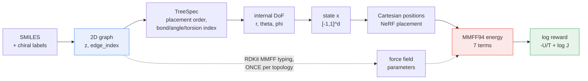
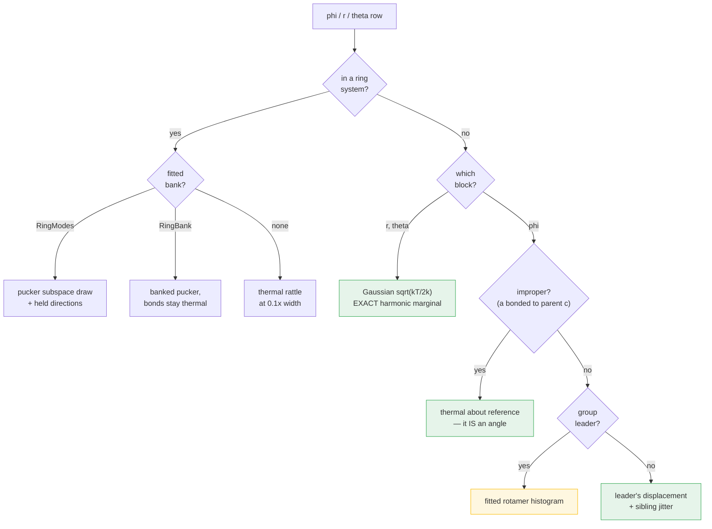
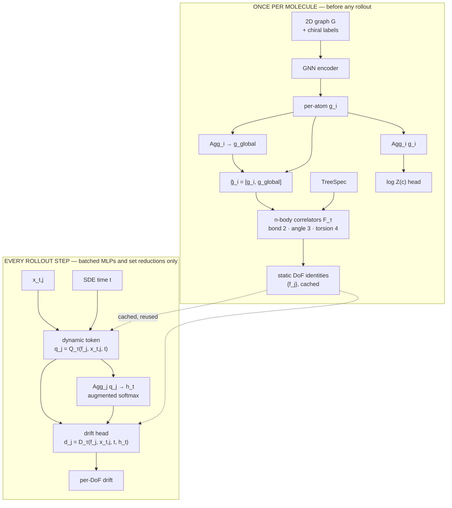

# The conditional conformer stack

Argument. What the conformer generator is made of, why each piece is shaped the way it
is, and what the conditional version needs that the unconditional one does not.

Scope: parameterisation, force field, prior, the diagnostics that say whether the prior
works, and the proposed conditional architecture. The ladder of DoF levels and the
chirality decision are argued in [`internal_dof_ladder.md`](internal_dof_ladder.md) and
not repeated here.

---

## 1. The pipeline

Everything downstream of the 2D graph is a deterministic function of it. That is the
property the conditional case rests on: if any step consulted an embedded geometry, then
`log Z(c)` would depend on which conformer happened to be embedded, and the condition
would not be well defined.



**The requirement, stated exactly.** Everything that defines the **condition and the
coordinate chart at inference** must be a deterministic function of the labelled molecular
graph. Reference geometries may inform diagnostics or offline analysis, but must not
determine the condition or the chart unless they come from a canonical deterministic
procedure.

**The tree obeys this; the linearity flags currently do not.**
`spec_from_graph(..., use_geometry=False)` builds the tree without geometry, because a
geometry-steered tree is not reproducible at load. But linearity is *measured* off a
reference conformer, and it **changes the chart**: acetonitrile reports `ndim = 11` where
3N−6 = 12, because a torsion about a linear frame is degenerate and gets dropped. So `d`
itself currently depends on an embedded geometry, which contradicts the requirement above
and means two runs with different embedding seeds could disagree on the chart for the same
molecule. See section 6.

The fix is available and cheap: **MMFF's typed θ₀ = 180 marks a linear centre**, and
typing is graph-determined. `ff_from_mmff` already computes exactly this flag
(`MMFF_LINEAR_THETA0 = 179.99`, used for the linear-angle functional form), so the
criterion can be swapped for the typed one without new machinery.

**The measure is carried explicitly, and there are TWO Jacobians.** The GFlowNet evolves in
normalised coordinates `x ∈ [-1,1]^d` while the physical target is defined on
`q = (r, θ, φ)`, so the density with respect to `dx` is

```
log R(x, c) = -U(q(x,c))/T  +  log J_BAT(q)  +  log |dq/dx|
```

`log J_BAT = Σ 2 log r + Σ log sin θ` is the BAT volume element relating the
internal-coordinate measure to the Cartesian one with the six external DoF integrated out.
It is *not* the determinant of the NeRF map, which is SE(3)-reduced and square; the two
differ by the orbit volume.

**`log |dq/dx|` is currently missing.** The chart is affine — `_free_scale` takes three
values (0.3 on r, 0.5 on θ, π on φ) — so `log |dq/dx| = Σ_j log(free_scale_j)` is constant
in `x`. Constant, but **not constant in `c`**: measured at −7.615 (ethanol, d=21), −9.873
(propanol/NMA, d=30), −12.130 (butanol), −17.397 (ala-dipeptide, d=60) — a **9.8-nat
spread** across that set alone. Unconditionally it is absorbed into log Z and harms
nothing, which is why it has not surfaced; conditionally it is a per-condition shift, so
`log Z(c)` is not the physical partition function and no two conditions are comparable
without it. Note `jacobian_energy`'s own docstring already makes precisely this argument
for the BAT term — "it is NOT constant in c ... must be added back if partition functions
are compared across molecules" — the reasoning simply was not carried to the chart term.

---

## 2. Force field

MMFF94, complete, in torch. All seven terms: quartic bond stretch, cubic angle bend (with
a separate functional form at linear centres), stretch–bend, out-of-plane, three-term
torsion, buffered 14-7 van der Waals, and electrostatics.

**Parameters come from RDKit; evaluation does not.** This split is the whole design.
Parameterisation — MMFF's atom typing and its thousands of parameters plus empirical
fallback rules — is the hard part and RDKit does all of it. Evaluation is ~40 lines of
batched tensor ops. Parameters are a fixed table per topology, computed once at setup, so
**RDKit is never in the hot loop**.

That is also why no existing torch force field was adopted. TorchMD, DIMOS and espaloma
all split the same way; adopting one trades RDKit for AmberTools on the half that already
worked, and none of them batches over independent conformers — their hot loop is one
system advancing through time, ours is thousands of geometries scored at once.

### What is verified

Each term is checked *separately* against RDKit at perturbed geometries, because a total
would hide a compensating pair. Bond, torsion, out-of-plane, electrostatic and vdW agree
to ~1e-14; angle, stretch–bend and out-of-plane to ~3e-4, which is the rounding of what
RDKit's accessors report rather than an error in the form.

No unit constant was transcribed — each was recovered by fitting RDKit's own per-term
energies, because a mistyped constant produces a plausible energy nothing downstream
detects. Three traps that only a per-term check catches are recorded in
`ff_from_mmff`'s docstring and pinned by `test_mmff_matches_rdkit.py`.

### Why the torch version exists

CPU is *not* the reason — RDKit is about 5x faster there. The case is batching and
autograd:

| batch | ethanol | NMA | ala-dipeptide |
|---|---|---|---|
| 1,024 | 3.7x | 1.3x | 5.4x |
| 4,096 | 14.5x | 6.4x | 17.6x |
| 16,384 | 41.6x | 21.8x | 20.4x |

Speedup over RDKit on GPU, float32. Crossover is around batch 256–1024; below that RDKit
wins on launch overhead. Float32 costs 0.02% of kT, so it is the right default on GPU.
Timings are near-flat in batch size, meaning the kernels are **dispatch-bound**, so CUDA
graphs or `torch.compile` likely have more to give.

`vdw_softcore_frac` (default 0 = exact MMFF) continues 14-7 linearly below `f·R*`.
Buffered 14-7 reaches ~1.5e9·ε at r=0, so one overlapping pair can outweigh a whole batch.
Linear, not exponential: a line has a constant gradient by construction, which is what
lets an optimiser walk back out of a clash.

---

## 3. Prior

A product of typed low-body correlates, plus joint structure wherever a product form is
*guaranteed* wrong.



**The organising principle**: a product-of-marginals prior is correct on the coordinates it
samples and says nothing about any quantity derived from several of them. Every green box
above exists because some redundant quantity — a graph angle the tree does not expose as a
coordinate — would otherwise be destroyed.

Three cases, each found by measurement rather than reasoning:

- **Sibling dihedrals.** An H–C–H angle is a *difference* of two tree torsions. Drawn
  independently, roughly a third of sibling pairs land on the same rotamer and put two
  substituents in the same place. Members of a group take the leader's angular
  displacement — which is a rigid rotation only if they share a reference axis, so groups
  are keyed on the **central bond**, not the parent atom.
- **Improper rows.** A tree dihedral is a genuine torsion only when its far reference `a`
  lies one bond further out. When `a` is bonded to the parent instead, the dihedral *is*
  the angle between two substituents. Drawing it from a rotamer histogram destroys that
  angle outright — on ethanol it put O–C–H at 14.5° against θ₀=108.6°, and that single
  angle carried 251 of the molecule's 252 kcal/mol of strain.
- **Ring closure.** A hard constraint a product form is guaranteed to violate, so ring
  systems draw jointly from a bank or a pucker subspace.

**r and θ are not fitted at all.** For a harmonic term the exact local Boltzmann marginal
is a Gaussian of width `sqrt(kT/2k)`, which the force field states outright. Pooled
histograms are much broader than any individual bond's thermal spread.

---

## 4. Diagnostics

The question is **coverage × sample quality**, and the two need different instruments.

### Why not ESS

A self-normalised ESS is built from the draws you got. A basin the prior never proposes
contributes no large weight and therefore no warning — the estimate looks *healthy*
precisely where the prior is broken. ESS reliably detects wasted samples and is close to
blind to missed modes, which is backwards: TB only needs support, so a wasteful prior
trains slower while a missed basin cannot be learned at all.

ESS also has no interpretable scale. It falls with dimension, and it is bounded by a
product-form ceiling that is a property of the *form* rather than the fit — measured at
~0.12 nats/dim, remarkably stable across molecules from d=21 to d=60.

### The two metrics that replaced it

**Coverage** — enumerate the rotamer basins, then ask what the prior assigns them. This is
a *reverse-direction* measurement, which is exactly why it sees what sampling from the
prior cannot. Report the **worst-covered basin**, never the mean.

**Effective temperature** — from equipartition, ⟨E−E_min⟩ = (d/2)kT_eff, so

> **T_eff / T = 1 + 2·excess/d**,  excess = (E−E_min)/kT − d/2

**1.0 = thermal, 0 = frozen**, dimension-free, no unknown ceiling. It is bounded below by
−d/2 in excess units, and a fully relaxed ethanol batch reads 0.019 — which is the check
that the scale means what it claims.

| | ethanol (21) | butanol (39) | NMA (30) | ala-dipeptide (60) |
|---|---|---|---|---|
| uniform | 41.7 | 53.5 | 48.5 | 85.0 |
| **prior** | **1.29** | **1.66** | **1.90** | **3.50** |

The prior samples at 1.3–3.5x the target temperature and uniform at 42–85x. Coverage is a
**tie** with uniform — neither misses an accessible basin — which is the expected and
correct result: uniform is the coverage ceiling, and the prior matching it means its
concentration costs nothing in reach.

So the prior buys ~nothing on coverage, because there was nothing to buy, and one to two
orders of magnitude on quality. The win narrows with size (147x → 34x on median energy)
because the redundant quantities grow superlinearly while the modelled coordinates grow
linearly. That is the ceiling of this class of prior, and none of it is a bug.

### Local relaxation

A few steps of gradient descent on the energy repair the high-dimensional decay. Legitimate
because **TB does not use the proposal density** — it would break IS log-Z estimation, not
training.

Break-even (T_eff → 1.0) is ~1–3 steps for small molecules and ~10–15 at d=60. Coverage
survives: zero missed basins at every step count, all basins still occupied at 100 steps,
migration between basins modest. But **uniform relaxation over-cools** — run it to 100
steps and T_eff/T reaches 0.02, i.e. frozen. The tail and the bulk want different amounts,
so the policy should be **energy-conditional**: relax each draw only while it is above
threshold. That self-scales with dimension, because the threshold is in kT.

---

## 5. Conditional architecture

The unconditional case fixes one molecule, so `d` is a constant and an MLP policy over
`[-1,1]^d` is adequate. The conditional case cannot do that: **`d` varies with the
molecule**, and the coordinates are not exchangeable — DoF *j* means a specific 2-, 3- or
4-body object in a tree whose shape is itself a function of the condition.

### The organising principle: static vs dynamic

**Separate what is computed once per molecule from what changes at every rollout step.**
The molecular graph already carries the chemical information that defines the target; the
internal-coordinate vector already carries the conformational information that defines the
policy. Neither the graph network nor a Cartesian conformer needs to appear inside the
trajectory.



### Static molecular encoding

`g = E_GNN(G)` produces **per-atom embeddings** `{g_i}`, not only a pooled vector. Its job
is chemical identity and environment: atom and bond types, connectivity, stereochemistry,
wider context.

Every local representation also needs global molecular context, obtained cheaply by
aggregate-and-broadcast: `g_global = Agg_i(g_i)`, then `g̃_i = [g_i, g_global]`. **None of
this depends on the current conformer.**

#### Choosing the encoder — STUB, still under discussion

**The cost objection does not apply here.** The usual case against dense attention is
O(N²) in the hot loop, but this encoder is static: it runs once and amortises over the
whole trajectory. At 10–100 atoms and hundreds of SDE steps, N² is 10²–10⁴ *once*. The
encoder should therefore be chosen on expressiveness alone, which is an unusual luxury.

**The canonical recipe is hybrid, not pure attention.** GraphGPS is the standard modern
construction: local message passing *and* global all-to-all attention **in each layer**,
with the attention told where it is by positional/structural encodings — LapPE (Laplacian
eigenvectors, a spectral notion of global position) and RWSE (random-walk return
probabilities, local structure). Graphormer is the other reference point and is more
directly "all-to-all with through-bond information": degree centrality encoding, **spatial
encoding** (shortest-path distance as a learned bias on the attention logits), and **edge
encoding** (bond features pooled along the shortest path between the pair).

The hybrid wins for a reason worth stating: a local MPNN handles short-range structure so
attention never has to *learn* locality, while attention supplies the long-range channel.
Pure attention on a bare 2D graph is strictly worse than either, because it discards bond
topology entirely — atoms two bonds apart and eight bonds apart become indistinguishable.

The edge-along-path encoding is the piece most often skipped and the piece that matters
most here: it separates "connected by three rotatable single bonds" from "connected across
a conjugated ring", which is exactly what decides whether two groups can approach.

**What actually argues for global reach is oversquashing, not range.** The genuinely
required range is *medium* — a torsion's rotamer preference is set by its substituents
(~3 bonds) and 1-5/1-6 sterics (4–6 bonds), plus ring membership; long-range through-bond
electronic effects are weak. Four to six message-passing layers would cover that *if* they
did not oversquash. Molecules are low-treewidth graphs with single-bond bottlenecks, which
is the textbook pathological case, so a distant substituent's information has to squeeze
through one edge. Global attention sidesteps the failure mode instead of tuning around it.

**The discriminator against the broadcast**, which is the cheaper option already specified
above: aggregate-and-broadcast is **rank-one** global context — every atom receives the
*same* vector, so it can express "this molecule contains an amide" but not "atom *i*
specifically needs to know about atom *k*". Attention is pairwise routing and can express
the second. The test is therefore whether DoF identity needs pairwise long-range
information or merely global context, and it is measurable: train the same policy on one
molecule with (a) broadcast-only message passing and (b) attention with a distance bias.
The difference should appear as better rotamer weighting on molecules with real 1-5
interactions — branched alkanes, the dipeptide — and be absent on ethanol. No measurable
difference means the broadcast was sufficient and the attention is unpurchased complexity.

**No equivariant machinery is required, at any point.** The encoder consumes a 2D graph,
the correlators emit scalars, and internal coordinates are themselves invariants, so the
whole policy is SE(3)-invariant *by construction* — no frames, no spherical harmonics, no
tensor products. This is a real simplification against the crystal side's Mo3ENet route,
which needs 3D equivariance because it consumes conformers. The single asymmetry is
chirality, a pseudoscalar, handled by the parity feature below.

**Chirality must enter as an explicit atom feature, or it is silently averaged over.** The
2D graph plus atom types is *identical* for enantiomers, so any encoder over it — message
passing or attention — is enantiomer-blind. The natural definition is already in the
stack: `TreeSpec`'s placement order is canonical (Weisfeiler-Lehman), so parity is the sign
of the improper dihedral in that ordering, which is reproducible and consistent with
everything downstream. See the gate in section 6.

#### Pretraining the encoder — OPEN, target not chosen

Because the encoder is static, it could plausibly be **pre-learned once and every
molecule's `{f_j}` cached**, with the policy trained on frozen embeddings.

**Geometry as a generative target is ruled out, and the argument is short.** Asking the
encoder to predict the internal-coordinate distribution is either circular or trivial:
if it learns the *true* distribution, that is the GFlowNet's job and the problem is
already solved; if it learns the *prior*, we have the prior and gain nothing. Any
generative target defined on `(r, θ, φ)` falls on one horn or the other. This kills the
otherwise-attractive framing that pretraining could fix the fitted prior's pooled
histograms.

**Structure reconstruction is what the literature actually does.** Hu et al.'s
*Strategies for Pre-training GNNs* is the reference point: attribute masking (mask atom
and bond attributes, predict them) and context prediction (predict surrounding subgraph
structure from a local neighbourhood, contrastively). GROVER sharpens both with
*contextual property prediction* — for a masked node, predict a statistical descriptor of
its k-hop subgraph context, richer than recovering one attribute — plus graph-level motif
prediction over RDKit-detectable functional groups, whose labels are free. MolCLR takes
the contrastive route with atom masking, bond deletion and subgraph removal.

**Masking beats autoencoding here, for a structural reason.** A reconstruction
autoencoder is non-trivial only because of its bottleneck, and the 2D analogue would pool
to a molecular latent and decode the graph — which trains `g_global`. But the correlators
consume **per-atom** `g̃_i`, so a pooled bottleneck puts the pressure in the wrong place.
Masking puts it in the right place: withhold what must be predicted, and the pressure
lands on the per-atom representations directly. GROVER's contextual variant is close to
ideal for this stack, since "what environment am I in" is what determines a torsion's
profile. Note also that plain adjacency reconstruction from *unbottlenecked* per-atom
embeddings is near-tautological — the encoder can pass topology straight through — so
masking is what makes the target real, not the choice of what to reconstruct.

**One family escapes the dichotomy above.** 3D Infomax and GraphMVP do not ask the 2D
encoder to *generate* geometry; they maximise mutual information between its embedding and
a learned 3D representation. The encoder never produces a distribution — it only has to
avoid discarding what would let a 3D encoder agree with it — so the target is
representational rather than generative, and is therefore neither the GFlowNet's job nor
the prior's. The 3D views are free from ETKDG.

**Whether any of this is on the critical path is undecided.** These molecules are small and
TB supplies a training signal directly, so pretraining may simply not earn its pipeline.
Its value is highest in exactly the case that motivates it — a **frozen** encoder with
`{f_j}` cached — where representation quality has to come from somewhere other than the
downstream task. Decide that first; it determines whether a target needs choosing at all.

### Static internal-coordinate embeddings

`TreeSpec` associates every DoF with a graph-local *n*-body object — a bond length with 2
atoms, an angle with 3, a torsion with 4 — so those correlates can be embedded once too:

```
f_j = F_τ(g̃_{i1}, …, g̃_{in}, e_j),    τ ∈ {r, θ, φ}
```

with `e_j` carrying static edge or tree-role information. `f_j` answers *what this
particular degree of freedom is, in this particular molecule*. The whole set `{f_j}` is
cached for the trajectory.

This beats feeding raw atom embeddings into every policy evaluation, because the topology
is fixed: the 2/3/4-body interpretation of each coordinate need only be resolved once.

### Dynamic state, and global conformational context

At step *t* the conformer is fully specified by `x_t` alone, up to the irrelevant external
SE(3) DoF — so the policy operates directly on `{(f_j, x_t,j)}` with **no Cartesian
instantiation**. Each coordinate produces a dynamic token
`q_j(t) = Q_τ(f_j, x_t,j, t)`, combining static identity with current value and SDE time.

A purely local head would be wrong: conformational DoF are coupled, and the preferred drift
of one torsion depends on the current values of others. That coupling is supplied by a
permutation-invariant reduction over the token set, `h_t = Agg_j q_j(t)` — which is also
what makes variable `d` free.

**Augmented-softmax aggregation** is the right reduction here because it keeps two things
at once: selective or extremal features through the softmax-weighted term, and *extensive*,
count-sensitive information through an unnormalised sum. Per-class summaries
`h_t^r, h_t^θ, h_t^φ` are an option; a single `h_t` is the simplest start.

### Policy heads

```
d_j(t) = D_τ(f_j, x_t,j, t, h_t)
x_{t+1} = x_t + d(x_t, g, t)·Δt + stochastic term
```

Each decision sees exactly three things: **what coordinate am I** (`f_j`), **where am I
locally** (`x_t,j`), and **what is the rest of the conformer doing** (`h_t`) — global state
dependence with no dynamic message passing.

### Why a set model is the right inductive bias

Internal coordinates are *not* physically exchangeable — torsion *j* and torsion *k* mean
different things. But their **storage order is arbitrary**, and because every token carries
its own identity `f_j`, the policy can be permutation equivariant with respect to the
coordinate table's enumeration. A DeepSets structure `ρ(q_j, Agg_k φ(q_k))` is invariant to
arbitrary ordering while staying sensitive to each coordinate's chemistry.

### The log Z head

`log Z(c)` depends only on the condition, never on the trajectory state, so it reads
straight off the static embeddings: `log Z(c) = Z_MLP(Agg_i g_i)`. The aggregation must
**preserve extensive information** rather than mean-pooling it away — log Z scales with
molecular size, and a mean pool discards exactly that. Augmented softmax again: the summed
component stays count-sensitive while the softmax component can emphasise chemically
important environments.

One static GNN therefore feeds two branches, neither of which recomputes during a
trajectory: `{f_j}` for policy conditioning, and `log Z(c)` for normalisation.

**Chirality enters as part of the condition**, not as a learned output. The molecule is
defined up to a 2D graph plus chiral labels, which is what happens in reality; the mirror
image is one Z₂ per molecule, not per stereocentre, since the mirror flips every centre at
once and individual flips are diastereomers with different energies.

### Cost

The trajectory hot loop contains **only batched MLPs and set reductions**. It contains no
repeated molecular GNN, no Cartesian NeRF reconstruction, no geometry-dependent neighbour
search, and no force-field evaluation. That is what should make long SDE rollouts
substantially cheaper than architectures re-encoding the graph or the 3D conformer at every
step.

### Capacity escalation

Start deliberately simple and escalate only against a measured bottleneck:

1. one global aggregation `h_t`;
2. separate bond, angle and torsion summaries;
3. several learned aggregation channels;
4. a lightweight self-attention layer over the DoF tokens.

Even (4) stays far cheaper than rerunning the molecular GNN, because it acts only on the
small set of internal-coordinate tokens.

### Sequencing

1. Unconditional, fixed-dim MLP, one molecule — validates parameterisation, force field
   and prior in isolation. **This is where the stack is now.**
2. Swap the policy for the set architecture, still one molecule at a time, so any
   regression is attributable to the architecture rather than the conditioning.
3. Condition over a molecule set; watch held-out evaluation, which catches what training
   metrics hide.

---

## 6. Known gaps

Ordered by how much they would change a conclusion.

- **`log |dq/dx|` is missing from the reward.** Constant in `x`, so unconditional results are
  unaffected, but it varies by 9.8 nats across the molecules measured in section 1 — which
  makes `log Z(c)` non-physical and cross-condition comparison invalid. Must be added before
  any conditional log Z is trusted. Fix is a per-condition constant, so it is cheap.
- **The chart is not yet a function of the graph alone.** Linearity is measured off a
  reference conformer and changes `d` (acetonitrile: 11 vs 3N−6 = 12), so the same molecule
  can get different charts from different embedding seeds. Swap to MMFF's typed θ₀ ≥ 179.99,
  which is graph-determined and already computed in `ff_from_mmff`.
- **Chirality has no gate yet, and it needs TWO tests, not one.** A parity feature must be an
  input or the encoder is enantiomer-blind, and nothing currently fails if it is absent.
  The two tests check different things and must not be conflated:
  - **Diastereomers test stereochemical *sensitivity*.** Identical connectivity, different
    stereocentre assignment, *not* mirror images. Require the encoder representations, the
    `{f_j}`, **and `log Z(c)`** to differ — the conformational thermodynamics genuinely
    differ, so the condition must too. Choose a pair with a large, robust gap (an axial /
    equatorial ring case) rather than a marginal one: measured minimum-energy separations of
    0.25 kcal/mol (2,3-butanediol) and 0.84 (an amino-alcohol) are near ETKDG sampling noise
    and would make a flaky gate.
  - **Enantiomers test physical parity *symmetry*.** Globally invert every centre. Require
    the labelled conditions to be **distinguishable**, but the mirrored conformers to have
    **identical** MMFF energies — verified exact, 0.00e+00 on three chiral molecules — and
    the physical partition functions to **agree** in an achiral environment.

  An earlier draft of this gate was wrong: it demanded that `log Z(c)` *differ* between
  enantiomers, which is physically false. A test that only checks "parity was passed in" is
  the swallowed-diagnostic pattern and does not count either.
- **Coverage can false-pass on coupled molecules.** Rotamer basins are enumerated from
  *rigid* 1-D scans with every other coordinate frozen, which overestimates barriers when
  DoF are coupled. Glycerol reports one accessible basin and "0 missed" — a flawless-looking
  pass — where a lower threshold finds at least 18. Needs relaxed scans. Until then
  coverage is trustworthy only for weakly-coupled rotamers.
- **`prior_diagnostics.py` has no tests.** Nothing would have caught the above except
  looking.
- **Rings are excluded from the diagnostics.** `prior_log_prob` raises on them by design
  (a ring block's density is a mixture, and singular in the directions its subspace does
  not span) and mode enumeration is rotamer-only. Most drug-like molecules are rings.
- **Mode enumeration is 3^n**, capping around five or six rotatable groups.
- **`prior_log_prob` is thinly validated** — it gates every ESS number, and no test would
  fail if it were subtly wrong. Note that T_eff and coverage do not depend on it.
- **`improper_phi_sigma` is a heuristic** (median tree-angle width), not derived per row.
- **Relaxation is measured on the prior, not in training.** Its interaction with off-policy
  TB and with replay intake is unexamined.
