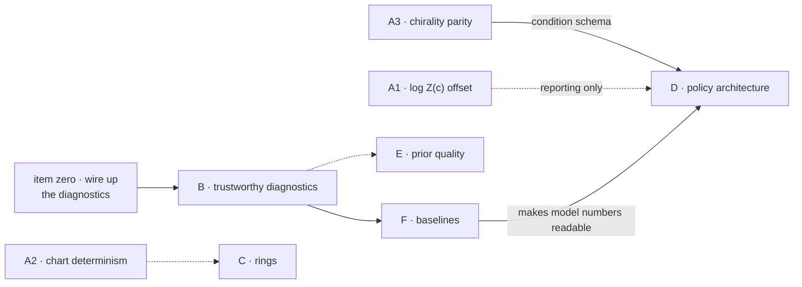

# Conformer sprint plan

Argument. What to build next on the conformer stack, in what order, and why that order.
State of the stack is [`conformer_conditional_stack.md`](conformer_conditional_stack.md);
this file is the work breakdown against its section 6.

Each item is written as a **self-contained brief** — goal, why, files, how to reproduce,
and a *checkable* done-condition — so it can be handed to another agent without this
conversation. Traps are listed where a plausible-looking wrong answer exists.

> **VERIFIED 2026-08-17 by an adversarial pass; worst verdict REFUTED.** Several claims below
> were wrong. Corrections are inline and marked. The measurement discipline held up — T_eff,
> prior-vs-uniform and the MMFF figures all reproduced — but the failures were of **scope**
> (no level was ever named), **plumbing** (no callers, no driver) and **the sequencing
> argument this document exists to make**.

---

## Item zero — the diagnostics are not wired to anything

Found by the verification pass; not previously in this plan, and it precedes every other item.

- **`prior_diagnostics.py` has ZERO callers repo-wide.** Nothing in either package imports it.
  Every published diagnostic number is currently unreproducible by any committed command.
- **`coverage_report` and `prior_report` RAISE at `level='torsion'`** — and `'torsion'` is the
  only level that ships. `configs/conformer_propanol.yaml:41` is the sole `level:` key in
  `configs/`, and `build_conformer_buffer.py`, `build_conformer_conditions.py` and
  `build_prior_states.py` all hardcode `level="torsion"`. Every diagnostic figure in the stack
  doc is measured on `'full'` or `'dihedral'`, which **no training run instantiates**.
- **This plan never named a level** in 288 lines. Every item below must state one.
- `conformer_data.py:290,295` serialises the **all-False geometry-free `spec.*` linearity
  flags**, not the measured `energy.*` ones — so any fix confined to `ConformerTorsions`
  leaves the conditional route unaffected.
- `configs/conformer_dev.yaml` and `configs/conformer_naproxen.yaml` have **no `level` key**,
  while `train_conformer.py:604` reads `prob.level` with no fallback. They appear to hard-fail
  at startup. Track D is nominally exercised on them. *(User-owned configs — flag, do not edit.)*
- `linearity_verified` is logged as a bare `True` (`train_conformer.py:624`): it records that
  the measurement ran, not what it found.

> **PARTIALLY CLOSED.** `energies/prior_smoke.py` is that driver: committed, fixed molecule
> set, ~60 asserted checks over 11 molecules, non-zero exit on violation, and a `--inject`
> self-test carrying 20 reproducible bug classes. It does **not** close the half this item is
> named for — `prior_report` and `coverage_report` still raise at `'torsion'`, so the
> prior-quality tier contributes **0 of 88** check slots at the only level that ships. The
> driver exists; the measurement it was built to drive does not run.
>
> **Three defects in the harness itself are open**, and until they close its verdict is not
> evidence:
> 1. A population bar calibrated to the current molecule list with **zero margin** — it
>    demands every molecule have at least one improper row, and ordinary correct molecules
>    (diethyl ether, dimethyl ether, propyne) have none. Adding one fails a healthy pipeline.
> 2. Several checks that cannot fail by construction — an ESS floor that is Cauchy–Schwarz,
>    and three magnitude floors the file's own adversarial pass found decorative.
> 3. **The geometry legs cannot distinguish a working pipeline from a dead one.** Both sides
>    of the round-trip are computed through `dof_from_state` (`build_positions` opens by
>    calling it), so shadowing that function to ignore its input leaves every residual
>    satisfied *exactly* and the file reports 0 FAILED. The same shape recurs in at least
>    three other checks: the permutation cancels in `external_*` because it is applied to
>    both the write and the read; `prior_rtheta_width` scores a draw against the same
>    function that produced it; `clash_excess_p10` measures both sides over one empty list.
>    A check whose two sides share a dependency is not a weak check — it is not a check. The
>    separator is a positive control on the perturbation, never a tighter bar.

**Done when.** A committed driver reproduces every published diagnostic number, and it either
runs at `'torsion'` or the docs state plainly which level each figure describes. The three
defects above are closed, and each is demonstrated closed by an injection that fires.

---

## Sequencing, and the one hard dependency

**CORRECTED — the original claim here did not survive.** "A1 changes the reward and A2
changes the state dimension" is unsupported:

- A1's offset is **exactly affine in atom count** — verified to 1e-15 on 7 molecules,
  `sum(log|_free_scale|)` at `'full'` = `(N-1)log0.3 + (N-2)log0.5 + (N-3)log(pi)`, slope
  −0.7524 nats **per atom, zero chemical content**. D1's own done-condition already mandates
  an *extensive* log Z(c) head, and a sum-over-atoms head represents a term linear in N
  exactly, as a bias.
- A2 **cannot change `d`** at `'torsion'` or `'dihedral'` (rebuilt at `LINEAR_TOL_DEG` 175 vs
  181: identical `d` on every molecule tested). D2 already requires d-agnostic operation.

**The real dependency is A3 → D1**, and it is a schema dependency: a parity *atom feature*
must enter the condition schema the D1 encoder consumes. Everything else is parallel.

**File-conflict map** — do not run these concurrently on the same worktree:

| Item | Primary file |
|---|---|
| A1, A2, C1 | `energies/conformer_torsions.py` |
| B1, B2, **C1** | `energies/prior_diagnostics.py` |
| **A2, A3** | `energies/conformer_data.py` (condition serialisation) |
| **A2** | `mxtaltools/conformers/topology.py` |
| D1–D3 | new files |
| F1, F2 | new file (`energies/prior_baselines.py`) |

**Corrected:** the original map had four omissions — C1 also touches `prior_diagnostics.py`,
A2 and A3 both land in `conformer_data.py`, and A2 reaches `topology.py`. A∥B is still safe.
D is clean.

---

## Track A — correctness of the target

Blocks all conditional work. All three are small; none is optional.

### A1 · Record the per-condition log Z offset — DO NOT put it in the reward

> **DOWNGRADED.** The term is genuinely absent — proved twice by construction: two charts
> differing by 14.6 nats of `log|dq/dx|`, mapped to the *same* physical geometry, give
> bit-identical energies (max diff 1.1e-13). Nothing in `bounding_energy`, `dof_from_state`
> or `log_jacobian` absorbs it. But this is **not** "the reward is wrong"; it is
> "`log Z(c)` is not comparable across molecules", and it is already documented.

**Level matters and the original brief never said one.** Every quoted number was
`level='full'`. At the shipped `'torsion'` the same molecules give `d`=1–4 and **+1.14 to
+4.58 nats — opposite sign, ~1/20 the magnitude**. Ethanol, the original headline molecule,
**cannot be built at `'torsion'` at all** (no rotatable bonds).

**It is a deliberate deferred offset, not an oversight.** `build_positions`' docstring
(`conformer_torsions.py:462-469`) states verbatim that the constant "has counts affine in N,
so it is a PER-MOLECULE offset and must be carried wherever log Z(c) is compared across
molecules."

**The original stated reason was wrong.** `dof_from_state` is **not** globally affine at
`'flex'`/`'full'` — the clamp makes the Jacobian **singular** (slogdet = −inf) from
|x| ≈ 1.57 outward. The logic inverts: adding the *true state-dependent* `log|dq/dx|` would
change the sampled distribution; adding the **constant** is what is safe.

**Goal (revised).** Compute the offset once in `__init__` as a **reporting attribute**
alongside the existing `log_jacobian_const` (`conformer_torsions.py:295-306` is the exact
precedent — a constant deliberately recorded and deliberately not used to short-circuit
anything). Subtract it only where `log Z(c)` is compared across molecules.

**Why not in `energy()`.** Three reasons, any one sufficient:
1. **It does not typecheck at the shipped level.** At `'torsion'` the state→DoF map is
   non-square (CCCO 3×1, CCCCO 6×2, ala-dipeptide 8×4) and `torch.linalg.slogdet` *raises*.
   The induced Hausdorff element `0.5·logdet(JᵀJ)` differs from `Σ log free_scale` by
   0.55–1.39 nats. **Picking a reference measure IS the work** — and if it is Lebesgue in
   `x`, the only self-consistent reading of a collective coordinate, **no correction is owed
   at `'torsion'` at all**.
2. **It contradicts this item's own done-condition.** `brute_force_log_z` integrates over
   the state box; adding the term moves propanol at `'torsion'` from log Z 3.699 → 2.554.
   "Add the term" and "reference values unchanged" cannot both hold.
3. **It buys nothing.** The term is constant, drops out of every loss and same-condition
   metric, and is already absorbed by the per-condition `log_z_target`
   (`gflownet_losses.py:295-299`).

**Files.** `energies/conformer_torsions.py` — `__init__` only.

**Done when.** The attribute exists, is `Σ log free_scale` at selection levels, and either
`0.5·logdet(MᵀM)` or an explicit `raise` at collective levels — matching how
`state_from_dof` already refuses at `:502-506`. `brute_force_log_z` and every stored
reference are **unchanged**.

### A2 · Make the chart deterministic — the real mechanism is r0/θ0/φ0, not `ndim`

> **DOWNGRADED, and the verifiers disagreed here.** "Two embedding seeds can disagree on the
> chart" **did not reproduce**: `ndim` was single-valued across ~2000 constructions (26 mols
> × 40 seeds and 14 × 30 at `'full'`, 30 at `'torsion'`, 200 at `'dihedral'`). MMFF pins
> genuine linear centres at 179.999–180.0°; the smallest margin to the 175° threshold found
> anywhere was 2.456°. The single flip either verifier found (`C1CCCC=C=CC1`) needs
> `mmff_reference=False` **plus** a 0.011° coincidence.

**But the goal is still violated — by a mechanism the original brief never measured.**
`ndim` is not the chart. `r0`, `θ0`, `φ0` are chart data too, they are serialised into the
condition (`conformer_data.py:286-288`), and at `'torsion'` across five embedding seeds they
move **0.0086 Å / 0.20 rad / 3.14 rad**, carrying the reward's own reference energy `e_ref`
by **0.245–1.835 kT** (CCCO 0.245, CCCCO 1.162, ala-dipeptide 1.835, naproxen 0.929). That is
the same order as the A1 term the original brief called urgent, and **the proposed fix does
not touch it**.

**Goal (revised).** Make the *serialised condition* — reference geometry included —
reproducible from the labelled graph. The linearity criterion is secondary.

**The typed fix is not a drop-in.** `GetMMFFAngleBendParams` returns `None` on ~6% of the
tree triples it must cover (31/507 and 252/4308, measured independently) — these are the
tree's root/seed frame triples, which are **not bonded angles at all** (`CC#N`'s frame
triple has Z = [1,1,6], i.e. H–H–C). A fallback must be specified and must be **loud**.
There is also a typed-vs-measured disagreement on allene.

**Files.** `energies/conformer_data.py` (serialisation — the actual bug),
`energies/conformer_torsions.py`, `mxtaltools/conformers/topology.py`.

**Done when.** The serialised condition is byte-identical across ≥5 embedding seeds for
CCCO, CCCCO, ala-dipeptide and naproxen at `'torsion'`; `e_ref` moves by 0.

**Traps.** `conformer_data.py:290,295` serialises the **all-False geometry-free `spec.*`
flags**, not the measured ones — so a fix confined to `ConformerTorsions` changes nothing on
the conditional route. `linearity_verified` logs a bare `True`, recording that the
measurement ran rather than what it found.

### A3 · Chirality: parity feature and a two-part gate

**Goal.** Stereochemistry materially changes the condition, and the gate proves it.

**Why.** A 2D graph plus atom types is identical for enantiomers, so any encoder over it is
enantiomer-blind. Nothing currently fails if parity is absent — the model would average
over stereoisomers and look plausible.

**Feature.** Tetrahedral parity as an atom feature, defined as the sign of the improper
dihedral in `TreeSpec`'s canonical (Weisfeiler-Lehman) placement order — reproducible and
consistent with everything downstream.

**The gate is TWO tests and they check different things.**

- **Diastereomers → stereochemical *sensitivity*.** Identical connectivity, different
  stereocentre assignment, *not* mirror images. Require representations, `{f_j}` **and**
  `log Z(c)` to differ. Pick a pair with a large robust gap — an axial/equatorial ring
  case. Measured minimum-energy separations of 0.25 kcal/mol (2,3-butanediol) and 0.84
  (an amino-alcohol) sit near ETKDG sampling noise and would make a flaky gate.
- **Enantiomers → physical parity *symmetry*.** Globally invert every centre. Require the
  labelled conditions to be **distinguishable**, but mirrored conformers to have
  **identical** MMFF energy (verified exact, 0.00e+00 on three chiral molecules) and the
  physical partition functions to **agree** in an achiral environment.

**Done when.** Both tests pass, and removing the parity feature makes the *diastereomer*
test fail. A test that only checks "parity was passed in" does not count.

**Traps.** An earlier draft of this gate demanded `log Z(c)` *differ* between enantiomers.
That is physically false and would have enshrined a bug.

---

## Track B — make the diagnostics trustworthy

Independent of A. Gates whether any prior measurement can be believed.

### B1 · Relaxed scans for mode enumeration

**Goal.** Coverage must stop false-passing on molecules with coupled coordinates.

**Why.** Basins are enumerated from **rigid** 1-D scans holding every other coordinate at
reference, which overestimates barriers when DoF are coupled. Glycerol reports **one**
accessible basin and "0 missed" — a flawless-looking pass — where **relaxed enumeration
finds 324** (per group 1→3, 1→3, 1→3, 1→3, 1→4).

> **CORRECTED.** "12–36 kT ranges" **dropped the worst group**. Actual per-group ranges are
> 12.5, 21.3, 24.9, 36.6 and **92.6** kT, falling to 7.6–14.8 under relaxation. And the
> pathology is **force-field conditional**, which the original brief never said: under
> `force_field='reference'` glycerol enumerates [3,3,3,3,3] *rigidly* with 1.2–4.0 kT
> ranges — so **a regression test that does not pin `force_field='mmff'` passes on a
> molecule that is not broken.**

**Fix.** Set the torsion, relax the *other* coordinates, then read the barrier. The
constraint holds to 1e−13 deg when verified from Cartesian geometry.

**Files.** `energies/prior_diagnostics.py` — `rotamer_modes`, `coverage_report`.

**Done when.** Glycerol's basin count is consistent with its five rotatable bonds, and the
regression test uses the **strongest available evidence** rather than a threshold
comparison: the rigid enumeration is **not a function of the molecule** — glycerol's rigid
mode count swings **1 / 1 / 24 / 2 / 8 across five ETKDG seeds** with `d` unchanged. That is
a one-command demonstration. Re-run the coverage table and **strike or restate** the
glycerol row.

**Also fix `oracle_logw`** — it carries a second copy of the same defect, so **every
`D_avoidable` figure is unfixed until it is corrected**, including the 4.25 / 2.69 nats this
plan quotes elsewhere.

**Traps.** Relaxation must not migrate the torsion being scanned. Watch the `min_rel` peak
threshold interact with the fix — a lower threshold alone is not the answer, it only
exposes the symptom.

### B2 · Tests for `prior_diagnostics.py`

**Goal.** The module has **zero** tests. Nothing would have caught B1 except looking.

**Done when.** Each metric has a test that fails when the metric is broken — not merely
when it errors. Minimum set: coverage detects a deliberately removed basin; T_eff reads
1.0 on a synthetic thermal sample and −d/2 in excess units on a frozen one; the mode
labeller assigns a known geometry to the correct basin.

**Traps.** T_eff's floor check is the strong one — a fully relaxed ethanol batch reads
0.019 against a floor of 0.0, which is what proves the scale means what it claims.

### B3 · Write the test that already passes — `prior_log_prob` is CORRECT

> **REFUTED.** The premise ("no test would fail if it were subtly wrong") is true — the
> function has zero coverage. The conclusion was false. It was attacked hard and held up:
> global normalisation **Z = 1.00041–1.00139 ± 0.0009** on 5 molecules at N=4e5 (and
> 1.00058/1.00040/1.00025 at N=1e6 across 3 seeds and 3 proposal widths); the analytic
> sampler entropy equals `E_q[-prior_log_prob]` to within MC noise (|diff| 0.007–0.026 nats
> on |H| ≈ 21–57) under **both** force fields, at T = 1, 4.93 and 100, and under all four
> `joint_torsions × thermal_rtheta` combinations. The test is **not blind**: it breaks by
> +1.46 / +3.72 / −0.77 / +293 / +1.38 / +1388 / +954 nats under seven deliberate sampler
> perturbations, each within ~6% of the predicted magnitude.

Both defects the original brief would have chased are dead. The wrapped-normal 3-image
truncation drops **0.000e+00** mass at every σ actually used (0.084–0.26 rad); it only
reaches 1.7e-3 at σ = 3 rad. And `improper_phi_sigma` is the **proposal**, not the density —
sampler and density call the same function, so changing it moves both and the density stays
exact.

**Goal (revised).** Do **not** demote the ESS panel — it is the one prior metric now
positively validated. Write the two assertions that already pass, both under
`force_field='mmff'`.

**Done when.** (1) IS normalisation `E_p[exp(prior_log_prob − log p)] = 1` to ~1e-3 against
an independently written normalised density; (2) `E_q[-prior_log_prob]` equals the
closed-form sampler entropy.

**Trap — and this one would have produced a blind test.** Under the **default**
`force_field='reference'`, `ff_from_reference` assigns constant `k_bond=300` / `k_angle=50`,
so every σ is identical (`s_r`=0.0408, `s_th`=0.1) and **a σ-scramble test cannot fail**.
Pin `force_field='mmff'` or the test is blind in exactly the pattern this project keeps
hitting.

---

## Track C — rings

Sequence after A (shares `conformer_torsions.py`).

### C1 · Ring blocks in the density and in coverage

**Goal.** Lift the acyclic-only restriction. Most drug-like molecules are rings.

**Why.** `prior_log_prob` raises on ring systems by design — a ring block draws from a bank
or pucker subspace whose density is a mixture, and is *singular* in the directions the
subspace does not span. Mode enumeration is rotamer-only.

**Done when.** `prior_log_prob` returns a finite, correct density for a molecule with one
ring and passes the same gates the acyclic path does; coverage enumerates pucker basins
(chair/twist-boat) alongside rotamers.

**Traps.** The singular directions are the hard part and are a real derivation, not an
oversight. Raising is currently the *correct* behaviour — do not replace it with a number
that merely looks usable.

---

## Track D — policy architecture

Depends on A. Biggest piece; build in the order given so each stage is separately testable.

### D1 · Static branch: encoder → correlators → cached `{f_j}`

Per-atom `g_i`, aggregate-and-broadcast to `g̃_i`, then type-specific n-body correlators
`f_j = F_τ(g̃_i₁ … g̃_iₙ, e_j)` over `TreeSpec`'s 2/3/4-body objects. Plus the
`log Z(c) = Z_MLP(Agg_i g_i)` head with an **extensive** aggregation.

**Done when.** `{f_j}` is computed once and cached; a test asserts the trajectory makes
**zero** encoder calls; and `log Z(c)` responds to molecular size rather than being
size-invariant (a mean pool would silently discard exactly that).

### D2 · Dynamic branch: tokens → `h_t` → drift heads

`q_j = Q_τ(f_j, x_t,j, t)`, augmented-softmax `h_t = Agg_j q_j`, then
`d_j = D_τ(f_j, x_t,j, t, h_t)`.

**Done when.** Permutation equivariance holds — shuffling the coordinate table leaves
predictions unchanged; variable `d` runs without padding; and the hot loop contains no
GNN, no NeRF reconstruction, no neighbour search, no force-field call.

**Start at capacity level 1** (one global `h_t`). Escalate only against a measured
bottleneck: per-class summaries, then multiple channels, then self-attention over tokens.

### D3 · Encoder discriminator

Train one molecule with **(a)** broadcast-only message passing and **(b)** attention with a
shortest-path distance bias plus path-pooled edge features.

**Expected signal.** Better rotamer weighting on molecules with real 1-5 interactions —
branched alkanes, the dipeptide — and **no difference on ethanol**.

**Done when.** Both arms are trained to the same budget on the same molecules and the
comparison is reported *including the null result* — no measurable difference anywhere is a
valid and useful outcome, meaning the broadcast was sufficient and the attention is
unpurchased complexity. Ethanol must be in the set precisely as the negative control.

**Traps.** Reporting only the arm that won turns this from a discriminator into a
justification. Fix the budget before looking.

---

## Track E — prior quality

Depends on B for measurement.

> **The priority here rests on which metric you read, and the two disagree.** By T_eff the
> prior is 1.3–3.5× thermal against uniform's 42–85× — a large win, and the original basis
> for calling this track lower priority. By ESS as an importance proposal at `'torsion'` on
> propanol (d=1, so the target is exact by quadrature) the fitted torsion histogram scores
> **−32% against uniform** under `ff_from_reference` and **+3%** under `ff_from_graph`. Both
> figures are correct. T_eff asks whether draws are thermally distributed; ESS asks whether
> they are usable as a proposal for *this* target. This project reports T_eff and coverage
> because ESS is blind to missed modes — so T_eff governs the priority of E1/E2, and the ESS
> figure governs E3, which is a different fix. Do not use one to defer the other.

### E1 · Energy-conditional relaxation

Relax each draw only while it is above a kT threshold, rather than a fixed step count.
Uniform relaxation over-cools — 100 steps drives ethanol to T_eff/T = 0.02, frozen — while
the tail and the bulk want different amounts. A kT threshold self-scales with dimension.

**Done when.** Median T_eff/T lands near 1.0 across the molecule set *and* the p99 tail
falls, which fixed-step relaxation cannot do simultaneously. Coverage must not degrade.

### E2 · Turn on `vdw_softcore_frac` for training

Default 0 is exact MMFF and correct for verification, but buffered 14-7 reaches ~1.5e9·ε at
r→0, and the tail excess is enormous on the dipeptide against a median of +75.

> **CORRECTED — the number was mislabelled.** +2996 kT is the **p90**, not the p99:
> `prior_diagnostics.py:291` computes only `excess_p90_kt` and the string "p99" appears
> nowhere in the module. The true p99 is **+144,400 kT**, 48× larger. This strengthens the
> argument, but the original brief quoted a figure it had not computed.

**Done when.** A training config sets it (0.3 or less, well inside the wall), and a test
asserts MMFF is reproduced exactly above the switch.

### E3 · Upgrade the force field — `ff_from_graph`'s parameter tables

**Goal.** Give the target real torsion physics, which it currently lacks.

**Why this and not a finer key.** Measured on propanol at `'torsion'`: under
`ff_from_reference` the target entropy is 7.601 of a maximum 7.625 — nearly uniform, because
that force field has **no torsion term at all** and preference comes only from weak sterics.
Uniform scores 95.8% there; the fitted prior 65.6%. The ceiling for *any* pooled or
3-fold-symmetric prior is 96.7%, so pooling was never the problem and neither was key
coarseness. The histogram is fitted to the **wrong energy**. Nothing else in this track
matters first: under `ff_from_reference` uniform already scores 95.8%.

**The gate is the parameter tables.** `ff_from_graph` covers 4 bond / 6 angle / 2
torsion-centre types — alkanes and alcohols only — and `_lookup` **raises** on anything else,
so every molecule in the committed set except propanol and butanol fails at construction.
These are published GAFF values: transcription, not research.

**Files.** `mxtaltools/conformers/energy.py`.

**Done when.** Every molecule in the smoke harness's committed set constructs under
`ff_from_graph` at `'torsion'`, and `_lookup` still raises loudly rather than defaulting on an
unknown type.

**Traps.** `ff_from_graph` does **not** remove the embedding-seed dependence at `'torsion'` —
r0/θ0 still come from `measure()` on the ETKDG conformer regardless of force field — and it
loses zero-at-reference, adding a seed-dependent floor. Swap the frozen centres to typed
values at the same time or A2 regresses.

---

## Track F — baselines

**Nothing in this plan previously covered this, and it is what makes every future model
number readable.** A model's ESS, T_eff or log Z means nothing without the same quantities for
the alternatives it must beat — measured the same way, at the same level, on the same
molecules, from a command anyone can re-run.

Depends on B. Gates Track D's *interpretation*, not its construction: the encoder can be
built without it, but no training curve can be read without it.

### F1 · The reference table

**Goal.** One committed command emits, for the smoke harness's molecule set at `'torsion'`:
uniform, the fitted prior, and a relaxation reference — scored on T_eff/T, coverage and ESS,
each with an error bar.

**Why an error bar and not a number.** The weekend produced six such tables and none is
reproducible by any committed command; worse, single-seed figures were compared against one
another as though the differences were real. A baseline without a noise floor cannot tell you
whether a model beat it.

**Files.** New — `energies/prior_baselines.py`, beside the producer.

**Done when.** The command runs at `'torsion'`, writes to `energies/results/`, and re-running
it reproduces every published prior-quality figure in
[`conformer_conditional_stack.md`](conformer_conditional_stack.md) — or that document is
corrected to state the level each of its figures actually describes.

**Traps.** Uniform is not a trivial baseline here: at `'torsion'` under `ff_from_reference` it
**beats the fitted prior**, and reporting only the prior would hide that. Relaxation is not a
baseline for the *prior* — it is a different proposal at a different cost — so report its
compute budget beside its score or the comparison is meaningless.

### F2 · log Z by importance sampling, untrained, several seeds

**Goal.** An independent reference value for log Z(c) that no learned quantity can drift.

**Why.** Every log Z the training loop reports is a fitted quantity checking itself. The IS
estimator on an untrained model over several seeds is correct by construction, and it is what
a trained log Z head must reproduce.

**Done when.** Reported for at least the size ladder at `'torsion'` with a seed spread, and
`brute_force_log_z` agrees wherever d is small enough to integrate.

**Traps.** Run it untrained and over several seeds — a single-seed estimate from a partly
trained model is neither a baseline nor a check. Carry A1's per-molecule offset wherever these
are compared **across** molecules: it is affine in atom count with zero chemical content, so
omitting it manufactures a size trend out of nothing.

---

## Green light for Track D

Track D can be **built** against A3 alone. It cannot be **read** until the rest is true.
Before the first training curve is interpreted:

| | Condition | State |
|---|---|---|
| 1 | A3 parity feature in the condition schema, both gate tests passing | not started — **hard dependency, blocks D1** |
| 2 | The harness can distinguish a working pipeline from a dead one | open — item zero, defect 3 |
| 3 | The harness has no check that fires on correct code | open — item zero, defect 1 |
| 4 | `prior_report` / `coverage_report` run at `'torsion'` | open — item zero |
| 5 | F1 reference table committed and reproducible | not started |
| 6 | F2 untrained log Z with a seed spread | not started |
| 7 | A1 offset recorded as a reporting attribute | not started |
| 8 | Jacobian in the energy, pre-multiplied by T, tested at **two** temperatures | wired; two-temperature test unconfirmed |
| 9 | `periodic_dims` wired into the policy layout | **done** — `TorsionGFN` replaced, `build_gfn` consumes it |

Conditions 2–4 are an afternoon of subtraction. 5–7 are the real work, and 1 is on the
critical path regardless. **8 is the cheapest item on this list and the most expensive to get
wrong**: a single-temperature test passes on the broken code.

---

## Explicitly not in this sprint

- **Encoder pretraining.** Target undecided, and it may not be on the critical path at
  all — decide whether the encoder is frozen first, since that is what determines whether
  a target needs choosing.
- **Capacity escalation past level 1** in D2.
- **Refitting the prior's torsion histograms.** Blocked on B; the fit is worst on glycerol
  (D_avoidable 4.25 nats) and ala-dipeptide (2.69), but glycerol's figure is suspect
  until B1 lands.

## Reading before starting Track D

Torsional-GFN is close neighbouring work. GraphGPS and Graphormer for the encoder.
