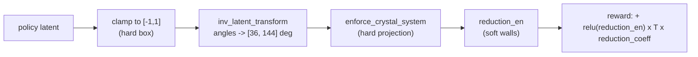

# Cell fundamental domains

*Drift: **T** (theory). Verified against commit `e17167e`, 2026-09-19. Sources at the end.*

A crystal's unit cell is not uniquely determined by the crystal. Any integer change of lattice basis $\mathbf{a}' = M\mathbf{a}$ with $\det M = \pm 1$ describes the same lattice, and a subset of those changes also leaves the space group's symmetry operators in the form the code stores them (`constants/space_group_info.py::SYM_OPS`, one fixed operator list per space-group number). That subset is a group, the *setting group* of that space group, acting on the six cell parameters $(a,b,c,\alpha,\beta,\gamma)$. A *fundamental domain* is a region of parameter space containing exactly one point of each orbit. Without one, the same crystal is reachable at infinitely many parameter points, so the target carries a multiplicity that varies from lattice to lattice and the buffer stores duplicates the coordinate metrics cannot see.

This page is about the cell only: the domain per setting class, the walls the code evaluates, and how they enter the reward. Two other redundancies act on the crystal and are different objects with different pages. The *pose* of the asymmetric unit, its centroid and orientation, is redundant under the Euclidean normaliser of the space group, a discrete quotient $N_E(G)/G$ plus a continuous translation along any direction every rotation part of $G$ fixes; that is [asymmetric-unit-reduction](asymmetric-unit-reduction.md). Which latent rows are held out of the diffusion because a projection overwrites them is [latent-dimension-structure](latent-dimension-structure.md). Also left out: the cluster reach used when a periodic neighbour list is built, and the setting-and-origin handling of `compute_standard_cell`; only which cell that function returns, in which convention, matters here.

## The setting group is per space group, not per crystal system

A basis change is admissible only if every stored operator survives it, up to an origin shift.

- **Triclinic (sg 1, 2).** The operator list is $\{E\}$ or $\{E,\bar{1}\}$, invariant under everything, so the setting group is all of $GL(3,\mathbb{Z})$ and the domain is the Niggli cell.
- **Monoclinic (sg 3 to 15), $b$-unique, cell choice 1.** Only the $ac$ plane moves: $\mathbf{a}' = p\mathbf{a}+q\mathbf{c}$, $\mathbf{c}' = r\mathbf{a}+s\mathbf{c}$, $ps-qr=\pm1$, $\mathbf{b}' = \det \cdot \mathbf{b}$. Which of those keep the glide is a condition on one entry, splitting sg 3 to 15 into the three classes of `common/sym_utils.py::MONO_CLASS`: `MONO_GLIDE` (7, 13, 14; $r$ even), `MONO_CENTRED` (5, 8, 9, 12, 15; $q$ even), `MONO_FREE` (3, 4, 6, 10, 11; any change).
- **Orthorhombic and above.** The metric constraints already pin the shape; the residual redundancy is a finite group of axis permutations and sign flips.

## Triclinic: the Niggli conditions, in a shifted sign convention

Write $A=a^2$, $B=b^2$, $\xi = 2\,\mathbf{b}\!\cdot\!\mathbf{c}$, $\eta = 2\,\mathbf{a}\!\cdot\!\mathbf{c}$, $\zeta = 2\,\mathbf{a}\!\cdot\!\mathbf{b}$. The Niggli main conditions are

$$a \le b \le c, \qquad |\xi| \le B, \quad |\eta| \le A, \quad |\zeta| \le A, \qquad |\mathbf{a}+\mathbf{b}+\mathbf{c}| \ge c,$$

plus a sign condition: $\xi,\eta,\zeta$ all positive (type I, all-acute) or all non-positive (type II). With boundary tie-breaks these select one cell per lattice.

`sym_utils.py::tri_niggli_reduction_penalty` evaluates the order, pairwise, sign and three-vector conditions as squared hinges: each condition $g \le 0$ contributes $\mathrm{relu}(g)^2$, so the penalty is zero exactly on the closed domain and rises quadratically outside it. The boundary tie-breaks are omitted, so uniqueness holds up to measure-zero ties. Its sign wall is *not* Niggli's: it takes $\eta \le 0$, $\zeta \le 0$, $\xi$ free: $\beta$ and $\gamma$ obtuse, $\alpha$ unconstrained. It is still one cell per lattice, with the zero set one connected region and $\alpha$ crossing $90^\circ$ without the cell jumping. The two rules agree on all-obtuse cells; an all-acute Niggli cell maps into this one by $(\mathbf{a},-\mathbf{b},-\mathbf{c})$, which fixes $\alpha$, sends $\beta \to 180^\circ-\beta$ and $\gamma \to 180^\circ-\gamma$, and preserves handedness and the P1/P$\bar{1}$ operators. So any cell from an external reducer, whether `crystal_ops.py::MolCrystalOps.compute_standard_cell`, `common/ase_interface.py::get_niggli_cell`, spglib or ASE, scores a positive penalty until that flip is applied.

The pre-Niggli walls are kept as `sym_utils.py::legacy_tri_reduction_penalty`, reachable only through `MXT_LEGACY_TRICLINIC_WALLS=1`: ordering and pairwise $|\cos|$ bounds plus $\mathrm{relu}(S)^2$ with $S = ab\cos\gamma + ac\cos\beta + bc\cos\alpha$ (`sym_utils.py::niggli_reduction_penalty`), which is neither sign branch and rejects every all-acute cell. `MXT_NIGGLI_TRICLINIC`, the switch that used to select the Niggli walls, is retired and raises at import if set.

## Monoclinic: a three-wall domain from $\Gamma_0(2)$

With $\tau = (a/c)\,e^{i\beta}$ in the upper half plane, the glide-class basis changes act as modular transformations: $\mathbf{a}\to\mathbf{a}+n\mathbf{c}$ is $\tau \to \tau+n$, $\mathbf{c}\to\mathbf{c}+2m\mathbf{a}$ is $\tau \to \tau/(2m\tau+1)$, the $\beta$ twin is $\tau \to -\bar\tau$. The group is $\Gamma_0(2)$, whose domain $-\tfrac12 \le \operatorname{Re}\tau \le 0$, $|\tau + \tfrac12| \ge \tfrac12$ reads as three walls:

$$\text{W1: } \cos\beta \le 0, \qquad \text{W2: } c\,|\cos\beta| \le a, \qquad \text{W3: } a\,|\cos\beta| \le c/2 .$$

`sym_utils.py::mono_reduction_penalty` implements all three as one two-sided bound on $\cos\beta$, per class: the limit is $\min(a/c,\ c/2a)$ for `MONO_GLIDE`, $\min(c/a,\ a/2c)$ for `MONO_CENTRED` (the $a\!\leftrightarrow\!c$ mirror image, because $C$-centring makes the $c$- and $n$-glides coexist), and $a/2c$ for `MONO_FREE`, which instead gets an explicit ordering hinge $a \le c$, since its setting group contains the swap. In the zero set $\beta$ reaches at most $135^\circ$ for the two glide classes and $120^\circ$ for the free class. The `MONO_FREE` ordering term $\mathrm{relu}(a/c-1)^2$ is unbounded above, unlike every other term here. Applying one class's walls to another is a different domain, and can leave lattices with no zero-penalty cell at all.

## Higher systems: metric only

For orthorhombic, tetragonal, trigonal, hexagonal, rhombohedral and cubic, the `sym_utils.py` functions contribute only crystal-system terms, squared differences driving $\alpha,\beta,\gamma$ to $\pi/2$ or $2\pi/3$ and $a$ to $b$, and no reduction term; the length-ordering hinges are present but commented out in `sym_utils.py::ortho_reduction_penalty` and `::tetra_reduction_penalty`. The derivation gives these systems a residual permutation redundancy, and therefore a fundamental domain. The code selects no unique cell outside triclinic and monoclinic.

## Hard projection, hard box, soft walls

Three mechanisms constrain the cell.

`crystal_ops.py::MolCrystalOps.latent_to_cell_params` clamps every latent row to $[-1,1]$ (lengths to $-0.99$) before `::MolCrystalOps.inv_latent_transform` maps the angle rows linearly onto $[0.2\pi, 0.8\pi]$, i.e. $[36^\circ, 144^\circ]$. That hard bound, not the walls, is what truncates the unbounded shear orbit of a monoclinic cell when W3 is absent. `geometry_utils.py::enforce_crystal_system` then *overwrites* the constrained angles with exact constants, which is a projection, not a penalty, so the crystal-system terms in the penalty are structurally zero on this path. `crystal_analysis.py::MolCrystalAnalysis.compute_cell_reduction_penalty` calls the walls at `margin=0.0`, the closed domain; `sym_utils.py::cell_reduction_penalty` itself defaults to `margin=0.1`, which shrinks the zero set and can leave a lattice with no zero-penalty cell.

The walls reach the sampler as an energy term, never as a constraint. In `energies/molecular_crystal.py::MolecularCrystal.generator_energy` the stored `reduction_en` enters as $\mathrm{relu}(\text{reduction\_en}) \times T \times$ `cfg:energy_config.reduction_coeff`; the temperature multiple keeps its weight in the Boltzmann exponent fixed as $T$ varies. Softness has an arithmetic consequence: a cell just outside a wall keeps weight $\exp(-c\,\delta)$ rather than none, so the effective copy count per lattice, $K_{\text{eff}} = \sum_{\text{copies}} \exp(-c\,\text{penalty})$, is not an integer near any wall even when the zero set holds exactly one cell.

Off the training path the same penalty is used hard: `crystal_ops.py::MolCrystalOps.sample_random_reduced_crystal_parameters` rejects and resamples until it is exactly zero, and the crystal-search optimiser's `crystal_opt_utils.py::compute_loss` adds $10^4 \times \mathrm{relu}(\text{reduction\_en})$ under `enforce_reduced`, with survivors filtered at penalty $< 10^{-3}$.

## Where the derivation and the code differ

The derivation in `docs/design/fundamental_domain.md` gives the triclinic domain as the $S$-term rule; the code's triclinic default is the Niggli-condition rule above, with the $S$-term rule kept behind the legacy switch. The derivation describes the monoclinic $(\alpha-\pi/2)^2$ pin as unable to fire because the projection runs first; that is still what the code does, and the terms remain in the penalty, live only where the projection is skipped. The derivation also derives a domain for the higher crystal systems that the code does not enforce, as the previous section says.

The same design note spends most of its length on the pose redundancy under the normaliser, and records the flat latent dimensions as unimplemented. Both are covered on their own pages, where the current code state is described.

## Owner choices

*Left for the owner. Three buckets: bullets bitten, design choices, priorities.*

## Config keys

`cfg:energy_config.reduction_coeff`, `cfg:energy_config.temperature`, `cfg:space_groups`, `cfg:z_primes`.

Environment variables: `MXT_LEGACY_TRICLINIC_WALLS` (`'0'` or `'1'`; other values raise), `MXT_NIGGLI_TRICLINIC` (retired; raises at import).

Code, mxtaltools (paths from that repo's root): `mxtaltools/common/sym_utils.py::cell_reduction_penalty`, `::tri_niggli_reduction_penalty`, `::legacy_tri_reduction_penalty`, `::niggli_reduction_penalty`, `::mono_reduction_penalty`, `::MONO_CLASS`, `::ortho_reduction_penalty`, `::tetra_reduction_penalty`; `mxtaltools/common/geometry_utils.py::enforce_crystal_system`; `mxtaltools/common/ase_interface.py::get_niggli_cell`; `mxtaltools/dataset_utils/data_class_methods/crystal_analysis.py::MolCrystalAnalysis.compute_cell_reduction_penalty`; `mxtaltools/dataset_utils/data_class_methods/crystal_ops.py::MolCrystalOps.latent_to_cell_params`, `::MolCrystalOps.inv_latent_transform`, `::MolCrystalOps.sample_random_reduced_crystal_parameters`, `::MolCrystalOps.compute_standard_cell`; `mxtaltools/crystal_search/crystal_opt_utils.py::compute_loss`; `mxtaltools/constants/space_group_info.py::SYM_OPS`.

Code, gfn_diffusion: `energies/molecular_crystal.py::MolecularCrystal.generator_energy`.

## Sources

Repo: docs/design/fundamental_domain.md, and the code above read at the stamped commit (mxtaltools at `d23a71e7`). Memory files project_triclinic_reduction_misses_niggli_sign_and_three_vector, project_p21c_cell_uniqueness_missing_wall, project_fundamental_domain_status, project_compute_standard_cell_origin_shift_latent and project_mipcas_niggli_reduced_search_right_angle_pinning located the code and were not used as evidence.
