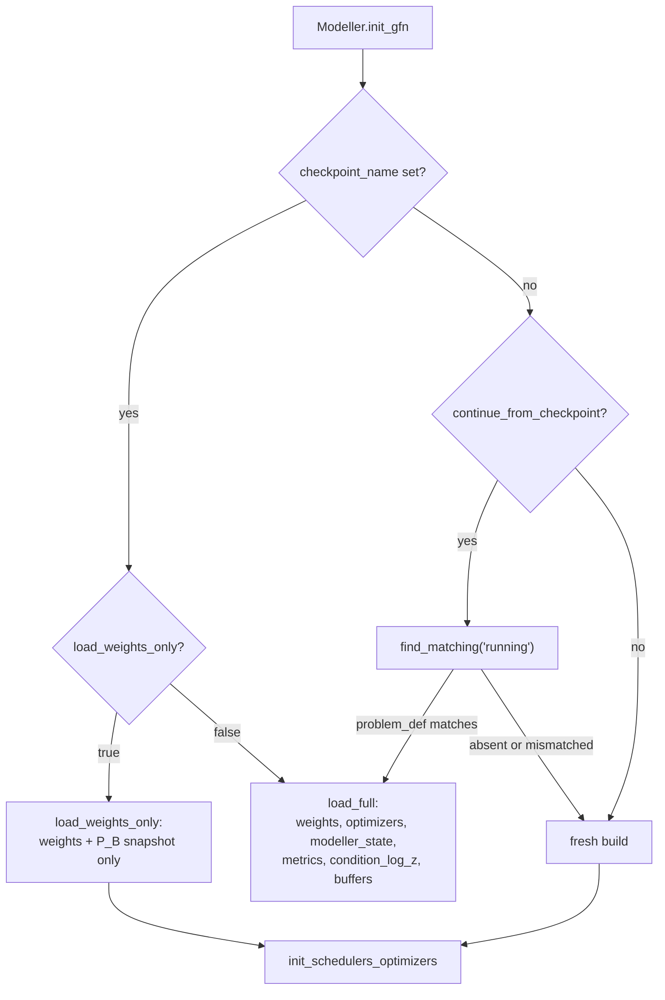

# Checkpoints and resume

*Drift: **C** (code-bound). Verified against commit `e17167e`, 2026-09-19. Sources at the end.*

A *checkpoint* is one `.pt` file holding everything needed to continue a run except the buffers, which live beside it in a *sidecar*. A *tag* is the short name at the end of the filename (`running`, `best`, `phase1_exit`, `step40000`) and is the only thing distinguishing two checkpoints of one run.

Checkpoints carry position and the config carries behaviour. A checkpoint records which stage the run was in *by name* and how far the engine had got inside it, but no loss coefficients, no exit thresholds, no balance rules; those are re-derived from the current config at every start, so editing a config rewrites a resumed run's future (`checkpointing.py::MODELLER_STATE_DEFAULTS`, `protocol.py::StageProtocol.advance`).

## What a checkpoint contains

`checkpointing.py::Checkpointer.save` builds one dict:

| key | what it is |
|---|---|
| `gfn_config` | the model's construction arguments: the policy is rebuilt from the file, not the config |
| `model_train`, `model_eval` | the training policy and the EMA policy |
| `pb_frozen` | P_B's frozen snapshot under a full freeze, or `None`, which also *lifts* a freeze on restore |
| `optimizers` | every optimizer's state, including Adam's step counter |
| `metrics` | the running metric tracker's EMAs |
| `condition_log_z` | the per-condition empirical log Z table |
| `modeller_state` | the fields of `checkpointing.py::MODELLER_STATE_DEFAULTS`, plus the gradient-clip tracker |
| `problem_def`, `problem_hash`, `train_T`, `run_name`, `tag` | identity and provenance |

`modeller_state` holds `step_ind`; `stage`, a stage *name* resolved against this config's `protocol.stages` list at load; `stage_ctrl`, the whole mutable stage engine, covering exit-term pass streaks, balance running bests, live annealed thresholds, gate windows, the `request_eval` flag (`protocol.py::fresh_stage_ctrl`); the batch sizer's conclusion and OOM ceiling; the log-Z absorber's variance; the progress gate's evidence history; the branch fracs; and the LR controller's scale and bracket. Restored batch state is then handed back to the config, clamped to `cfg:max_batch_size` and pinned when `cfg:grow_batch_size` is off.

## The files a run writes

Every path is `{checkpoints_dir}/{run_name}_{problem_slug}_{tag}.pt`, the slug being a human-readable tag that is never parsed back (`checkpointing.py::Checkpointer.path_for`, `utils.py::problem_slug`).

- **`running`**: every 50 steps, unconditionally.
- **`best`**: hardlinked off `running` when the combo-loss record sets a new minimum; `utils.py::atomic_save` swaps the directory entry, so the link freezes those bytes.
- **`last_ok`**: the rewind target, relinked whenever the combo loss is within `cfg:rewind_tolerance` of the best.
- **`step<N>`**: a periodic archive every `cfg:archive_period` steps, also a hardlink; `cfg:archive_buffers` links the rolling sidecar alongside it.
- **`final`**: once, after the step loop, with buffers.
- **Phase-exit snapshots**: `on_exit: ['snapshot:phase1_exit']` writes the outgoing stage's untouched end state *before* any transition mutation, with its own frozen sidecar (`protocol.py::StageProtocol._snapshot`). `snapshot_prior` additionally writes `prior` and deletes `best`.
- **`stage_start`**: written after the incoming stage's `on_enter` actions, so a spike rewind lands on the new stage.

`cfg:checkpoint_read_only` suppresses every write above and leaves loading untouched.

## The three ways a run starts

**Fresh.** No file is read; `protocol.py::StageProtocol.begin` pins the first stage and walks any `skip_if` chain.

**Warm start (`cfg:checkpoint_name`).** A named file, by path, from any run. With `cfg:load_weights_only` false this is `load_full`: weights, P_B snapshot, optimizers (Adam moments and step counter), `modeller_state`, metric tracker, condition-log-Z table, buffers. A checkpoint with no `stage` key predates the stage protocol and is refused outright. `cfg:override_learning_rates` then stamps this config's rates over the restored ones, the fused optimizer's trailing group taking `cfg:lr_flow` as the Z head.

With `load_weights_only` true, only the train and EMA weights and the P_B snapshot are read; everything else starts fresh, so the run opens at step 0 in the first stage with no buffers and no restored step count. This is the only path honouring `cfg:warm_start_ignore_problem_keys`.

**Auto-resume (`cfg:continue_from_checkpoint`).** Reads *this run identity's own* `running` file via `checkpointing.py::Checkpointer.find_matching`, then takes the same `load_full` path. `load_weights_only` is read only on the `checkpoint_name` branch, and `continue_from_checkpoint` is inert while `checkpoint_name` is set, because `train.py::Modeller.init_gfn` tests that branch first. A missing or mismatched file is reported and the run starts fresh rather than raising.

Both loading paths rebuild the model from the *checkpoint's* `gfn_config`, except `RECONFIGURABLE_GFN_KEYS`, which follow this run's config. `dead_latent_rows` fixes the input width, so it is compared and a mismatch raises (`checkpointing.py::Checkpointer._assert_dead_rows_match`).

## What a resume does not do

**`on_enter` actions do not re-fire.** A resumed run is already *inside* its stage, and entry actions run only in `protocol.py::StageProtocol.advance`, i.e. at a transition. So `rebuild_prior_by_churn`, `bootstrap_z` and `freeze_pb` on a stage's `on_enter` do not happen on a resume into that stage, and the restored prior buffer stands as it was. Top-level `cfg:freeze_backward_policy` does apply, and never re-snapshots over one the checkpoint restored.

A pre-transition snapshot is the exception: `_snapshot` stamps `request_eval` true into the *saved* state only, so a run resumed from `phase1_exit` pulls its eval to the first post-resume step and the exit streaks in the same saved `stage_ctrl` re-fire the transition through the normal eval → `maybe_advance` path. No force flag exists, because a transition consumes eval-time metrics nothing checkpoints.

**The cadence anchor re-seeds.** `cfg:stage.fwd_rollout_every` counts from the step the stage was entered, not from the absolute counter, and the anchor is derived lazily rather than checkpointed, so a mid-stage resume re-seeds it and rolls out immediately, re-pinning log Z before training against it (`train.py::Modeller._fwd_gates`).

**Bars are not checkpointed.** Nothing in `train.py::Modeller._rollout_trigger_fires` is serialized: each bar re-reads at the next measurement, and a `None` reading never fires. The replay warm-up latch (`cfg:stage.replay_warmup_rows`) is per-stage and unsaved, so a resume with a restored buffer clears it at once while a weights-only start warms again.

## The buffer sidecar and its currency

Buffers dominate a save's bytes, so they are written separately and only at eval cadence, into `{stem}[_{tag}]_buffers.pt` (`checkpointing.py::BUFFER_SUFFIX`). The untagged file is the *rolling* sidecar; a tag gives a snapshot its own frozen copy. A resume therefore restores buffers up to `cfg:eval_period` steps staler than its weights, and the sidecar stores its `step_ind` so the lag is readable.

`checkpointing.py::Checkpointer.sidecar_candidates` works from the filename: the checkpoint's own frozen sidecar first, then the run's rolling one, reached by stripping a tag in `checkpointing.py::CHECKPOINT_TAGS` or an `_step<N>` suffix. `last_ok` and `stage_start` are in neither family, so a `checkpoint_name` pointed at one finds no sidecar and the buffers initialize fresh, which is not an error, and it says so. A mismatched `problem_def` is ignored the same way.

`cfg:buffers.fresh_on_switch` (`checkpointing.py::fresh_buffers_on_switch`, off by default) makes a load of another run's checkpoint, one whose stored `run_name` differs from this run's, skip the sidecar entirely: the prior and anchor buffers then seed from the prior dataset the live energy function has just re-analysed (`train.py::Modeller.init_prior_buffer_seed`, `train.py::Modeller.init_anchor_buffer_seed`) and the replay buffer refills from rollouts, so every stored row is scored by this run's energy function. It exists for a model switch under an unchanged problem identity (`cfg:mlip_path` is not part of it; `energy_sampling/configs/acr_m2_sep26/make.py` is the first user). A resume of the run's own checkpoint restores as usual, so a requeue never resets the buffers.

Currency is enforced in two halves. `buffer.py::CrystalBuffer._refuse_unknown_currency`, inside `from_state_dict`, is the structural half: crystal rows come back carrying an `lj_coeff` stamp or they do not come back, and a format-version-2 dict whose recorded coefficient disagrees with its rows is refused. Migration is a separate explicit script (`buffer.py::migrate_legacy_lj_coeff`). The value half cannot live there, since this run's coefficient is known only after the prior dataset is read, *after* the restore, so `checkpointing.py::Checkpointer.assert_buffer_currency` runs once buffers are seeded or restored and refuses a store stamped with another run's coefficient.

## `epochs` is an absolute bound

The step clock is `trange(init_step, self.args.epochs + 1)` with `init_step` the restored `step_ind` (`train.py::Modeller.train`). `cfg:epochs` is a ceiling on the absolute counter, not a run length: a resumed leg whose seed step exceeds `cfg:epochs` runs zero iterations and exits through the normal finish path, having written a `final` checkpoint.

## The global RNG is reset when a GFN is constructed

`mxtaltools/models/modules/components.py::scalarMLP.__init__` calls `torch.manual_seed(seed)` with a default of `0`, and `mxtaltools/models/modules/components.py::vectorMLP.__init__` does the same. A GFN builds several, so *constructing the model* puts torch's global RNG in a fixed state. `utils.py::set_seed` runs in `Modeller.__init__`, before `init_gfn`, so `cfg:seed` is overwritten by model construction on every path. A draw taken after `init_gfn` is governed by the construction seed, not by `cfg:seed`.

## Problem identity, and what it refuses

`utils.py::get_problem_definition` returns what says *which problem is being solved*: schema version, energy function, energy config minus a non-identity exclusion list, prior path, space groups, Z primes, conditioning flags. `utils.py::problem_hash` is a short SHA-256 of it and goes in the filename, but comparisons use the stored dict, normalized on both sides so growing the exclusion list does not orphan older files (`utils.py::normalize_problem_def`). A mismatch on an explicitly named file, `cfg:checkpoint_name` or `cfg:prior_model_name`, raises with a field-by-field report; on an auto-resume candidate it merely declines. Trajectory length `T` is *absent* from identity, so nothing refuses a checkpoint trained at another `T`.

## Owner choices

*Left for the owner. Three buckets: bullets bitten, design choices, priorities.*

## Config keys

`cfg:checkpoints_dir`, `cfg:checkpoint_name`, `cfg:load_weights_only`, `cfg:continue_from_checkpoint`, `cfg:prior_model_name`, `cfg:warm_start_ignore_problem_keys`, `cfg:override_learning_rates`, `cfg:checkpoint_read_only`, `cfg:archive_period`, `cfg:archive_buffers`, `cfg:rewind_tolerance`, `cfg:freeze_backward_policy`, `cfg:epochs`, `cfg:eval_period`, `cfg:seed`, `cfg:max_batch_size`, `cfg:grow_batch_size`, `cfg:lr_flow`, `cfg:stage.on_enter`, `cfg:stage.on_exit`, `cfg:stage.fwd_rollout_every`, `cfg:stage.replay_warmup_rows`.

Code: `checkpointing.py::Checkpointer.save`, `.archive`, `.link`, `.path_for`, `.sidecar_candidates`, `.load_buffers_for`, `.assert_buffer_currency`, `.load_full`, `.load_weights_only`, `.find_matching`, `.assert_problem_match`, `.reconcile_batch_size`, `._assert_dead_rows_match`; `checkpointing.py::MODELLER_STATE_DEFAULTS`, `CHECKPOINT_TAGS`, `BUFFER_SUFFIX`; `train.py::Modeller.init_gfn`, `.train`, `._fwd_gates`, `._rollout_trigger_fires`; `protocol.py::StageProtocol.begin`, `.advance`, `.maybe_advance`, `._snapshot`, `._snapshot_prior`; `protocol.py::fresh_stage_ctrl`; `buffer.py::CrystalBuffer.from_state_dict`, `._refuse_unknown_currency`; `buffer.py::migrate_legacy_lj_coeff`; `utils.py::get_problem_definition`, `normalize_problem_def`, `problem_hash`, `problem_slug`, `atomic_save`, `set_seed`; `models/gfn.py::GFN.pb_snapshot_state`; `mxtaltools/models/modules/components.py::scalarMLP.__init__`, `mxtaltools/models/modules/components.py::vectorMLP.__init__`.

## Could be tooling

Most of this page is a manifest a script could print better than prose describes it: given a checkpoint path, dump tag, step, stage name, `train_T`, P_B snapshot presence, which optimizers carry state, the problem definition diffed against a named config, and which sidecar `sidecar_candidates` resolves to, with its lag and stamped coefficient. The other check belongs at config-generation time: assert `epochs` exceeds the seed's `step_ind` by the intended budget.

## Sources

The code above, read at the stamped commit, and the Checkpoints block of the canonical config. Nine memory files (project_epochs_is_absolute_and_resumes_can_start_past_it, project_gfn_construction_resets_global_rng, project_rebuild_prior_on_resume_trick, project_phase_exit_checkpoints and others on warm starts, buffer stamps and the stage protocol) located the code and were not used as evidence; several name a `phases.py`/`PhaseController` layer and an `mle_gate['request_eval']` latch that no longer exist.
