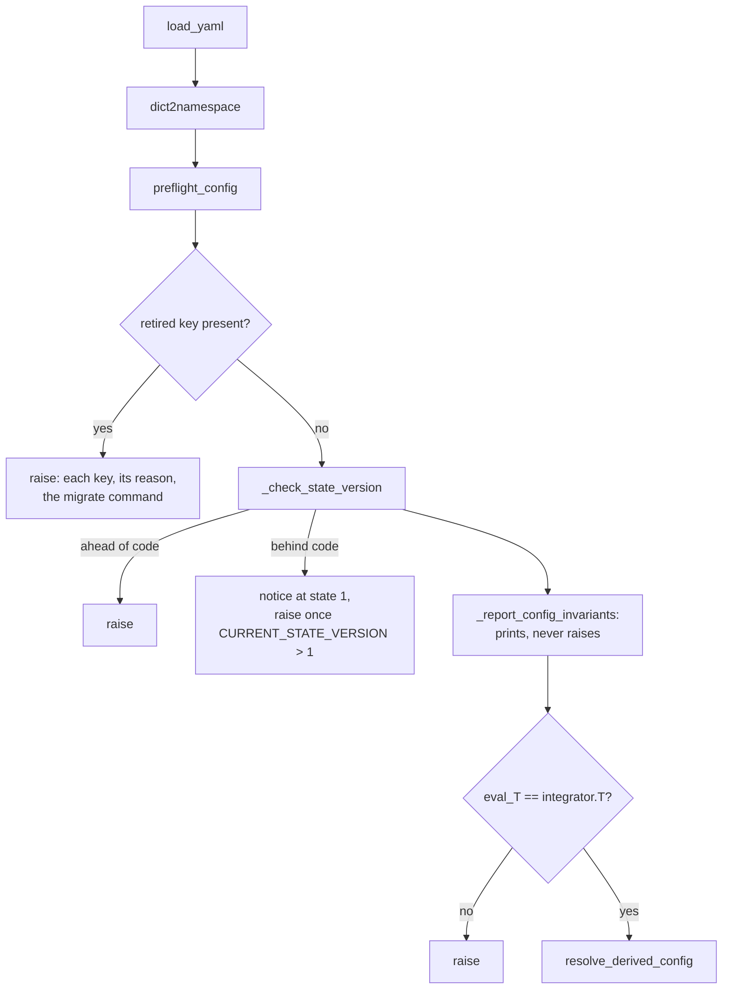

# Config validation

*Drift: **C** (code-bound). Verified against commit `a637e70`, 2026-09-20. Sources at the end.*

A run is a YAML file. `utils.py::get_train_args` takes one named argument, `--config PATH`, and returns `resolve_derived_config(preflight_config(dict2namespace(load_yaml(path))))`; nothing else in `train.py` reads the file. Between the text on disk and the object the trainer holds, the nested dicts become an `argparse.Namespace` tree, the config is refused if it carries a retired key or a stale state stamp, and values written `auto` become numbers derived from the primitives. This page covers those gates, the rules that report without gating, and the versioning that repairs an old file.

## The canonical config

`configs/mk_dev.yaml` carries `cfg:project_state_version` at 10, the run identity, every block the trainer reads, and both protocols under `cfg:protocols` with the live one named in `cfg:protocol`. The generator takes it as the base (`configs/generate.py::CANONICAL`) and stamps its hash into every arm as `canonical_sha` (`configs/generate.py::stamp`, `canonical_hash`); the mode-safety and snapshot suites perturb it rather than a fixture. A key read as `getattr(cfg, 'name', default)` and absent from this file resolves to the fallback, and no reader of the canonical config can see that it exists. Generation itself is [battery-generation](battery-generation.md).

## The load path

`utils.py::resolve_derived_config` needs both primitives, $T$ = `cfg:integrator.T` and $W$ = `cfg:model.policy_hidden_dim`, and returns unchanged if either is missing. Each key in `utils.py::_LR_KEYS` written `auto` is overwritten with `cfg:lr_control.seed_lr`, or with a module-level seed when that key is unset, and its name recorded on `args.lr_servo_managed`, since after the overwrite `auto` and an explicit float are the same value; `utils.py::_require_lr_control` then raises if nothing can move a managed rate. `cfg:lr_flow` is not in `_LR_KEYS` and must be an explicit number. `cfg:gradient_norm_clip` written `auto` resolves to `_CLIP_ANCHOR * grad_median(T)/grad_median(25) * sqrt(W/512)`. What was derived is printed.

`config_snapshot.py::snapshot` runs that same path and captures what it produced: the resolved tree, `lr_servo_managed` as a per-key boolean map, the resolved periodic-centroid axes, and a summary per active stage including effective loss coefficients computed by `protocol.py::StageProtocol.coeffs` over a stub modeller. A config that fails to load returns `load_error` rather than raising. `compare` flattens two snapshots to dotted paths and sorts differences into CHANGED, ADDED, REMOVED and ENVIRONMENT; `_shape_changes` files a path that is a leaf on one side and a subtree on the other as CHANGED, because `Comparison.behaviour_preserved` reads CHANGED only.

`python -m config_snapshot <cfg> --check` calls `contract`, which composes the load, every invariant rule, and the requirement that the active protocol resolve to at least one stage whose coefficients computed without error. It cannot be combined with the comparison or snapshot-output options, and its issue list includes BASELINE violations.

## The invariant rules

`config_invariants.py` holds pure functions of a raw config dict: no torch, no model construction, so they run over a YAML file on disk as readily as over a loaded run. A rule receives the whole config and returns a list of `Violation`, each carrying a severity, the rule's name and a detail string. `ERROR` is a relation wrong under any circumstances; `BASELINE` is a project default a run may knowingly depart from. Stage-scoped rules read `active_stages`, which resolves `cfg:protocol` against `cfg:protocols` and returns `[]` when it cannot, rather than raising.

A rule abstains where it cannot know: `_num` returns `None` for `auto`, and a rule with a `None` input returns `[]`. That does not extend to a key with a code fallback, where an unset key is not an unmade choice but the fallback value. `conditional_z_settings_are_conditional` judges absence for that reason: a stage that sets `tb_z_source` nowhere on a conditional route is reported, because `train.py::Modeller.tb_z_source` falls back to `learned`.

The rules in `config_invariants.py::RULES`, each against the config relation it refuses:

| rule | what it refuses |
|---|---|
| `protocol_selector_resolves` | a selector naming an absent or stageless protocol, which leaves every stage rule vacuous |
| `every_protocol_parses` | a protocol that fails `Stage` parsing, selected or not |
| `vargrad_needs_groups` | VarGrad where grouping cannot give 2 rows per group |
| `conditional_z_settings_are_conditional` | unconditional Z settings on a conditional route (BASELINE) |
| `auto_lr_requires_lr_control` | `auto` with no `lr_control` to move it; a float declared managed |
| `lr_bracket_is_well_formed` | a bracket whose grid or reading cannot fail |
| `burn_in_reaches_adam_steady_state` | a burn-in too short for Adam's bias correction |
| `periodic_centroids_needs_one_crystal_space_group` | that feature with other than one crystal space group |
| `loaded_data_paths_are_not_null` | `prior_path` or `molecules_path` null where a loader `torch.load`s them |
| `lr_probe_is_retired` | an `lr_probe` block, gated here rather than by a transition |
| `exit_patience_is_reachable` | a patience counting more metric writes than the schedule produces |
| `exit_bar_is_within_measured_range` | a bar outside its metric's observed range |
| `util_target_actuable` | `batch_util_target` with growth off, no headroom, or outside the fraction range |
| `figs_period_fires` | `figs_period` not a multiple of `eval_period` |
| `batch_ceiling_above_floor` | `max_batch_size` below `batch_size` |
| `dplr_is_well_formed` | `dplr_rho_max` outside $[0,1)$; DPLR unmasked where angular dims are implied |
| `deactivate_threshold_is_sane` | a threshold at or above 1/3, which can empty a three-way split |
| `pinned_frac_matches_fracs` | `balance.pinned.<mode>` disagreeing with the stage's `fracs.<mode>` |
| `effective_batch_meets_baseline` | an effective batch below `MIN_EFFECTIVE_BATCH` (BASELINE) |
| `fwd_rollout_cadence_is_well_formed` | a cadenced stage whose other settings undo the cadence |
| `z_fill_mode_is_well_formed` | a malformed fill mode, variance or reset |
| `batch_root_forward_is_well_formed` | `tb_z_source: batch_root` on bwd or replay, or with no cadence |
| `replay_seat_is_well_formed` | the replay-seat keys, an audit twin of `Modeller.set_loss_coeffs` |
| `condition_draw_is_well_formed` | the two condition draws, likewise |

One rule set, three severities by entry point. At load, `utils.py::_report_config_invariants` prints everything, raises nothing, and swallows its own exception. At generation, `configs/generate.py::validate` makes ERROR fatal and returns BASELINE for reporting. Under `--check`, both are failures.

## Retired keys

`utils.py::_RETIRED_KEYS` maps 66 dotted paths to the reason each was deleted. `preflight_config` walks every one with `_walk_key` and raises if any is present, naming each key with its reason and pointing at `python -m config_state migrate`. The check is at load, not at first use, and is a hard failure rather than a warning.

Because the key is refused at load, it is absent from every loadable config by construction, so runtime code reading one through `getattr(cfg, key, False)` sits behind a branch that can never be taken. `tests/config/test_no_gating_on_retired_keys.py` reconstructs dotted paths from the AST of twelve runtime modules and fails on any such read, matching by path rather than by leaf because about half the retired entries are relocations whose leaf is live at a new home.

## Project state and migrations

`config_state.py` holds the semantic history and the executable migrations as one artifact. `CHANGES` is a tuple of `Change` records, each carrying the state it landed in, a summary, components, invariants and validation. A change carries a `Transition` if and only if it moves the state integer, the test being whether a config or checkpoint written before it could be read wrong afterwards: a rename, a removal, a reinterpretation, a default whose meaning moved, but not a bug fix or a refactor. `CURRENT_STATE_VERSION` is the maximum state over `CHANGES`, currently 10, derived rather than written as a literal.

A `Transition` carries `added`, `renamed`, `removed`, `manual`, `moved` and an optional `migrate_fn`. `migrate` deep-copies the config and applies each transition between the declared and target states in add, rename, remove order, then the escape hatch, then the version stamp. Keys in `manual` are left as found and reported in `MigrationReport.needs_judgment`, and the CLI refuses `--write` while any item needs judgment; `moved` is declaration only, because `removed` pops before `migrate_fn` runs. A config ahead of the code raises in both `migrate` and `_check_state_version`; behind the code it is a printed notice while `CURRENT_STATE_VERSION` is 1 and a raise thereafter, so at state 10 a stale stamp is fatal at load. `render_history_markdown` generates `docs/change_history.md`, and `tests/config/test_config_state.py` fails when that file is stale.

## Absence

An absent key is the code's fallback. An absent block is a disabled feature, with no error: `grad_clip_guard.py::GradClipGuard.from_config` returns a disabled guard for a `None` config, so a config with no `cfg:grad_clip_guard` block runs on the static `cfg:gradient_norm_clip` bar; `train.py` reads `getattr(self.args, 'z_calibration', None)` at five sites and returns early on `None`; a stage with no `lr_sensor` block runs no sensor, which `config_snapshot.py::_stage_summary` records as the string `absent (no sensor)` so that a dropped block reads as a CHANGED value. An *unknown* key inside such a block is a hard error, in `GradClipGuard.from_config`, in `protocol.py::Stage.__init__`'s closed key set, and in `StageProtocol.coeffs` for an override with no base entry, while the block's absence is checked nowhere.

## Identity and paths

Problem identity is a separate axis: `utils.py::get_problem_definition` versions what problem is being solved so a resume can refuse a checkpoint trained under different physics, and a migration across `cfg:project_state_version` leaves it untouched ([checkpoints-and-resume](checkpoints-and-resume.md)).

Nothing in the load path or the rules judges whether a path is reachable from the machine that will run the config. `loaded_data_paths_are_not_null` refuses an explicitly null `cfg:prior_path` or `cfg:molecules_path` and states that absent is not null; no rule reads the string, so a drive-letter path is refused nowhere in the load path. The shared generator performs no drive-letter scan, and `assert_no_local_paths` is defined as a copy in eleven battery `make.py` files.

## Owner choices

*Left for the owner. Three buckets: bullets bitten, design choices, priorities.*

## Config keys

`cfg:project_state_version`, `cfg:protocol`, `cfg:protocols`, `cfg:integrator.T`, `cfg:eval_T`, `cfg:model.policy_hidden_dim`, `cfg:lr_policy`, `cfg:lr_back`, `cfg:lr_replay`, `cfg:lr_fused`, `cfg:lr_flow`, `cfg:lr_control.seed_lr`, `cfg:gradient_norm_clip`, `cfg:grad_clip_guard`, `cfg:z_calibration`, `cfg:prior_path`, `cfg:molecules_path`, `cfg:energy_function`, `cfg:batch_size`, `cfg:max_batch_size`, `cfg:grow_batch_size`, `cfg:batch_util_target`, `cfg:figs_period`, `cfg:eval_period`, `cfg:model.dplr_rank`, `cfg:model.dplr_mask_angular`, `cfg:model.periodic_centroids`, `cfg:space_groups`, `cfg:fwd_loss_coeffs.tb_z_source`.

Code: `utils.py::get_train_args`, `load_yaml`, `dict2namespace`, `preflight_config`, `resolve_derived_config`, `_RETIRED_KEYS`, `_walk_key`, `_check_state_version`, `_report_config_invariants`, `_require_lr_control`, `_LR_KEYS`, `get_problem_definition`; `config_snapshot.py::snapshot`, `contract`, `compare`, `flatten`, `_shape_changes`, `_stage_summary`, `Comparison.behaviour_preserved`; `config_invariants.py::check`, `errors`, `RULES`, `Violation`, `active_stages`, and the rules named above; `config_state.py::CHANGES`, `Change`, `Transition`, `migrate`, `MigrationReport`, `render_history_markdown`, `CURRENT_STATE_VERSION`; `configs/generate.py::CANONICAL`, `canonical_hash`, `stamp`, `validate`; `grad_clip_guard.py::GradClipGuard.from_config`; `protocol.py::Stage.__init__`, `StageProtocol.coeffs`; `train.py::Modeller.set_loss_coeffs`, `Modeller.tb_z_source`; `tests/config/test_no_gating_on_retired_keys.py`.

## Could be tooling

Coverage of the canonical config is mechanical from what is already here: an AST walk collecting every `getattr(X, 'name', default)` where `X` is a config object, resolved to a dotted path the way `test_no_gating_on_retired_keys.py` already resolves receivers, set-differenced against the flattened keys of `configs/mk_dev.yaml`. Every name in the difference is a live key with a silent default, and the walk also yields each fallback, which is what a rule needs in order to judge absence. Absent blocks fall out of the same walk, as receivers read with a `None` default and an early return. Path reachability is the third: one drive-letter scan in `configs/generate.py` replaces eleven copies.

## Sources

The code above, read at the stamped commit, and `configs/mk_dev.yaml` and `docs/change_history.md` as they stand there. Memory files located the code and were not used as evidence: feedback_mk_dev_carries_every_live_key, feedback_invariants_must_judge_absence, feedback_no_runtime_gate_on_a_retired_key, project_config_snapshot_drift_audit, project_infrastructure_stabilization, project_local_paths_pass_local_preflight.
