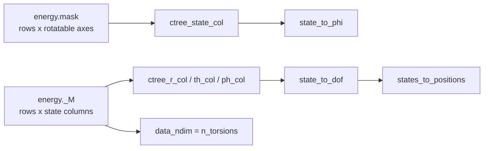

# Conformer chart and internal coordinates

*Drift: **M** (mixed). Verified against commit `a637e70`, 2026-09-20. Sources at the end.*

A conformer is a point in one molecule's internal-coordinate space, and the sampler proposes on a box $[-1,1]^d$ rather than on that space. This page is about the chart between them: the tree that names the coordinates, the tiers that decide which are free, the map from state to degrees of freedom, the redundancies the tree carries, and the column tables that address the chart from the graph side. Four neighbours have their own pages: [conformer-force-field-and-prior](conformer-force-field-and-prior.md), [conformer-training](conformer-training.md), [conformer-conditioning-and-carrier](conformer-conditioning-and-carrier.md) and [molecule-encoder](molecule-encoder.md).

## The tree, and uniqueness up to Aut(G)

`mxtaltools/conformers/topology.py::TreeSpec` is one spanning tree per molecule. Atoms are relabelled into *placement order*, and the atom in slot $k$ owns $\min(k,3)$ coordinates: slot 1 a bond $r$, slot 2 a bond and an angle $\theta$, every later slot a bond, an angle and a dihedral $\phi$. `TreeSpec.n_dof` is defined as $3N-6$, and `ConformerTorsions.__init__` asserts that its block widths $N-1$, $N-2$, $N-3$ sum to it. The six external degrees of freedom are spent by the seed convention: root at the origin, slot 1 along $+x$ (`geometry.py::place_seed_second`), slot 2 in a canonical plane (`::place_seed_third`, whose docstring records three of the six being consumed there), so `builder.py::build` emits positions already SE(3)-reduced.

Ordering decisions break ties on `topology.py::canonical_rank`, colour refinement over $(z, \text{neighbours})$ with no coordinates and no RDKit. `::choose_root` takes the graph centre tie-broken by $(z>1, \deg, -\text{rank}, -\text{index})$, `::_canonical_bfs` visits neighbours in rank order, `::_pick` ranks reference candidates by $(\deg, -\text{rank}, -\text{index})$. Atoms still tied after refinement are orbits of the automorphism group $\mathrm{Aut}(G)$: a methyl's three hydrogens, the ortho carbons of a monosubstituted ring. Any choice within an orbit gives an isometric tree, so the chart is determined by the molecule up to $\mathrm{Aut}(G)$ and no further, the residual index tie-break making it concrete. That bound follows from refinement, not from this code.

## The tiers, and what freezing does to the distribution

`ConformerTorsions.LEVELS` is `("torsion", "dihedral", "flex", "full")`, chosen by `cfg:energy_config.level`, which is keyword-only with no default and no `**kwargs` behind it. `full` frees all $3N-6$ rows, `flex` the $\theta$ and $\phi$ rows, `dihedral` the $\phi$ rows, `torsion` one collective column per rotatable bond.

Write $q = (s,f)$ with $s$ frozen and $f$ free, and the target at `full` as $p(s,f) \propto e^{-U(q)/T} J_{\mathrm{BAT}}(q)$. Freezing $s$ at $c_0$ makes the sampled density

$$p(f \mid s = c_0) = \frac{p(c_0, f)}{\int p(c_0, f')\,df'},$$

a conditional slice, whereas the marginal a `full` sampler's $f$ coordinates follow is $p(f) = \int p(s,f)\,ds$. The two coincide only if $p$ factorises as $p_1(s)p_2(f)$, which the potential does not: redundant graph angles, ring closure and the nonbonded term all couple $r$ and $\theta$ to $\phi$. The rigid-constraint ensemble is a third object, differing from the slice by a state-dependent Fixman factor $|H|^{1/2}$, the Schur complement of the mass-metric tensor over the frozen block, so it is not a normalisation either.

## State to DoF: one linear map, and where the inverse exists

`ConformerTorsions.dof_from_state` is a single scatter at every tier,

$$q = q_{\text{ref}} + \text{scatter}\big((x \odot \text{scale})\,M^{\top}\big),$$

with `_ref_dof` the reference vector, `_free_scale` per column (`delta_r_max` on $r$, `delta_theta_max` on $\theta$ and on a transverse column, $\pi$ on $\phi$), `_M` the map restricted to driven rows and `_driven_idx` their indices. The product of those scales is `log_chart_jacobian`, $\log|dq/dx| = \sum_j \log \text{scale}_j$, added to the log reward in `::energy`; it is constant in $x$ and cancels from a TB residual, and it differs between molecules because their free-column counts do.

The same function clamps $r$ at `r_floor` and $\theta$ into $(\theta_{\text{floor}}, \pi-\theta_{\text{floor}})$; `_lin_free_idx` is empty at `torsion` and `dihedral`, so the clamp is skipped there. Its docstring gives the clamp, not the box wall, as the domain guarantee: $2\log r$ is NaN at $r \le 0$, $\log\sin\theta$ is NaN or $-\infty$ outside $(0,\pi)$, and `build` is non-injective off domain since $d(r, 2\pi-\theta, \phi+\pi) = d(r,\theta,\phi)$, which `builder.py::measure` cannot detect because `geometry.py::bond_angle` returns $[0,\pi]$ always. A transverse column is exempt: its slot holds $u$, whose domain is a disc with the pole in the interior.

At `torsion` a column is *collective*: `_find_rotatable` builds its mask column as $(\texttt{torsion\_index}[:,1]=u) \wedge (\texttt{torsion\_index}[:,2]=v)$ for a tree bond $(u,v)$ that is a bridge of the full graph with a heavy atom on the moving side, so one column adds the same displacement to every dihedral about that bond, a rigid rotation of the moving fragment. `ConformerTorsions.collective` records whether any column drives more than one row, and `::state_from_dof` raises `NotImplementedError` in that case. At the selection tiers `_sel_rows` holds one row per column and `state_from_dof` inverts the affine map, wrapping the $\phi$ columns to $[-1,1)$; with transverse rows present it converts the polar pair to $(u,v)$ first, so it inverts `dof_from_state` followed by the chart-to-polar step. `periodic_dims` returns the columns with block code 2, the $\phi$ columns and only those, and `conformer_modeller.py::ConformerModeller._build_gfn_config` passes it as `angular_mask`.

## Redundant DoF families

A tree dihedral over $(a,b,c,n)$ is a torsion about the $b$-$c$ bond only when the far reference $a$ lies one bond further out, bonded to $b$. `ConformerTorsions.improper_phi_rows` returns the rows where $a$ is instead bonded to $c$; that dihedral is measured between two substituents of the same parent and *is* the angle between them. Its docstring gives ethanol's row 1, the dihedral being the O4-C0-H1 angle.

`ConformerTorsions.torsion_groups` partitions the non-improper $\phi$ rows by central bond, leader first, every member taking the leader's displacement. On a spanning tree each atom has exactly one parent, so for a proper row the reference $b$ is a function of $c$ and keying on parent or on central bond gives the identical partition; impropers are the only rows sharing a parent with a different reference.

A ring-closure bond is not in the tree. It goes into `broken_bond_index`, its length becomes a determined function of the tree coordinates through `builder.py::closure_length`, and the force field scores it as an ordinary graph bond. Differences of sibling dihedrals in a group likewise fix graph angles the tree does not expose as coordinates.

## Chirality is a discrete label the chart cannot change

In `geometry.py::place_nerf` the dihedral enters through $\cos\phi\,\mathbf{m}_2$ and $\sin\phi\,\hat{\mathbf{n}}$, and only the second term is odd, so $\phi \to -\phi$ on every row is exactly the global reflection. The chart is SE(3)-reduced and not reflection-reduced: each physical conformer appears twice, and MMFF and the reference field are mirror-invariant, so no term in the potential separates the images. At `torsion` the frozen $r$ and $\theta$ already carry a configuration; at `dihedral` and above the sign is free. The label is fixed outside the chart by `energies/dof_features.py::atom_parity`, the signed triple product of three neighbours in $\{-1,0,+1\}$, read off the reference conformer and restricted to RDKit's perceived stereocentres.

## Column bookkeeping, and where two tables disagree

The diagram traces the two column tables, `energy.mask` and `energy._M`, to the `ctree_*` fields each one feeds.

`energy.mask` is the rotatable-bond mask, built with no reference to the tier and byte-identical at all four. `energy._M` is the tier's own map, built by zeroing every row on a chart singularity and dropping the columns that then drive nothing, so `data_ndim` is the surviving column count and is what `conformer_data.py` stores as `n_torsions`. `::_state_columns` reads `mask`; `::_dof_state_map` reads `_M` with `_free_scale`, and its docstring records the graph reconstruction missing the energy's by 5 to 6 Å on butanol at every tier above `torsion`. `::state_to_dof` reads it and raises with a rebuild instruction when it is absent.

The two counts are the same quantity only at `torsion`; above it they differ by construction. At `torsion` they come apart on a molecule with a linear centre. The `singular` mask zeroes the $\theta$ rows flagged `angle_is_linear` and not carried transversely, and every $\phi$ row flagged `torsion_frame_is_linear`; `keep = m_full.any(axis=0)` then drops a rotatable column whose dihedral rows were all zeroed, so the column survives in `mask` while `data_ndim` is smaller and `ctree_state_col` names a state column the row does not have. `build_conformer_conditions.py` compares the two column counts at `torsion` only and skips such a molecule with `chart defect: ... (alkyne?)`. `energies/conformer_carrier.py::carrier_pad_condition` remaps the `ctree_*_col` triple into the carrier layout and states that `ctree_state_col` is not remapped, because it indexes rotatable axes.

The linearity flags themselves are measured in `ConformerTorsions`, not in the tree: `spec_from_graph` is called with `use_geometry=False`, so `spec.angle_is_linear` is all False. `self.linearity_source` is `'mmff_typed'` when `cfg:energy_config.force_field` is `mmff`, reading MMFF's typed equilibrium angle $\theta_0 \ge 179.99°$ off the graph, and `'measured'` otherwise, reading the reference conformer against `LINEAR_TOL_DEG`.

A linear row is either held or carried as the transverse pair $(u,v) = \rho(\cos\phi,\sin\phi)$ with $\rho = \pi-\theta$, under which $\sin\theta\,d\theta\,d\phi = \mathrm{sinc}(\rho)\,du\,dv$ and the divergence becomes `geometry.py::log_sinc`. The pair needs the bend to be linear, the atom to have a $\phi$ row holding $v$, and its placement frame not to be collinear. `ConformerTorsions.__init__` raises at `level == 'full'` when any row is held, unless `allow_constrained`.

## Atom order, and the encoder contract

`spec.perm[k]` is the original RDKit index of placement slot $k$. The encoder builds its own atom order, and `models/encoder_cache.py::embed` takes `perm` and returns per-atom embeddings in tree order; it also takes `z_tree = spec.z` and checks the alignment against it, and a length mismatch raises separately. `ConformerTorsions.__init__` and `._find_rotatable` use the inverse permutation to move the bond graph and the `networkx` bridge set into slot numbering, and `conformer_data.py::condition_from_energy` applies `perm` to the Gasteiger charges before writing them to `mol.x`.

## Owner choices

*Left for the owner. Three buckets: bullets bitten, design choices, priorities.*

## Config keys

`cfg:energy_config.level`, `.smiles`, `.force_field`, `.delta_r_max`, `.delta_theta_max`, `.r_floor`, `.theta_floor`, `.bounding_coeff`, `.include_trivial_rotations`. `energy_config` is filtered against the constructor signature, so `.rho_wall` and `.allow_constrained` are settable the same way; neither appears in a shipped config.

Code, gfn_diffusion: `energies/conformer_torsions.py::ConformerTorsions.__init__`, `.LEVELS`, `.dof_from_state`, `.state_from_dof`, `._find_rotatable`, `.torsion_groups`, `.improper_phi_rows`, `.periodic_dims`, `.describe`; `energies/conformer_data.py::_dof_state_map`, `::_state_columns`, `::state_to_dof`, `::state_to_phi`, `::states_to_positions`, `::condition_from_energy`; `energies/conformer_carrier.py::carrier_pad_condition`; `energies/dof_features.py::atom_parity`; `models/encoder_cache.py::embed`; `conformer_modeller.py::ConformerModeller._build_gfn_config`; `build_conformer_conditions.py`.

Code, mxtaltools (paths from that repo's root): `mxtaltools/conformers/topology.py::TreeSpec`, `::canonical_rank`, `::choose_root`, `::_canonical_bfs`, `::_pick`, `::spec_from_graph`; `mxtaltools/conformers/builder.py::build`, `::measure`, `::closure_length`; `mxtaltools/conformers/geometry.py::place_nerf`, `::log_sinc`, `::bond_angle`, `::place_seed_second`, `::place_seed_third`.

## Could be tooling

`ConformerTorsions.describe` prints the tier, the per-block free counts, the linearity source, the transverse and constrained lines and one line per rotatable axis. The same table read from the graph side, `mask` columns against `_M` columns against `n_torsions`, decides whether `ctree_state_col` and the `ctree_*_col` triple agree for a molecule at a tier, and it is computable for every molecule in a conditions file at build time.

## Sources

Repo: `docs/design/internal_dof_ladder.md`, `docs/design/conformer_parameterisation.md`, `docs/design/conformer_conditional_stack.md` section 1, and the code above read at the stamped commit (mxtaltools read from the sibling checkout). Memory files project_internal_dof_ladder, project_conformer_internal_coords, project_conformer_prior_redundant_dof_bugs, project_alkyne_chart_defect and project_encoder_and_conformer_atom_orders_differ located the code and were not used as evidence.
