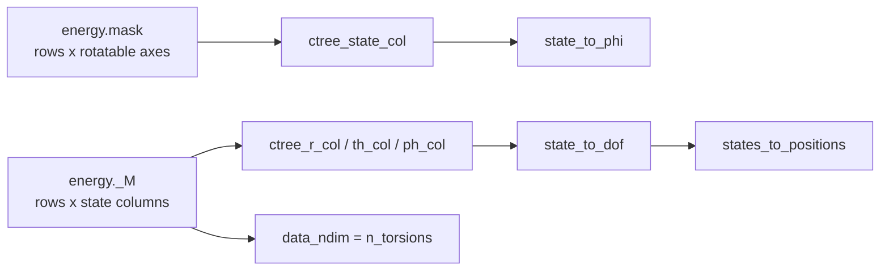

# Conformer chart and internal coordinates

*Drift: **M** (mixed). Verified against commit `a637e70`, 2026-09-20; the paragraph on the perceived bond graph verified on 2026-09-26 against commit `5f4828d` plus uncommitted working-tree changes that are in no commit yet; the root rule, the tier sentence on the tree, the chirality section, the `singular` mask and the linear-row and dummy-frame paragraphs verified on 2026-09-26 against commit `9c532ac` and mxtaltools `1e081312` (branch `claude/conf-alkyne`), both plus uncommitted working-tree changes that are in no commit yet; the chirality section after its rewrite for the stereo lock, and the `torsion_groups` sentence, verified on 2026-09-26 against commit `9c532ac` plus uncommitted working-tree changes; the builder's `chart_defect` sentence, the builder's handling of a `ChartRefused` code and the shipped-config sentence under Config keys verified on 2026-09-27 against commit `9c532ac` plus uncommitted working-tree changes, and that sentence re-verified the same day against a later state of those changes, in which `configs/conformer_mk.yaml` declares `stereo_coeff`; the stored-reference sentences of the perceived-graph paragraph written on 2026-09-30 and verified on 2026-10-01 against commit `f60dea0` plus the working-tree changes committed with them; the bounded double-bond dihedral paragraph, the scale, clamp and `periodic_dims` sentences around it and its config-key sentence written on 2026-10-02 against commit `9b4798e` plus the working-tree changes committed with them. Sources at the end.*

A conformer is a point in one molecule's internal-coordinate space, and the sampler proposes on a box $[-1,1]^d$ rather than on that space. This page is about the chart between them: the tree that names the coordinates, the tiers that decide which are free, the map from state to degrees of freedom, the redundancies the tree carries, and the column tables that address the chart from the graph side. Four neighbours have their own pages: [conformer-force-field-and-prior](conformer-force-field-and-prior.md), [conformer-training](conformer-training.md), [conformer-conditioning-and-carrier](conformer-conditioning-and-carrier.md) and [molecule-encoder](molecule-encoder.md).

## The tree, and uniqueness up to Aut(G)

`mxtaltools/conformers/topology.py::TreeSpec` is one spanning tree per molecule. Atoms are relabelled into *placement order*, and the atom in slot $k$ owns $\min(k,3)$ coordinates: slot 1 a bond $r$, slot 2 a bond and an angle $\theta$, every later slot a bond, an angle and a dihedral $\phi$. `TreeSpec.n_dof` is defined as $3N-6$, and `ConformerTorsions.__init__` asserts that its block widths $N-1$, $N-2$, $N-3$ sum to it. The six external degrees of freedom are spent by the seed convention: root at the origin, slot 1 along $+x$ (`geometry.py::place_seed_second`), slot 2 in a canonical plane (`::place_seed_third`, whose docstring records three of the six being consumed there), so `builder.py::build` emits positions already SE(3)-reduced.

Ordering decisions break ties on `topology.py::canonical_rank`, colour refinement over $(z, \text{neighbours})$ with no coordinates and no RDKit. `::choose_root` takes the graph centre tie-broken by $(z>1, \deg, -\text{rank}, -\text{index})$; with `avoid_sp_carbon`, which `::spec_from_graph` passes as `avoid_sp_root` (default off), a pick that is a carbon with exactly two neighbours is replaced by the atom of least eccentricity among those of degree at least two that are not such a carbon, under the same key, and `TreeSpec.root_moved_from` records the input index of the replaced atom ($-1$ when none was). A molecule with no such atom keeps its root. `ConformerTorsions` passes `avoid_sp_root` at the tiers in `ConformerTorsions.CHART_TIERS`, `flex` and `full`, and raises `RuntimeError` when the atom moved off is not a linear centre under its own `linearity_source`; `ConformerTorsions.ring_blocks` passes the same value to `mxtaltools/dataset_utils/data_class_methods/conformer_methods.py::MolConformerMethods.build_conformer_tree`, whose tree it compares with its own index for index. `::_canonical_bfs` visits neighbours in rank order, `::_pick` ranks reference candidates by $(\deg, -\text{rank}, -\text{index})$. Atoms still tied after refinement are orbits of the automorphism group $\mathrm{Aut}(G)$: a methyl's three hydrogens, the ortho carbons of a monosubstituted ring. Any choice within an orbit gives an isometric tree, so the chart is determined by the molecule up to $\mathrm{Aut}(G)$ and no further, the residual index tie-break making it concrete. That bound follows from refinement, not from this code.

The graph the tree spans is perceived from geometry, not read from RDKit. `ConformerTorsions.__init__` embeds the molecule with ETKDGv3 and optimises it with `MMFFOptimizeMolecule` when `mmff_reference` is set (the default). Given `reference_positions`, coordinates in the atom order of the hydrogen-explicit parse of the SMILES, it takes them as the reference conformer instead, with no embedding and no relaxation, so `seed` is not read; when `mmff_reference` is set it still sets up MMFF94 typing on the molecule, which re-types aromaticity in place as the relaxation does (a 4-pyridone ring becomes aromatic). `ConformerTorsions.reference_source` is `'embedded'` or `'stored'`. `tests/conformer/test_stored_reference_member.py` rebuilds members from their own embedded reference and compares every attribute, the condition graph, the member signature and the energy at six states, bit for bit. The constructor passes the reference conformer to `mxtaltools/conformers/perception.py::infer_bond_index`, which bonds two atoms whose distance is under 1.2 times the sum of their covalent radii. The tree, `bond_index_slot` and the force field's van der Waals and electrostatic pair list (`mxtaltools/conformers/builder.py::nonbonded_pairs` over the tree) follow that graph, while `mxtaltools/conformers/energy.py::ff_from_mmff` takes its bonded terms from RDKit's bonds. The two graphs differ when the reference conformer holds a bonded pair beyond that distance or a non-bonded pair within it. A pair then carries nonbonded terms when its bond separation in the perceived graph is at least `min_separation` (3 by default), whatever its separation in RDKit's graph, so it can carry both a bonded and a nonbonded term, or lose a nonbonded term MMFF94 includes. `ConformerTorsions.__init__` does not compare the two graphs, and `energies/conformer_data.py::check_state_convention`, which compares two position reconstructions over the same tree, passes such a member.

## The tiers, and what freezing does to the distribution

`ConformerTorsions.LEVELS` is `("torsion", "dihedral", "flex", "full")`, chosen by `cfg:energy_config.level`, which is keyword-only with no default and no `**kwargs` behind it. `full` frees all $3N-6$ rows, `flex` the $\theta$ and $\phi$ rows, `dihedral` the $\phi$ rows, `torsion` one collective column per rotatable bond. The tree is the same at every tier except for a molecule whose default root is an sp carbon, whose root moves at `flex` and `full` only (the tree section).

Write $q = (s,f)$ with $s$ frozen and $f$ free, and the target at `full` as $p(s,f) \propto e^{-U(q)/T} J_{\mathrm{BAT}}(q)$. Freezing $s$ at $c_0$ makes the sampled density

$$p(f \mid s = c_0) = \frac{p(c_0, f)}{\int p(c_0, f')\,df'},$$

a conditional slice, whereas the marginal a `full` sampler's $f$ coordinates follow is $p(f) = \int p(s,f)\,ds$. The two coincide only if $p$ factorises as $p_1(s)p_2(f)$, which the potential does not: redundant graph angles, ring closure and the nonbonded term all couple $r$ and $\theta$ to $\phi$. The rigid-constraint ensemble is a third object, differing from the slice by a state-dependent Fixman factor $|H|^{1/2}$, the Schur complement of the mass-metric tensor over the frozen block, so it is not a normalisation either.

## State to DoF: one linear map, and where the inverse exists

`ConformerTorsions.dof_from_state` is a single scatter at every tier,

$$q = q_{\text{ref}} + \text{scatter}\big((x \odot \text{scale})\,M^{\top}\big),$$

with `_ref_dof` the reference vector, `_free_scale` per column (`delta_r_max` on $r$, `delta_theta_max` on $\theta$ and on a transverse column, $\pi$ on $\phi$, the box half-width on a bounded double-bond dihedral, below), `_M` the map restricted to driven rows and `_driven_idx` their indices. The product of those scales is `log_chart_jacobian`, $\log|dq/dx| = \sum_j \log \text{scale}_j$, added to the log reward in `::energy`; it is constant in $x$ and cancels from a TB residual, and it differs between molecules because their free-column counts do.

The same function clamps $r$ at `r_floor` and $\theta$ into $(\theta_{\text{floor}}, \pi-\theta_{\text{floor}})$ when `_rtheta_free` is set, which it is when an $r$, $\theta$ or transverse column is free; it is not at `torsion` and `dihedral`, so the clamp is skipped there. Its docstring gives the clamp, not the box wall, as the domain guarantee: $2\log r$ is NaN at $r \le 0$, $\log\sin\theta$ is NaN or $-\infty$ outside $(0,\pi)$, and `build` is non-injective off domain since $d(r, 2\pi-\theta, \phi+\pi) = d(r,\theta,\phi)$, which `builder.py::measure` cannot detect because `geometry.py::bond_angle` returns $[0,\pi]$ always. A transverse column is exempt: its slot holds $u$, whose domain is a disc with the pole in the interior.

At `torsion` a column is *collective*: `_find_rotatable` builds its mask column as $(\texttt{torsion\_index}[:,1]=u) \wedge (\texttt{torsion\_index}[:,2]=v)$ for a tree bond $(u,v)$ that is a bridge of the full graph with a heavy atom on the moving side, so one column adds the same displacement to every dihedral about that bond, a rigid rotation of the moving fragment. `ConformerTorsions.collective` records whether any column drives more than one row, and `::state_from_dof` raises `NotImplementedError` in that case. At the selection tiers `_sel_rows` holds one row per column and `state_from_dof` inverts the affine map, wrapping the $\phi$ columns to $[-1,1)$; with transverse rows present it converts the polar pair to $(u,v)$ first, so it inverts `dof_from_state` followed by the chart-to-polar step. `periodic_dims` returns the columns with block code 2, the $\phi$ columns and only those, and `conformer_modeller.py::ConformerModeller._build_gfn_config` passes it as `angular_mask`. `_lin_free_idx` holds every other column, and `ConformerTorsions.bounding_energy` walls those outside $|x| > 1$.

`ConformerTorsions.__init__` takes `double_bond_box_deg`, default None, under which every column is as described above. Given a value $W$ in degrees, it gives block code 4 to each state column that drives a proper dihedral row about a double bond the stereo lock holds: the rows `held_phi_rows` adds to the improper rows, recorded in `ConformerTorsions.double_bond_rows`. An improper row about the same bond keeps code 2, and a row that is a transverse $v$ keeps code 3. A code-4 column has scale $W$ in radians, so $x = \pm 1$ is the reference dihedral $\pm W$ degrees; it is not in `periodic_dims` and is in `_lin_free_idx`, so it takes the box wall; and `log_chart_jacobian` is lower by $\log(180/W)$ per such column than without the argument. `state_from_dof` takes the column's displacement from its reference on the circle, in $(-\pi, \pi]$, before dividing by the scale, and does not wrap the result. The row remains a dihedral: `dof_from_state` does not clamp it and `_rtheta_free` does not count it, so at `dihedral`, where it is the only walled column, `log_jacobian_const` is still recorded and `energies/conformer_data.py::condition_from_energy` still writes `ctree_clamp` false. The constructor raises `ValueError` for $W$ outside $(0, 90)$, and for any $W$ when `stereo_coeff` is 0, with or without a double bond in the molecule. At `torsion` no column takes the code, since the lock refuses a rotatable column about a locked double bond there (`stereo_torsion_double_bond`). `energies/conformer_data.py::_dof_state_map` reads `_free_scale`, so the graph's `ctree_ph_scale` carries $W$ on those rows, and the carrier places the column in its theta region ([conformer-conditioning-and-carrier](conformer-conditioning-and-carrier.md)). `energies/dof_features.py::dof_features` is unchanged by the argument; its `is_held_bond` column is set on the same rows. `ConformerModeller._member_signature` digests the block codes, so a member's digest differs with and without the argument. `build_conformer_database.py::member_signature` reads code 4 as 2 and `::refuse_other_member_kwargs` leaves the argument out of its comparison (`::CHART_ONLY_KWARGS`), so a member built with the box matches a database built without it; `::match_rows` then refuses a condition with a stored row outside the box (`db_outside_box`). `build_conformer_references.py::load_references` does compare the argument, reading a stamp that lacks an argument as holding its signature default. `tests/conformer/test_double_bond_box.py` compares each of these with the default chart of the same molecule, the set energy with each member's own, and one stored row of a database shard with its stored energy.

## Redundant DoF families

A tree dihedral over $(a,b,c,n)$ is a torsion about the $b$-$c$ bond only when the far reference $a$ lies one bond further out, bonded to $b$. `ConformerTorsions.improper_phi_rows` returns the rows where $a$ is instead bonded to $c$; that dihedral is measured between two substituents of the same parent and *is* the angle between them. Its docstring gives ethanol's row 1, the dihedral being the O4-C0-H1 angle.

`ConformerTorsions.torsion_groups` partitions the $\phi$ rows outside `ConformerTorsions.held_phi_rows` by central bond, leader first, every member taking the leader's displacement. The held rows are the improper rows, plus, when the stereo lock is on, the rows about a locked double bond ([conformer-force-field-and-prior](conformer-force-field-and-prior.md)). On a spanning tree each atom has exactly one parent, so for a proper row the reference $b$ is a function of $c$ and keying on parent or on central bond gives the identical partition; impropers are the only rows sharing a parent with a different reference.

A ring-closure bond is not in the tree. It goes into `broken_bond_index`, its length becomes a determined function of the tree coordinates through `builder.py::closure_length`, and the force field scores it as an ordinary graph bond. Differences of sibling dihedrals in a group likewise fix graph angles the tree does not expose as coordinates.

## Chirality is a discrete label the chart cannot change

In `geometry.py::place_nerf` the dihedral enters through $\cos\phi\,\mathbf{m}_2$ and $\sin\phi\,\hat{\mathbf{n}}$, and only the second term is odd, so $\phi \to -\phi$ on every row is exactly the global reflection. The same holds with transverse rows, where $v \to -v$ in `place_nerf_transverse`, and with dummy-frame rows, whose dummy lies along $\mathbf{m}_2$ of its reference frame (`geometry.py::dummy_reference`), not along $\hat{\mathbf{n}}$; `mxtaltools/conformers/tests/test_dummy_frame.py::test_negating_every_phi_and_v_is_the_mirror_image` checks it at box draws. The chart is SE(3)-reduced and reduced neither by reflection nor by permutations of identical atoms. At a centre carrying two identical substituents, exchanging them is a relabelling that reverses the centre's labelled parity, so the box can hold a molecule with $m$ such centres in up to $2^m$ labelled configurations of equal energy, and each of them again as its mirror image. MMFF and the reference field are invariant under both, so no force-field term separates the copies. At `torsion` the frozen $r$ and $\theta$ already carry a configuration, and a rotation about a bond keeps every tetrahedral parity; at `dihedral` and above the sign is free. The `stereo_coeff` keyword of `ConformerTorsions`, when above zero, adds the stereo lock of `energies/stereo_lock.py`, which is zero only on the reference's labelled parity at every four-coordinate centre and on its side of every locked double bond ([conformer-force-field-and-prior](conformer-force-field-and-prior.md)); at zero, the default, the potential is unchanged.

Two per-coordinate features carry the configuration to the policy; neither is a term of the potential. `energies/dof_features.py::atom_parity` is the signed triple product of three neighbours in $\{-1,0,+1\}$, read off the reference conformer and set only at the four-coordinate centres the SMILES specifies, as `stereo_lock.py::tagged_elements` perceives them, so an untagged centre reads 0. `::row_ez_parity` is its double-bond counterpart per $\phi$ row: on a proper row about a double bond the SMILES specifies, $+1$ when the row's first and last atoms are cis at the reference and $-1$ when trans, and 0 elsewhere; `dof_features` writes it as the row column `row_ez_parity`. `dof_features` also writes `is_held_bond` on the rows `held_phi_rows` adds beyond the improper rows.

## Column bookkeeping, and where two tables disagree

The diagram traces the two column tables, `energy.mask` and `energy._M`, to the `ctree_*` fields each one feeds.

```mermaid
flowchart LR
  MK["energy.mask<br/>rows x rotatable axes"] --> SC["ctree_state_col"]
  MM["energy._M<br/>rows x state columns"] --> DM["ctree_r_col / th_col / ph_col"]
  MM --> ND["data_ndim = n_torsions"]
  SC --> SP["state_to_phi"]
  DM --> SD["state_to_dof"] --> PO["states_to_positions"]
```

`energy.mask` is the rotatable-bond mask, built with no reference to the tier and byte-identical at all four. `energy._M` is the tier's own map, built by zeroing every row on a chart singularity and dropping the columns that then drive nothing, so `data_ndim` is the surviving column count and is what `conformer_data.py` stores as `n_torsions`. `::_state_columns` reads `mask`; `::_dof_state_map` reads `_M` with `_free_scale`, and its docstring records the graph reconstruction missing the energy's by 5 to 6 Å on butanol at every tier above `torsion`. `::state_to_dof` reads it and raises with a rebuild instruction when it is absent.

The two counts are the same quantity only at `torsion`; above it they differ by construction. At `torsion` they come apart on a molecule with a linear centre. The `singular` mask zeroes the $\theta$ rows flagged `angle_is_linear` and not carried transversely, and the $\phi$ rows in `held_frame_rows`, those flagged `torsion_frame_is_linear` that no dummy frame carries (all of them at `torsion` and `dihedral`); `keep = m_full.any(axis=0)` then drops a rotatable column whose dihedral rows were all zeroed, so the column survives in `mask` while `data_ndim` is smaller and `ctree_state_col` names a state column the row does not have. `build_conformer_conditions.py::build_member` compares the two column counts at `torsion` only and refuses such a molecule under the reason code `chart_defect`, with a message ending `(alkyne?)`. `energies/conformer_carrier.py::carrier_pad_condition` remaps the `ctree_*_col` triple into the carrier layout and states that `ctree_state_col` is not remapped, because it indexes rotatable axes.

The linearity flags themselves are measured in `ConformerTorsions`, not in the tree: `spec_from_graph` is called with `use_geometry=False`, so `spec.angle_is_linear` is all False. `self.linearity_source` is `'mmff_typed'` when `cfg:energy_config.force_field` is `mmff`, reading MMFF's typed equilibrium angle $\theta_0 \ge 179.99°$ off the graph, and `'measured'` otherwise, reading the reference conformer against `LINEAR_TOL_DEG`.

A linear row is either held or carried as the transverse pair $(u,v) = \rho(\cos\phi,\sin\phi)$ with $\rho = \pi-\theta$, under which $\sin\theta\,d\theta\,d\phi = \mathrm{sinc}(\rho)\,du\,dv$ and the divergence becomes `geometry.py::log_sinc`. The pair needs the bend to be linear, the atom to have a $\phi$ row holding $v$, and its placement frame either not collinear or carried by a dummy frame.

A $\phi$ row whose frame $a$-$b$-$c$ is collinear, $b$ a linear centre with $a$ and $c$ on its axis, has no plane to measure $\phi$ in. At `flex` and `full`, `ConformerTorsions.__init__` sets `dummy_frame_rows` to the rows flagged `torsion_frame_is_linear` whose $b$ is not in `cumulated_centres` (carbons whose two bonds are both double), keeps those `mxtaltools/conformers/builder.py::dummy_frame_refs` accepts, drops an unchained row whose anchor angle is flagged `angle_is_linear`, and repeats until no row is dropped. On a flagged row `builder.py::build` and `::measure` use, in place of the real atom $a$, the Z-matrix dummy $X_d = b + \mathbf{m}_2(P_d, q, b)$ (`geometry.py::dummy_reference`, over the frame helper `::nerf_frame`): unit distance from $b$, perpendicular to the $q \to b$ axis, where $q$ is $b$'s parent and $c$'s angle reference, and in the $(P_d, q, b)$ plane on $P_d$'s side. $P_d$ is $X_c$ when $c$'s own row is flagged, a chain of linear centres, and otherwise the atom forming a tree angle at $q$ with $b$: $b$'s angle reference, or the root's second child when $b$ is its first. `builder.py::DummyFrame` holds that resolution per atom, and `::dummy_frame_refs` raises when $b$ is not $c$'s parent, when $q$ is not $b$'s parent, or when an unchained row has no such atom. $X_d$ depends only on atoms placed before $d$, so `::log_jacobian` takes no dummy argument and its expression is unchanged; `test_dummy_frame.py::test_the_volume_element_is_unchanged` compares it with a central-difference determinant of the build.

The two frame angles a dummy row involves are $\angle(X_d, b, c) = \pi/2 \pm \rho_c$, $\rho_c$ being $c$'s bend at $b$, and $\angle(P_d, q, b)$, a tree angle or $\pi/2 \pm \rho_b$. `ConformerTorsions.dummy_frame_min_sin` is the smallest sine of these over the state box, from the $\theta$ box and the transverse reach. `tests/conformer/test_alkyne_chart.py::test_the_dummy_frames_carry_a_regularity_certificate` compares it with the sines of the frames `build` constructs, recorded from inside the builder; `test_dummy_frame.py::test_every_dummy_frame_stays_regular_over_the_box` checks those recorded frames over box draws and at the pole $u = v = 0$, and `::test_the_chart_is_well_conditioned_at_the_pole` the smallest singular value of the build Jacobian there. The constructor raises `ValueError` when a transverse bend that anchors a dummy row can reach $\rho \ge \pi/2$ in the box, and when `rho_wall` is not below $\pi/2$ while dummy rows exist; `ConformerTorsions.dummy_frame_crossings` counts anchoring bends at $\rho \ge \pi/2$, a set `.transverse_crossings`, which counts $\rho \ge \pi$, does not include; no trainer, modeller or eval code calls either, so a run does not report them. `ph0` is re-measured against the dummies and stays polar, so the zero state rebuilds the reference conformer (`test_alkyne_chart.py::test_the_zero_state_rebuilds_the_reference`). `ConformerTorsions.torsion_frame_atoms` is `spec.torsion_index` with the first column of each dummy row replaced by the real atom its chain points to (`torsion_frame_first`, from `builder.py::dummy_frame_anchor_atoms`), and `energies/dof_features.py::dof_features` and `::free_dof_atom_index` read their $\phi$ frames from it. `ConformerTorsions._build` passes both masks to `build`, and `.build_positions` and the build sites of `energies/prior_smoke.py` call it. On the graph, the per-atom `ctree_dummy_frame` is written by `energies/conformer_data.py::dummy_frame_atom_flags` and read back per torsion row by `::dummy_frame_mask`, which `::states_to_positions` passes to `build`.

`ConformerTorsions.__init__` raises at `level == 'full'` when any row is held, unless `allow_constrained`, with a `ChartRefused` (a `ValueError`) whose `code` is `wholly_linear` when every atom of degree two or more is a linear centre, `cumulated` when a collinear frame through a cumulated centre is held, and `incomplete_chart` otherwise; `build_conformer_conditions.py::build_member` refuses the molecule under the reason code `build_conformer_conditions.py::_CHART_CODES` maps that code to, `incomplete_chart_full` for `incomplete_chart` and the code itself for the other two.

## Atom order, and the encoder contract

`spec.perm[k]` is the original RDKit index of placement slot $k$. The encoder builds its own atom order, and `models/encoder_cache.py::embed` takes `perm` and returns per-atom embeddings in tree order; it also takes `z_tree = spec.z` and checks the alignment against it, and a length mismatch raises separately. `ConformerTorsions.__init__` and `._find_rotatable` use the inverse permutation to move the bond graph and the `networkx` bridge set into slot numbering, and `conformer_data.py::condition_from_energy` applies `perm` to the Gasteiger charges before writing them to `mol.x`.

## Owner choices

*Left for the owner. Three buckets: bullets bitten, design choices, priorities.*

## Config keys

`cfg:energy_config.level`, `.smiles`, `.force_field`, `.delta_r_max`, `.delta_theta_max`, `.r_floor`, `.theta_floor`, `.bounding_coeff`, `.include_trivial_rotations`. `energy_config` is filtered against the constructor signature, so `.rho_wall`, `.allow_constrained` and `.stereo_coeff` are settable the same way; `configs/conformer_mk.yaml` declares all three, `.stereo_coeff` at 300, and `configs/conformer_cond/make.py::check_protocol` refuses a battery arm whose `.stereo_coeff` is absent or other than `configs/conformer_cond/make.py::STEREO_COEFF`. The constructor keyword `double_bond_box_deg` passes the same filter; `configs/conformer_mk.yaml` does not declare it, which leaves it None.

Code, gfn_diffusion: `energies/conformer_torsions.py::ConformerTorsions.__init__`, `.LEVELS`, `.CHART_TIERS`, `.dof_from_state`, `.state_from_dof`, `._find_rotatable`, `.torsion_groups`, `.improper_phi_rows`, `.held_phi_rows`, `.double_bond_rows`, `.bounding_energy`, `.periodic_dims`, `.describe`, `._build`, `.build_positions`, `.torsion_frame_atoms`, `.dummy_frame_crossings`, `.transverse_crossings`, `.ring_blocks`; `energies/conformer_torsions.py::ChartRefused`; `energies/conformer_data.py::_dof_state_map`, `::_state_columns`, `::state_to_dof`, `::state_to_phi`, `::states_to_positions`, `::condition_from_energy`, `::dummy_frame_atom_flags`, `::dummy_frame_mask`; `energies/dof_features.py::dof_features`, `::free_dof_atom_index`; `energies/prior_smoke.py`; `energies/conformer_carrier.py::carrier_pad_condition`; `energies/dof_features.py::atom_parity`, `::row_ez_parity`; `energies/stereo_lock.py::tagged_elements`; `models/encoder_cache.py::embed`; `conformer_modeller.py::ConformerModeller._build_gfn_config`; `build_conformer_conditions.py::build_member`, `::_CHART_CODES`; `energies/conformer_torsions.py::ConformerTorsions.reference_source`; `tests/conformer/test_stored_reference_member.py`; `conformer_modeller.py::ConformerModeller._member_signature`; `build_conformer_database.py::member_signature`, `::refuse_other_member_kwargs`, `::CHART_ONLY_KWARGS`, `::match_rows`; `build_conformer_references.py::load_references`; `tests/conformer/test_double_bond_box.py`.

Code, mxtaltools (paths from that repo's root): `mxtaltools/conformers/topology.py::TreeSpec`, `::canonical_rank`, `::choose_root`, `::_canonical_bfs`, `::_pick`, `::spec_from_graph`; `mxtaltools/conformers/builder.py::build`, `::measure`, `::closure_length`, `::log_jacobian`, `::DummyFrame`, `::dummy_frame_refs`, `::dummy_frame_anchor_atoms`; `mxtaltools/conformers/geometry.py::place_nerf`, `::nerf_frame`, `::dummy_reference`, `::log_sinc`, `::bond_angle`, `::place_seed_second`, `::place_seed_third`; `mxtaltools/dataset_utils/data_class_methods/conformer_methods.py::MolConformerMethods.build_conformer_tree`; `mxtaltools/conformers/tests/test_dummy_frame.py`.

## Could be tooling

`ConformerTorsions.describe` prints the tier, the per-block free counts, the linearity source, the transverse, dummy-frame, moved-root and constrained lines and one line per rotatable axis. The same table read from the graph side, `mask` columns against `_M` columns against `n_torsions`, decides whether `ctree_state_col` and the `ctree_*_col` triple agree for a molecule at a tier, and it is computable for every molecule in a conditions file at build time.

## Sources

Repo: `docs/design/internal_dof_ladder.md`, `docs/design/conformer_parameterisation.md`, `docs/design/conformer_conditional_stack.md` section 1, and the code above read at the stamped commit (mxtaltools read from the sibling checkout). Memory files project_internal_dof_ladder, project_conformer_internal_coords, project_conformer_prior_redundant_dof_bugs, project_alkyne_chart_defect and project_encoder_and_conformer_atom_orders_differ located the code and were not used as evidence.
