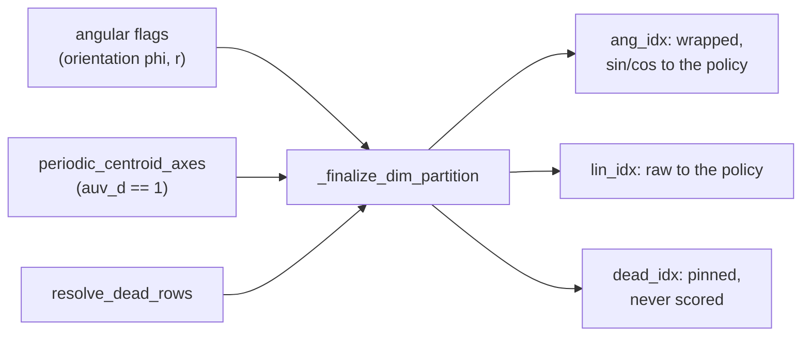

# Latent dimension structure

*Drift: **C** (code-bound). Verified against commit `a637e70`, 2026-09-20. Sources at the end.*

The sampler diffuses over a fixed-width real vector, the *latent*, and a crystal is built from it at the end of every trajectory. This page is about that vector, row by row: which physical quantity each row carries, how it is mapped, which rows the build ignores, and which rows the SDE treats as living on a circle. Two neighbouring objects have their own pages: the walls that select one unit cell per lattice are [cell-fundamental-domains](cell-fundamental-domains.md), and the redundancy of the asymmetric unit's pose under the Euclidean normaliser is [asymmetric-unit-reduction](asymmetric-unit-reduction.md).

## The layout

Width is $6 + 6 Z'_{\max}$, set once by the energy as `data_ndim` (`energies/molecular_crystal.py::MolecularCrystal.__init__`) and read by the policy as `dim`. `max_z_prime` defaults to the maximum of `cfg:z_primes`, and an explicit value below that maximum raises. `models/gfn.py::GFN.get_periodic_dimensions` recomputes the width and raises when it disagrees with `dim`. The table lists the quantity each row slice carries.

| rows | quantity |
|---|---|
| 0:3 | aunit lengths, log-scaled and normalised |
| 3:6 | cell angles $\alpha, \beta, \gamma$ |
| $6 : 6+3Z'_{\max}$ | aunit centroids, one 3-vector per unit, flattened |
| $6+3Z'_{\max} : 6+6Z'_{\max}$ | aunit orientations, spherical rotation vectors $(\theta, \phi, r)$ per unit, flattened |

Both per-unit blocks are flattened whole, so unit $i$'s rotation magnitude is row $6 + 3Z'_{\max} + 3i + 2$.

## The clamp, and the maps

`crystal_ops.py::MolCrystalOps.latent_to_cell_params` clamps before it transforms. The floor is $-1$ except on the three length rows and, per unit, both the rotation-magnitude and the rotation-polar row, which take $-0.99$; the ceiling is $1$ except on rows 0 and 1, which take $1-10^{-4}$ (the slice is `max_vals[0:2]`, so row 2 keeps the plain $1$). The polar floor was added 2026-09-21 (working tree, not yet committed): at $-1$ the polar row maps to $\theta = 0$ exactly, and the crystal-to-latent rotation inverse is singular there, returning a non-finite gradient — see the orientation-rows section. `::MolCrystalOps.inv_latent_transform` maps the clamped box to physical parameters, and `geometry_utils.py::enforce_crystal_system` runs last unless `skip_enforce_crystal_system` is passed.

- **Lengths.** Affine in $\log$ of the normalised aunit length, between `au_range` $[0.075, 0.075, 0.1]$ and $[3, 3, 4]$. The normalisation divides the aunit length by $2R$, $R$ being the molecule radius over $Z'^{2/3}$, and the cell length is the aunit length over `auv`, that space group's aunit box widths.
- **Angles.** Affine onto $[0.2\pi, 0.8\pi]$, that is $[36^\circ, 144^\circ]$. The bound truncates the angle range; no penalty acts on these rows.
- **Centroids.** $u = x/2 + 1/2$ in $[0,1]$, then fractional coordinate $= u \cdot \text{auv}_d$: a latent period of 2 is one traverse of the aunit box.
- **Orientations.** `geometry_utils.py::lat2sph_rotvec` maps $\theta \mapsto x(\pi/4) + \pi/4$, $\phi \mapsto x\pi$, $r \mapsto x\pi + \pi$, then `::sph2cart_rotvec` builds the rotation vector; `::sph_rotvec2lat` and `::cart2sph_rotvec` are the inverses.

`::MolCrystalOps.latent_params`, the round trip back from a built crystal, canonicalises the $Z'$ unit ordering in place, gauge-fixes the free centroid axes unless `gauge_fix_free_axes=False`, transforms, and clips to $[-1,1]$. Buffer rows are stored in this form.

## Dead rows

A row is *dead* when the build discards it. Two kinds, both tabulated in `models/dead_latent_rows.py`.

`::dead_latent_rows` returns the union of the two kinds. Its angle table reads `constants/space_group_info.py::LATTICE_TYPE` and gives the rows `enforce_crystal_system` overwrites with a constant: none for triclinic, $(3,5)$ for monoclinic, $(3,4,5)$ for orthorhombic, tetragonal, hexagonal and cubic. A `rhombohedral` entry is present and empty, and `LATTICE_TYPE` assigns no space group to it; a crystal system with no entry raises. Length constraints such as $a=b$ are imposed as `mean(a, b)`, so the degenerate direction is $a-b$, not a coordinate axis, and no length row is dead.

`::free_centroid_rows` returns the first centroid block's rows along a *free axis*, an axis in the shared $+1$ eigenspace of the space group's rotation parts, read off `constants/space_group_info.py::CONTINUOUS_DIMS`. Moving the centroid along one translates the whole crystal rigidly. `crystal_ops.py::MolCrystalOps.canonicalize_free_axes` pins those coordinates to the aunit box centre, fractional $\text{auv}_d/2$, which is latent 0; it returns without acting at $Z' > 1$, and `free_centroid_rows` returns empty there to match.

`::resolve_dead_rows` is the entry point and adds the `is_crystal` gate: toy energies carry `cfg:space_groups: [1]` as a placeholder, and P1 has all three centroid axes free. `::probe_dead_rows` forces each row across the box and compares canonical cell parameters; `train.py::Modeller._verify_dead_latent_rows` runs it on a clone at startup through `::verify_dead_rows`, logs `dead_rows/probe_verified`, and raises if a dead row round-trips to a nonzero latent.

`train.py::Modeller._resolve_dead_latent_rows` resolves one index set per run. Free axes do not follow the crystal system, so monoclinic alone carries three sets: sg 3, 4, 5 give $(3,5,7)$; sg 6, 7, 8, 9 give $(3,5,6,8)$; sg 10 to 15 give $(3,5)$. Configured space groups that disagree raise.

## Holding dead rows out of the SDE

`models/gfn.py::GFN._finalize_dim_partition` turns the per-dim angular flags and the dead rows into a three-way partition, asserting that `ang_idx`, `lin_idx` and `dead_idx` together are exactly `range(dim)`. Dead takes precedence over angular: `ang_mask` is the angular flags minus the dead mask, `expanded_dim` is $\text{lin\_dim} + 2\,\text{ang\_dim}$, and `dplr_zero_mask` is the *original* angular flags or dead, so a dead row never carries a low-rank component in `::GFN.get_dplr_cov`. The pinned values live in the non-persistent buffer `_dead_values`, all zeros for every space group reachable today, paired with the caller's row ordering rather than the sorted one.

`::GFN._pin_dead` writes those values back wherever `::GFN._wrap_ang` runs and at both trajectory endpoints, so what the policy emitted on a dead row is discarded rather than masked; `::GFN._live_only` drops dead rows from `::GFN.gauss_logprob` and `::GFN.fwd_gauss_logprob` after the wrap, and `::GFN._mean_over_live` excludes them from per-dim diagnostics. `cfg:model.hold_dead_latent_rows` is the switch, and it changes the policy input width, which `checkpointing.py::Checkpointer._assert_dead_rows_match` compares on load.

### A live-but-dead row in the reward

With the switch off, a dead row still reaches the reward. `energies/molecular_crystal.py::MolecularCrystal.generator_energy` computes `bounding_energy` from `raw_latents` as $\sum_d \mathrm{relu}(|x_d|-1)^2$, multiplies it by the temperature, and adds `bounding_total` $=$ `bounding_energy` $\times$ `cfg:energy_config.bounding_coeff` to the total; `::MolecularCrystal.energy` then divides by the temperature. The exponent weight is therefore $k = $ `bounding_coeff`, and the target's marginal on a row the build ignores is $\exp(-k\,\mathrm{relu}(|x|-1)^2)$, whose normaliser is the flat box plus the leak past a soft wall:

$$\int_{-\infty}^{\infty} e^{-k\,\mathrm{relu}(|x|-1)^2}\,dx = 2 + 2\int_0^\infty e^{-ku^2}du = 2 + \sqrt{\pi/k},$$

so each such row adds $\log(2 + \sqrt{\pi/k})$ to $\log Z$ rather than $\log 2$; at `cfg:energy_config.bounding_coeff` $= 10$ in the canonical config, that is $\log 2.5605 = 0.9402$. The penalty is quadratic, so its onset at the boundary has zero slope. Two cases fall outside this arithmetic: a dead row that is also wrapped has period exactly 2, so its volume is $\log 2$; and a free-axis row scored by an energy reading `latent_params(gauge_fix_free_axes=False)` is not clobbered at all, and is an ordinary Gaussian dimension of that energy.

## Periodic rows

`::GFN.get_periodic_dimensions` builds the flags. On the crystal layout the six cell rows and all centroid rows start non-angular, and each orientation block contributes `[False, True, True]`: $\phi$ and $r$ wrap, $\theta$ does not. `cfg:model.periodic_centroids` then adds centroid axes, supplied by `train.py::Modeller._resolve_periodic_centroid_axes` from `models/aunit_periodicity.py::sg_periodic_centroid_axes`, which returns the axes whose `RAW_ASYM_UNITS` entry is exactly 1.0, where the traverse of the aunit box is a whole-cell lattice translation. Space groups without defined aunit bounds return none, and the feature requires exactly one entry in `cfg:space_groups`. An explicit `angular_mask` bypasses the crystal layout and cannot be combined with centroid axes. A wrapped row reaches the policy as $(\sin \pi x, \cos \pi x)$ through `::GFN.expand_state_for_policy`, and `::GFN._wrap_ang` wraps it to period 2 after every step.

### Scoring the periodic rows

Three rules are marked R1, R2 and R3 in `models/gfn.py`. R1: `::GFN.gauss_logprob` and `::GFN.fwd_gauss_logprob` take the nearest-image residual `z = self._wrap_ang(delta_x - drift)` before restricting to live rows. R2: `::GFN._eval_pb_logprob` wraps `next_state` before the backward drift, so P_B conditions on the canonical representative. R3: `::GFN._fwd_step` and `::GFN._bwd_step` wrap immediately after sampling, so no scorer sees a pre-wrap coordinate.

`cfg:model.pb_exact_reversal` selects the angular P_B kernel in `::GFN._pb_logprob`. False scores the single-image term. True canonicalises both endpoints and calls `::GFN._pb_mixture_ang_logprob`: a mixture over arrival lifts `PB_LIFTS` of the next state, weighted by the forward marginal at $t_{\text{next}}$ through a softmax in which the Gaussian normaliser cancels, each component image-summed over the previous state's lifts `PB_IMAGE_LIFTS`. Linear rows keep the diagonal bridge throughout. Under the mixture `::GFN._bwd_step` samples the same kernel, drawing a per-row component from a categorical driven by a pre-drawn `u_lift`, then the component Gaussian. `cfg:model.dplr_mask_angular` zeroes the correlated fraction on wrapped rows, and construction asserts it is true whenever `cfg:model.dplr_rank` is positive and any row wraps, because per-row nearest-image residuals inside a correlated Gaussian are not exact.

## The orientation rows

`energies/molecular_crystal.py::MolecularCrystal.compute_jacobian` reads the orientation block of `latent_params()`, maps it through `lat2sph_rotvec`, and adds the measure corrections $-2T\log\sin(r/2)$ and $-T\log\sin\theta$, each clamped at $10^{-8}$ inside the logarithm and logged as `rot_r_jacobian_energy` and `rot_theta_jacobian_energy`. Inside a clamp the term is constant, so its gradient in that coordinate is zero. The code's $\theta$ map is $x(\pi/4) + \pi/4$ over $x \in [-1,1]$, i.e. $[0, \pi/2]$, so $\theta = 0$ at latent $-1$ and $\sin\theta$ reaches the clamp there; the docstring of `lat2sph_rotvec` states the range as $[\pi/4, 3\pi/4]$, which the arithmetic in the same function does not produce.

**The polar row's floor.** `latent_to_cell_params` floored the rotation-magnitude row at $-0.99$ and left the $\theta$ row at $-1$, which parks any out-of-box polar latent on $\theta = 0$ — the axis pole, where $\varphi$ is undefined. The clamps inside the logarithms bound that row's *value*, but not its gradient: `latent_params()`'s rotation inverse (`acos`/`atan2` on the rotation matrix) has an infinite local derivative there, so $\mathrm{d}(\text{anything})/\mathrm{d}x$ comes back non-finite for such a row, and on the plain reward path one row poisons the whole batch's gradient. Masking inside `::MolecularCrystal.compute_jacobian` cannot fix it — the Inf is created upstream and meets $0 \times \infty$ in that backward. Measured on a phase-1 qm9c policy, 2026-09-21: 3 rows in 2048 non-finite at the $-1$ floor, 0 at $-0.99$, in-box median $|\mathrm{d}J/\mathrm{d}x|$ unchanged (25.30 against 25.32), and `rot_theta_jacobian_energy` capped near 33 nats against the magnitude row's $\sim$37. The polar row now takes the same $-0.99$ floor (working tree, not yet committed). Of the stored priors, only `qm9c100k_prior_niggli_v2` is affected at all: 7 rows of 52,181 sit below $-0.99$, its polar minimum being exactly $-1$; the MIPCAS priors reach only $-0.877$.

## $Z' > 1$

`dataset_utils/utils.py::collate_data_list` zero-pads each item's `aunit_centroid`, `aunit_orientation` and `aunit_handedness` to the batch's widest `max_z_prime`, then truncates the batch's columns to that width; `buffer.py::CrystalBuffer` does the same and clips `z_prime` when a restored batch disagrees. Since `latent_params` canonicalises the unit ordering in place, `::MolecularCrystal.compute_zp_order_penalty` reads `raw_latents` and maps them through the same $[-1,1] \to [0,1] \to {\times}\,\text{auv}$ chain, ranking on the cell-fractional centroid. `canonicalize_free_axes` and `free_centroid_rows` return without acting above $Z'=1$.

## Owner choices

*Left for the owner. Three buckets: bullets bitten, design choices, priorities.*

## Config keys

`cfg:model.hold_dead_latent_rows`, `cfg:model.periodic_centroids`, `cfg:model.pb_exact_reversal`, `cfg:model.dplr_mask_angular`, `cfg:model.dplr_rank`, `cfg:space_groups`, `cfg:z_primes`, `cfg:energy_config.bounding_coeff`, `cfg:energy_config.temperature`.

Code, gfn_diffusion: `models/gfn.py::GFN.get_periodic_dimensions`, `._finalize_dim_partition`, `._pin_dead`, `._wrap_ang`, `._live_only`, `.expand_state_for_policy`, `.gauss_logprob`, `.get_dplr_cov`, `._eval_pb_logprob`, `._pb_logprob`, `._pb_mixture_ang_logprob`; `models/dead_latent_rows.py::dead_latent_rows`, `::free_centroid_rows`, `::resolve_dead_rows`, `::probe_dead_rows`, `::verify_dead_rows`; `models/aunit_periodicity.py::sg_periodic_centroid_axes`; `energies/molecular_crystal.py::MolecularCrystal.__init__`, `.generator_energy`, `.energy`, `.compute_jacobian`, `.compute_zp_order_penalty`; `train.py::Modeller._resolve_dead_latent_rows`, `._resolve_periodic_centroid_axes`, `._verify_dead_latent_rows`; `buffer.py::CrystalBuffer`; `checkpointing.py::Checkpointer._assert_dead_rows_match`.

Code, mxtaltools (paths from that repo's root): `mxtaltools/dataset_utils/data_class_methods/crystal_ops.py::MolCrystalOps.latent_to_cell_params`, `.inv_latent_transform`, `.latent_params`, `.canonicalize_free_axes`, `.canonicalize_zp_aunits`; `mxtaltools/common/geometry_utils.py::lat2sph_rotvec`, `::sph2cart_rotvec`, `::enforce_crystal_system`; `mxtaltools/constants/space_group_info.py::CONTINUOUS_DIMS`, `::LATTICE_TYPE`; `mxtaltools/constants/asymmetric_units.py::RAW_ASYM_UNITS`; `mxtaltools/dataset_utils/utils.py::collate_data_list`.

## Could be tooling

`models/dead_latent_rows.py::describe` and `models/aunit_periodicity.py::describe` each print one line for one space group at startup. The table they jointly define is static: for every space group and $Z'$, the row list with each row's name, its physical map and range, and its class (linear, wrapped, dead by clobber, dead by free axis), plus the resulting `lin_dim`, `ang_dim`, `expanded_dim` and pinned values. Printed for all 230 it is also a fixture a config generator can check `cfg:space_groups` against, since a set whose rows disagree raises only at startup.

## Sources

The code above, read at the stamped commit (mxtaltools read from the sibling checkout), and the model and `energy_config` blocks of the canonical config. Memory files (project_flat_latent_dimensions, project_periodic_wrap_scoring_bug, project_theta_polar_singularity_collapse, project_toy_gauge_fix_p1 and others) located the code and were not used as evidence.
