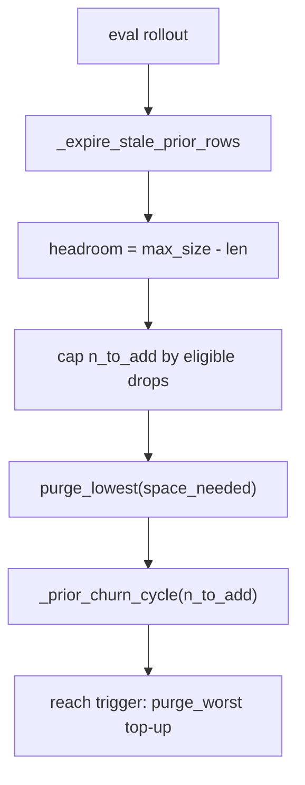

# Prior buffer

*Drift: **M** (mixed). Verified against commit `a637e70`, 2026-09-20. Sources at the end.*

The prior buffer is the store the backward branch draws its terminal states from. A backward step picks rows out of it, reads each row's latent state, and rolls a fresh stochastic backward path to that endpoint; the buffer holds terminals only and no trajectories, so two draws of the same row are two different trajectories to the same point (`train.py::Modeller.draw_bwd_sample`, under `bwd_sampling_mode` `prior`). Left out and named: the shape of the noise a row is born with ([prior-buffer-row-geometry](prior-buffer-row-geometry.md)), the archive the rows are sourced from ([anchor-buffer](anchor-buffer.md)), and the trajectory store the replay branch uses ([replay-buffer](replay-buffer.md)).

## Two sources

`cfg:buffers.prior_buffer.source` selects where churn intake comes from; `train.py::Modeller._prior_churn_cycle` branches on it at the top.

Under `anchors`, the canonical config's setting, the whole churn budget goes to `train.py::Modeller.top_up_prior_from_anchors`: rows are drawn from the anchor buffer priority-weighted on its `ema_loss` with a uniform floor of `cfg:buffers.anchor_buffer.replay_beta`, jittered in latent space, re-scored, and offered to the admission gate. No prior model is in the loop, and `prior_buffer_prior_admit_rate` reads NaN, its denominator never incremented.

Under `prior_model` the budget is drawn from a frozen separate GFN through `train.py::Modeller.sample_from_prior`, at the prior's own training rollout length rather than the eval length. What the draw failed to get admitted becomes a shortfall backfilled from the anchors by the same top-up call, so this source mixes prior-model rows with anchor rows in a proportion set by the admission outcome rather than by a key. With no prior sampler (`train.py::Modeller._has_prior_sampler` false, the state of a run resumed past `snapshot_prior` without `cfg:prior_model_name` set) the draw is skipped and a warning prints once per stage.

## Admission: the energy window

Admission is per condition. `train.py::Modeller._condition_energy_floor` returns each row's condition's best known energy $E_{\min}(c)$, preferring the `condition_log_z` tracker's `best_energy` over the anchor buffer's per-condition minimum; a condition with no observations gets $+\infty$, so its first sample is always admissible. A row is admitted when

$$E < E_{\min}(c) + \text{ramp\_floor}.$$

`cfg:buffers.prior_buffer.ramp_floor` and `cfg:buffers.prior_buffer.ramp_width` are read through `train.py::Modeller._ramp_params`, which requires $0 < \text{ramp\_width} \le \text{ramp\_floor}$ and raises otherwise. The pair is a depth ramp in energy units above each condition's own minimum, $w(d) = \mathrm{clamp}((\text{ramp\_floor} - d)/\text{ramp\_width}, 0, 1)$; admission uses `ramp_floor` alone. Before either source of $E_{\min}(c)$ exists the gate falls back to the absolute bar `cfg:buffers.prior_buffer.reward_min` on the log reward.

With `cfg:buffers.prior_buffer.anchor_floor_frac` above zero the backfill is per condition rather than pooled: every condition the draw touched gets `max(shortfall_c, ceil(anchor_floor_frac * drawn_c))` rows, built to exact counts by `train.py::Modeller._stratified_anchor_draw`. A condition holding no anchors leaves its quota unfilled and prints; it is never reassigned. Because that is a maximum rather than a sum, the request can exceed the cycle budget.

## Churn, and where it runs

`train.py::Modeller.manage_prior_buffer` is called from `train.py::Modeller._admit_eval_rollout`, inside evaluation rather than inside a train step, and takes the eval rollout regardless of the replay buffer's own `admit_from_eval` switch. The call site runs only while the stage carries the `buffers_active` flag. The budget is

$$n_{\text{churn}} = \max\left(1000,\ \frac{\Delta_{\text{bwd}}}{\text{mean\_lifetime}} \cdot \text{churn\_batch\_ref}\right), \qquad n_{\text{to\_add}} = \min(\text{eval\_num\_samples},\ n_{\text{churn}}),$$

with $\Delta_{\text{bwd}}$ the backward steps since the last call (`train.py::Modeller.bwd_step_delta`). `cfg:buffers.prior_buffer.mean_lifetime` and `cfg:buffers.prior_buffer.churn_batch_ref` reach the dynamics only through their ratio, an admission rate in rows per backward step. `churn_batch_ref` is a fixed reference rather than the live batch size, so a batch-sizer growth event does not multiply turnover. During a stage whose backward branch is inactive $\Delta_{\text{bwd}}$ is zero and the budget sits on the hardcoded 1000 floor.

## Three eviction channels

**Gate staleness.** `train.py::Modeller._expire_stale_prior_rows` applies the admission test to the resident rows: $E_{\min}(c)$ ratchets down as the tracker sees better structures, so a row admitted under a looser gate stops clearing the current one. It drops rows with `excess >= ramp_floor`, capped at `cfg:buffers.prior_buffer.expire_max_frac` of the buffer per call, worst excess first, printing when the cap truncates; at or below zero the channel is off. It runs before headroom is measured, so the rows it frees are intake room for the same call.

**Loss quantile at capacity.** `headroom = max_size - len(buffer)`, and only `n_to_add > headroom` runs the eligible-drop branch: `buffer.py::CrystalBuffer.get_elig_drop_count` marks eligible the rows whose `ema_loss` is at or below the 25th percentile among rows with at least `min_visits` draws, `n_to_add` becomes `headroom + min(eligible, overflow)`, and `buffer.py::CrystalBuffer.purge_lowest` removes up to `space_needed` of them with $p \propto \mathrm{softmax}(-\text{loss})$, the realised count read back from the length delta. Both prior-buffer call sites pass `loss_floor` as $+\infty$, disarming that function's absolute-nats cut, and the purge call passes `loss_min` as $-\infty$, disarming its uncapped forced-purge branch. `min_visits` is 5 here, and `select_counts` increments only on draws, so a row never drawn is never eligible.

**Reach purge.** After the churn cycle the excess above $E_{\min}(c)$ is pooled over the buffer and its `cfg:buffers.anchor_buffer.reach_quantile` quantile compared against the margin: $\text{reach} = 1 - q/\text{ramp\_floor}$. Below `cfg:buffers.anchor_buffer.reach_threshold`, and with `cfg:buffers.anchor_buffer.reach_topup_size` positive, the top-up is called with `purge_worst=True`, which first removes up to that many rows, capped at the buffer length, ranked by excess above their own condition's minimum. A $+\infty$ floor scores $-\infty$, so those rows are never purged.

## What `max_size` does

Below capacity the loss-quantile branch never runs, so `cfg:buffers.prior_buffer.max_size` sets whether a row can be evicted for its `ema_loss` at all, alongside the staleness and reach channels that read energy. Where it binds, headroom is zero, intake is limited to the eligible set, and the rows removed are those at or below the 25th `ema_loss` percentile. A full buffer whose rows have never been drawn has an empty eligible set, and `n_to_add` collapses to whatever staleness freed.

## What `y` stores

`buffer.py::CrystalBuffer` computes a scalar `y` per row from the key `train.py::Modeller._buffer_y_fn` returns, which is `cfg:energy_function` itself. On the crystal route that string is `elj` and the attribute of that name is the raw lattice sum: no `lj_coeff`, no division by $z'$, and none of the density, pressure, reduction or Jacobian terms. So `y` feeds buffer logging and the progress gate's energy marginal, and is not commensurate with $E_{\min}(c)$, the composite total reconstructed as $-\log r \cdot T$.

The staleness expiry, the reach trigger and the `purge_worst` ranking all compare a resident row against $E_{\min}(c)$, and all three read `train.py::Modeller._prior_row_energy` instead. That composes the row's current training energy live from two stored legs, $(1 - \lambda)\,\text{flow\_energy} + \lambda\,\text{physical\_energy}$, so a row admitted at one $\lambda$ is judged at today's; it raises on a buffer restored from before the leg split.

## Seeding and the stage actions

`cfg:buffers.prior_buffer.seed_source` chooses between `generated` (lazy creation from the first evaluation batch) and `prior_dataset`. Under the latter, `train.py::Modeller.init_prior_buffer_seed` builds the buffer at init from the prebuilt dataset loaded off `cfg:prior_path`, random-subsampled to `max_size`, conditioned to match generated candidates' key set, and constructed fresh so `ema_loss`, `select_counts` and `ema_logw` start clean. It is skipped when a checkpoint-restored buffer exists. `train.py::Modeller.grow_prior_buffer` adds up to `cfg:buffers.prior_buffer.min_size` prior-model rows at init, ungated, tallied as `from_seed` -- but only when `cfg:buffers.prior_buffer.source` is not `anchors`: under the anchors source the init skips it with a printed line, because that fill was the one path that bypassed the source setting (a requeued leg handed its own `*_prior.pt` took 10k prior-model rows into an anchors-only buffer, 2026-09-23).

Three stage actions touch the buffer, all in `protocol.py::ACTIONS`:

- `rebuild_prior_by_churn[:N]` discards the buffer and refills from zero by repeating `_prior_churn_cycle` in chunks of `min_size`, to `N` rows or to `cfg:buffers.prior_buffer.init_fraction` of `max_size`. A cycle that admits nothing ends the loop, a cap of four times the ideal cycle count plus four prints when it truncates, and the outgoing buffer is held and restored if nothing was admitted.
- `reseed_prior_from_dataset[:flush]` re-adds the prior dataset, additive and subsampled to the remaining headroom by default, or with `flush` replacing the buffer with a fresh full-size draw. Neither variant applies the admission gate; the rows count as `from_seed`.
- `seed_prior_from_anchors:N[:flush]` tiles each condition's single lowest-energy anchor `N` times with noise and adds it ungated (`train.py::Modeller.seed_prior_from_condition_minima`).

## Telemetry

`prior_churn` is a dict of counters drained on read at each eval: `prior_buffer_added` sums the three source tallies, `prior_buffer_expired` is the staleness subset of `prior_buffer_evicted`, and `prior_buffer_anchor_fraction` and `prior_buffer_prior_admit_rate` are NaN on a zero denominator. All are flows over one window, not a resident composition; no row carries a source tag.

## Owner choices

*Left for the owner. Three buckets: bullets bitten, design choices, priorities.*

## Config keys

`cfg:buffers.prior_buffer.{source, seed_source, mean_lifetime, churn_batch_ref, min_size, max_size, init_fraction, expire_max_frac, anchor_floor_frac, reward_min, ramp_floor, ramp_width, weighted_bwd_beta}`, `cfg:buffers.anchor_buffer.{replay_beta, noise_log_range, reach_quantile, reach_threshold, reach_topup_size}`, `cfg:eval_num_samples`, `cfg:prior_path`, `cfg:prior_model_name`, `cfg:energy_function`.

Code: `train.py::Modeller.manage_prior_buffer`, `_expire_stale_prior_rows`, `_prior_churn_cycle`, `rebuild_prior_by_churn`, `top_up_prior_from_anchors`, `_stratified_anchor_draw`, `reseed_prior_from_dataset`, `init_prior_buffer_seed`, `grow_prior_buffer`, `_prior_row_energy`, `_buffer_y_fn`, `_ramp_params`, `_condition_energy_floor`, `_admit_eval_rollout`, `draw_bwd_sample`; `buffer.py::CrystalBuffer.get_elig_drop_count`, `buffer.py::CrystalBuffer.purge_lowest`; `protocol.py::ACTIONS`.

## Could be tooling

- The churn ceiling is `cfg:eval_num_samples`, a key belonging to evaluation, and the admission rate is a ratio of `mean_lifetime` and `churn_batch_ref`. One rows-per-step key with its own ceiling would carry both.
- The resident composition is not recoverable from any emitted metric; a per-row source tag is a `CrystalBuffer` schema change.
- `buffer.py::CrystalBuffer.purge_lowest` carries `loss_floor`, `loss_min` and `temperature` as absolute-nats parameters, all three disarmed at both prior-buffer call sites while their 1.0 defaults stay live for other callers.

## Sources

Repo, at the stamped commit: `buffer.py`, `train.py`, `protocol.py`, `configs/mk_dev.yaml` `buffers.prior_buffer`, `docs/design/prior_buffer_sizing.md`. Memory used to locate the code, not as evidence: project_prior_buffer_cap_starts_target_drift, project_prior_buffer_churn_batch_decouple, project_prior_buffer_scores_raw_elj, project_prior_buffer_full_churn_stall, project_rebuild_prior_by_churn, project_reseed_prior_flush, feedback_prior_buffer_anchors_only_default, project_prior_model_sampling_only. Two no longer match: project_prior_buffer_scores_raw_elj has the staleness, reach and `purge_worst` channels reading `y`, which they no longer do, and the design note proposes the staleness channel and the anchor floor as unbuilt, both of which exist.
