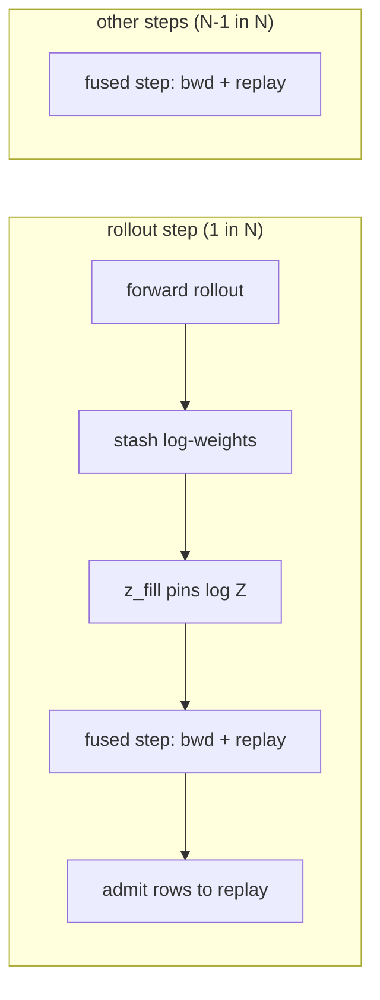

# Rollout cadence and dose

*Drift: **M** (mixed). Verified against commit `e17167e`, 2026-09-19. Sources at the end.*

The forward branch is the only branch of a training step that calls the energy function. The backward and replay branches train on rows whose energies were stored when the rows were made, and the prior buffer's churn runs inside evaluation, not inside the step. So the number of steps between forward rollouts is the energy-cost axis of training, and on a machine-learned potential the energy call is most of the step. This page is about what a forward rollout buys, what it costs to do fewer of them, and which quantity governs the harm.

The key is `cfg:stage.fwd_rollout_every`, written $N$ below. $N = 0$ means a rollout every step; that is a point on the axis, not a bypass of it.

## What a rollout buys

At the production loss weights the forward branch's coefficient is zero, so a forward rollout carries no gradient. Its trajectories still reach the gradient, one step later, through the replay buffer; but the rollout step itself trains only the backward and replay branches. A rollout therefore buys exactly two things: a batch of fresh rows admitted to the replay buffer, and an on-policy reading of log Z.

The rollout rate is therefore an *admission* rate, and the on-policy reading is what pins log Z. The two products are treated separately below.

## The buffer side: Little's law

With the whole forward batch stored (`cfg:buffers.replay_buffer.churn_rate` at 0, which means "the live batch size") and a full replay batch drawn every step, the buffer obeys the queueing identities. Let $B$ be the batch size and $\tau$ the mean residence in steps (`cfg:buffers.replay_buffer.mean_residence_steps`).

$$
\text{admissions per step} = \frac{B}{N}, \qquad
\text{occupancy } O = \frac{B\,\tau}{N}, \qquad
\text{draws per row} = \frac{\tau B}{O} = N .
$$

Two things fall out. Reuse per row equals $N$ and nothing else: $\tau$ and $B$ cancel. And because the eviction hazard is memoryless, the age distribution of resident rows is exponential with mean $\tau$ whatever the arrival pattern, so mean age equals $\tau$ and nothing else. The two knobs are independent levers on two different failures:

| failure | what drives it | row property | knob | metric |
|---|---|---|---|---|
| staleness: the row no longer represents the policy | how far the policy moved since the row was born | age | $\tau$ | `replay/policy_drift_ess_frac` |
| overfit: the policy fits these exact rows | how often the row was trained on | draws | $N$ | `replay/val_gap_nats` |

Staleness happens whether or not a row is ever drawn; overfit happens only through drawing. What *is* welded is overfit and cost, because both are $N$. Buying energy savings buys reuse, and there is no way to give the reuse back short of drawing less than a full batch per step, which cuts across the loss weights being weights rather than sample fractions ([loss-composition](loss-composition.md)).

The draw also needs something to draw from: $O \ge B$, which is $\tau \ge N$. The generator ships $\tau = 5N$, so on generated configs the two knobs move together. Occupancy is a consequence of the two knobs, never a lever. The age distribution reaches its stationary exponential shape only after several multiples of $\tau$ steps, so a reading taken earlier is a transient.

Staleness is a relevance problem, not a correctness one. A stored trajectory re-scored under the current policy gives an unbiased trajectory-balance residual, because TB is off-policy correct and the stored backward and reward terms are exact. A stale row trains the policy in a region it no longer visits; it does not bias the gradient.

## The Z side: what must hold when rollouts are rare

Between rollouts nothing on-policy is measured, so log Z is frozen. Under rare rollouts the dangerous lag has a definite sign: *low*. The policy absorbs the level onto the stored and anchor rows, and at the next rollout the closed-form root walks down to meet the stale Z. That loop is the identifiability failure discussed on [trajectory-balance](trajectory-balance.md), and the only brake is to snap Z to the fresh batch at every rollout. The full-batch root's standard error is $\text{rms}_{\text{clipped}}/(\sqrt{B}\cdot f_{\text{unclipped}})$ ([batch-size](batch-size.md)).

Two invariants follow, and both are refused at load rather than silently ignored (`protocol.py::Stage`):

- The Z-calibration servo must be off on the stage (`cfg:stage.flags.z_calibration` false). Its rollout mode does its own forward rollout and energy call per Z step, off a sensor that is frozen between rollouts, so it would fire on every *skipped* step and restore the cost the cadence removed.
- The level fill must be armed (`cfg:z_calibration.fill_threshold` above 0). It is then the only thing pinning log Z at a rollout. Under the default `fill_mode: absorb` the threshold is only the enable switch; the fill is a one-dimensional Kalman filter whose gain is the batch's precision share.

The fill runs inside the rollout step, after the stash and before the backward and replay losses are built, so those residuals are computed against the pinned level and no optimizer step on Z is spent against the stale one. The one exception is a stage whose forward loss is live, where log Z is already in the forward graph and the fill runs after the step instead (`train.py::Modeller.fused_train_step`).

An extra rollout whose only product is the Z stash, with no admissions and no gradient, is available as `cfg:stage.z_pin_rollout_every`, which sets the pin frequency independently of the admission rate.

## The state variable is a dose

Define the dimensionless dose

$$
D = N \cdot \frac{\text{lr}}{10^{-4}} \cdot \frac{w_{\text{replay}}}{0.1} \cdot \frac{1000}{B} .
$$

Occupancy, cap, residence and mean age cancel in $D$. The branch losses are normalised means, so the per-step parameter displacement a single resident row contributes scales as $\text{lr}\cdot w_{\text{replay}}/B$, and a row is drawn $N$ times over its residence; the product is $D$, with $\tau$ and $O$ dropping out of both the reuse count and the per-row weight. What does not appear in $D$ is the temporal density of those draws: the same total exposure delivered over a short residence and a long one differ, and $\tau$ re-enters there.

The validation gap, the memorisation sensor, is approximately absorbed fraction times trained level. It grows with $N$ because the *trained* side falls, not because the held-out side degrades. The gap and `replay/tb_err_worst` are the same residual contrast read from either side.

## Cost

Only the forward branch calls the potential, so between rollouts the training-time energy cost is zero. On the local ELJ route the speed-up saturates by about $N = 20$ because the backward and replay branches set a floor on step time. On a machine-learned potential the forward call is most of the step, so the saving keeps growing with $N$ ([mlip-energy-routes](mlip-energy-routes.md)).

## Triggers, and how to read the cadence

`cfg:stage.fwd_rollout_every` is a backstop, deliberately loose. The bars under `cfg:stage.fwd_rollout_triggers` fire a rollout early when the state says one is needed, each reported under its own name, and they are what set the cadence in practice (`train.py::Modeller._rollout_trigger_fires`). Four exist: `occupancy_min_batches` fires below a buffer-to-batch ratio, `val_gap_max` above a validation gap, `drift_std_max` above a policy drift, `ess_min` below a drift ESS. A bar at zero is off, and the whole block is inert at $N = 0$.

Two mechanical facts about the occupancy bar. It reads the buffer against the *live* batch size while admissions are capped at a churn rate derived from the batch at stage entry, so if the batch sizer grows the batch past what churn was sized for, no admission rate can clear the bar and it fires on every tick. And a buffer whose equilibrium occupancy sits near the bar does not fall through it; it equilibrates on it, and the bar then sets the cadence rather than $N$.

`rollout/every_eff` and `rollout/rate` are cumulative sawtooths that publish only on rollout steps, so at $N = 20$ they under-read the cadence. `rollout/n` is an integer count per ten-step window, so its median is quantised; its sum over a known span is the rollout count on that span.

## Calibrations

- **[calibration, rr07_rr_n7_v1, 2026-09-07]** Little's law on a real run at $B = 400$, $N = 7$, $\tau = 35$: predicted occupancy 2000, observed 2024 to 2381; predicted reuse 7, observed 7.53.
- **[calibration, local ELJ, batch 400, 2026-09-07]** Step time $t(N) = 0.26 + 0.51/N$ seconds.
- **[calibration, rr and hc batteries, 2026-09-08]** Fitted absorption rate $\lambda \approx 0.0195\,D^{0.75}$, $R^2 = 0.94$, across the arms that define $D$ above.
- **[calibration, rr and hc batteries, ELJ route, 2026-09-08]** Arms matched on $D$ at reuse differing two-fold absorbed at the same rate.

## Owner choices

*Left for the owner. Three buckets: bullets bitten, design choices, priorities.*

## Config keys

`cfg:stage.fwd_rollout_every`, `cfg:stage.z_pin_rollout_every`, `cfg:stage.fwd_rollout_triggers.{occupancy_min_batches, val_gap_max, drift_std_max, ess_min}`, `cfg:stage.flags.z_calibration`, `cfg:z_calibration.{fill_mode, fill_threshold, fill_se, fill_cooldown_steps}`, `cfg:buffers.replay_buffer.{churn_rate, mean_residence_steps, max_size, backstop_mult}`, `cfg:batch_size`.

Code: `protocol.py::Stage` (parse and the two refusals), `train.py::Modeller._fwd_gates`, `train.py::Modeller._rollout_trigger_fires`, `train.py::Modeller.manage_replay_buffer` (per-step hazard), `train.py::Modeller.z_level_fill`, `train.py::Modeller.fused_train_step`.

## Sources

Repo: docs/design/rarer_rollouts.md, docs/design/replay_occupancy_and_cadence.md, docs/design/z_fill_process_variance.md, and the code above at the stamped commit. Memory: project_rollout_rate_is_an_admission_rate, project_rarer_rollouts_redesign, project_rollout_every_eff_wrong_at_n20, project_occupancy_bar_unreachable_churn_vs_live_batch, project_logz_lag_sign_and_cadence.
