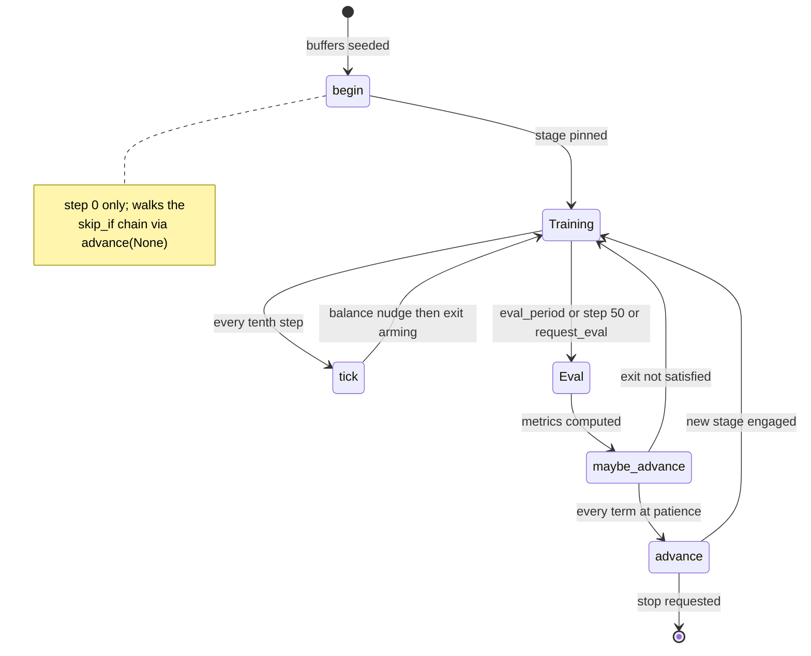

# Stage protocol engine

*Drift: **M** (mixed). Verified against commit `a637e70`, 2026-09-20. Sources at the end.*

A *protocol* is an ordered list of *stages*, and a stage is one declarative description of a training regime: what the train step is, which loss coefficients are live, which branch weights move and how, and what has to be true before the run leaves it. `protocol.py` parses that list into `Stage` objects and runs it with `StageProtocol`, which holds a reference to its owning `Modeller` and keeps every mutable engine value on that `Modeller`. The config names the live protocol in `cfg:protocol` and defines them all under `cfg:protocols`; the trainer and the config validators both resolve it through `config_invariants.active_stages`, so they read the same list.

This page covers the spec a stage may declare, the four entry points (`begin`, `tick`, `maybe_advance`, `advance`), and what a transition does. The balance kinds are on [balance-controllers](balance-controllers.md); what a transition writes to disk and what a resume restores are on [checkpoints-and-resume](checkpoints-and-resume.md); the learning-rate controller it calls into is on [learning-rate](learning-rate.md).

## The stage spec

`protocol.py::Stage.__init__` accepts a fixed key set and raises on anything else, including on two keys kept in the set only so their own message fires: the retired `buffer_servo` and the renamed `fwd_rollout_drift_max`.

- **`name`**: non-empty, unique; a checkpoint stores it as the run's position. **`train_mode`**: `bwd` or `fused`, read every step by `train.py::Modeller.train_logic`. **`bwd_sampling_mode`**: `dataset` or `prior`.
- **`flags`**: booleans from `STAGE_FLAGS`: `update_log_z`, `scramble_conditions`, `weighted_condition_sampling`, `buffers_active`, `weighted_bwd_sampling`, `z_calibration`. An unknown flag raises. `mle_gate` is a block with its own defaults (`MLE_GATE_DEFAULTS`), not a flag; presence of the block is the switch.
- **`loss_coeffs`**: a per-mode overlay on the base `fwd/bwd/replay_loss_coeffs` blocks. `StageProtocol.base_coeffs` captures those once, pristine; `StageProtocol.coeffs` returns base overlaid with the overrides, and an override key absent from the base raises.
- **`fracs`**, **`min_fracs`**, **`deactivate_threshold`**: the entry branch weights (normalized by their sum at the transition), the per-mode floors, and the frac below which the fused step skips a branch outright. A stage declaring no `fracs` carries the previous stage's across. **`balance`** moves two of those fracs during the stage ([balance-controllers](balance-controllers.md)).
- **`exit`**: an AND-list of terms, each `{metric, above|below, abs, patience}` with exactly one of `above`/`below`. `StageProtocol._resolve` reads a metric name in one of three namespaces: `gates/x` (published by `publish_gate`), `eval/x` (the eval metrics dict, present only inside `maybe_advance`), `dir/x` (the running metric tracker). A stage with no `exit` is terminal. A bar that is a bool, a string or a NaN raises at parse, naming the stage and the term.
- **`skip_if`**: one of `SKIP_CONDITIONS`, today only `prior_loaded`. **`on_enter` / `on_exit`**: action lists parsed into `(name, arg)` pairs, each argument grammar validated at load.
- The rollout keys, `condition_draw`, `lr_sensor` and `hot_lr_sensor` are parsed here too and belong to other pages.

Patience counts fresh measurements of a term's metric rather than ticks. `_advance_term` compares the metric's write-stamp (`StageProtocol._write_step`) with the stamp that streak last judged (`stage_ctrl['exit_seen']`). A fresh passing value advances the streak, a fresh failing value resets it to zero, and no fresh value holds it. Every source persists its last value, so a term is denominated in its own metric's cadence: patience N on an `eval/*` metric costs N times `cfg:eval_period` train steps where the same N on a tick metric costs 10N, a relation `config_invariants.py::exit_patience_is_reachable` states at load.

## The ACTIONS vocabulary

`ACTIONS` is the closed list an `on_enter` or `on_exit` entry may name, dispatched by `StageProtocol._run_action`.

| action | what it does |
|---|---|
| `snapshot[:tag]` | writes the outgoing stage's untouched end state with its own frozen buffer sidecar; tag defaults to `stage_exit` |
| `snapshot_prior` | saves a `prior` checkpoint, deep-copies the EMA model into `prior_model`, deletes `best`; raises where backward sampling draws from a fitted `internal_prior` |
| `bootstrap_z` | on the single-scalar route fills log Z from `eval_fwd/jensen_z`, or, with no eval stream, from the mean `ema_logw` over the tracker's visited conditions, and raises where neither exists; on the conditional or full-flow route calls `train.py::Modeller.bootstrap_log_z`, which regresses the flow head onto `ema_logw`, with `:train_conditioner` letting that fit shape the conditioner; `:rollout[:n]` is a separate path through `train.py::Modeller.bootstrap_z_by_rollout`, a large forward sample's winsorized-Huber root |
| `seed_prior_from_anchors[:N[:flush]]` | seeds the prior buffer with N rows per condition from the condition minima |
| `reseed_prior_from_dataset[:flush]` | reseeds the prior buffer from the dataset |
| `rebuild_prior_by_churn[:N]` | rebuilds the prior buffer through the online admission gate |
| `freeze_pb[:full\|:head]` / `unfreeze_pb` | freezes or lifts the freeze on P_B; bare `freeze_pb` means `full`, `unfreeze_pb` takes no argument |
| `set_lr_flow:<float>` | sets `cfg:lr_flow` on args and on both live flow groups, the fused optimizer's trailing group included |
| `set_lr_policy:<float>` | sets `lr_policy`, `lr_back`, `lr_replay`, `lr_fused` on args |
| `set_max_batch_size:<int>` | moves `cfg:max_batch_size`, clamps the live batch under it, clears the sizer |
| `set_traj_checkpoint[:on\|off]` | flips rollout gradient checkpointing on both models and clears `traj_checkpoint_modes` when on; bare means ON |
| `stop` | sets `_stop_requested`, which `advance` reads to end the run instead of advancing |

## The four entry points

**`begin`** runs once from `train.py::Modeller.train`, after the buffers are seeded. It pins `m.stage` to the first stage when none is set, and returns unless `m.step_ind` is 0, so a resumed run is left wherever its checkpoint says. At step 0 it walks the skip chain: while the current stage declares a `skip_if` that holds and a successor exists, it calls `advance(None, run_exit_actions=False)`. That argument gates only the outgoing stage's `on_exit`; the incoming stage's `on_enter` runs unconditionally, at step 0, with `eval_metrics` `None`. The first stage is never entered through a transition, so its own `on_enter` does not fire.

**`tick`** runs from the ten-step reporting block, after the gate publishers: the balance nudge when the stage declares a `balance`, then `_exit_tick`, which advances the streak of every term whose metric is not `eval/*` and, on the rising edge of "all tick terms at patience", sets `stage_ctrl['request_eval']` to pull the next eval forward. Arming is a tick-term question only: an `eval/*` term does not contribute to it.

**`maybe_advance`** is called from `train.py::Modeller.evaluation` with the fresh metrics dict, and is the one place a transition executes. It clears `request_eval` first, whoever set it, advances the `eval/*` terms against those metrics, and calls `advance` when `_exit_satisfied` finds every term at its patience.

**`advance`** runs the outgoing stage's `on_exit` actions first, while nothing has mutated. It then checks `_stop_requested`, after the exit actions and before the successor lookup, so the exit snapshots are already on disk and a single-stage protocol with an exit does not raise, and otherwise moves to the next stage by index.

## What a transition resets

After the switch (`m.stage`, a fresh `fresh_stage_ctrl()`, the incoming stage's normalized entry fracs), `advance` performs the same reset at every boundary, before any `on_enter` action runs:

- `m.combo_loss_record` cleared, so the `best`-checkpoint gate restarts.
- The batch sizer's conclusion cleared: `m.batch_sizer`, the three OOM fields, the two runaway latches and the accumulation-floor latch, and the `_recent_step_times` / `_recent_step_work` deques. The live batch returns to `min(cfg:batch_size, cfg:max_batch_size)` when `cfg:grow_batch_size` is true, and `batch_size_last_grow` is set to the current step.
- `m.init_schedulers_optimizers()` rebuilds every optimizer from scratch, so Adam's moments and step counter start at zero. The four policy groups are constructed at `cfg:lr_control.burn_in_scale` times their base rates (`lr_policy`, `lr_back`, `lr_replay`, `lr_fused`); the flow group is constructed at `cfg:lr_flow` unscaled. `m.set_loss_coeffs()` then publishes the new stage's overlay.
- `m.lr_controller.on_stage_change()` re-enters burn-in, clears the promoted scale, the loss and gradient histories and the fitted bars, and sets the scale to `burn_in_scale`.
- `m.grad_guard.refresh(reason=...)` is called unconditionally and returns without doing anything unless the guard is enabled and `cfg:grad_clip_guard.refresh_on_stage` is set; where it does run it re-arms each branch's warm-up, holding the outgoing bar live while it re-measures.

Then the incoming stage's `on_enter` actions run, after the rebuild, so a `freeze_pb` there means the fresh Adam never sees a P_B gradient, and `m.checkpointer.save('stage_start')` writes the post-`on_enter` state under the *new* stage's name.

Not touched: the policy and EMA weights, the metric tracker, the condition log Z table, the buffers and the P_B freeze state (unless an action changes them), and `step_ind`, which `cfg:epochs` bounds absolutely. The forward-rollout cadence anchor is not held here either: `train.py::Modeller._fwd_gates` re-seeds `_cadence_anchor` to the current step whenever `_cadence_anchor_stage` differs from the live stage name, so the first cadenced step of a stage rolls out. The replay warm-up latch is keyed on the stage name the same way.

## stage_ctrl

`fresh_stage_ctrl()` returns the engine's whole mutable state, checkpointed inside `modeller_state` and replaced at every transition: `gates` and `gate_written` (published values and their publish steps), `gate_state` (per-gate scratch, such as the MLE slope window), `rules`, `coeffs` (live annealed energy coefficients), `exit` and `exit_seen`, the anneal counters (`anneal_streak`, `last_anneal_step`, `anneal_events`, `anneal_cooling`), `boost`, `exit_armed`, `request_eval`, and the per-kind controller states `prop_scale`, `prop_streak`, `cs_theta`, `gr_share`, `gr_fired`, `gr_best`, `gr_held`, `gr_tripped`. `StageProtocol.ctrl` substitutes a fresh dict when the Modeller carries none.

`_snapshot` stamps `request_eval` true into the saved state only and restores the live value immediately after, so a run reloaded from a pre-transition snapshot pulls its eval to the first post-resume step and re-fires the transition through the ordinary eval path.

## Transition-time failures

`train.py::Modeller.train` wraps only `self.train_step(step_type)` in the `except (RuntimeError, ValueError)` clause that calls `handle_train_epoch_error`. `evaluation()` is called outside that clause, and `maybe_advance` and therefore `advance` and every `on_enter` action run inside `evaluation()`. An OOM raised by a transition action is not seen by `handle_train_epoch_error`, so the batch is not cut. The other `handle_train_epoch_error` call sites are `eval_bwd`, `anchor_refresh` and `eval_fwd`.

## Owner choices

*Left for the owner. Three buckets: bullets bitten, design choices, priorities.*

## Config keys

`cfg:protocol`, `cfg:protocols`, `cfg:stage.name`, `cfg:stage.train_mode`, `cfg:stage.bwd_sampling_mode`, `cfg:stage.flags`, `cfg:stage.loss_coeffs`, `cfg:stage.fracs`, `cfg:stage.min_fracs`, `cfg:stage.deactivate_threshold`, `cfg:stage.balance`, `cfg:stage.exit`, `cfg:stage.on_enter`, `cfg:stage.on_exit`, `cfg:stage.skip_if`, `cfg:stage.mle_gate`, `cfg:stage.lr_sensor`, `cfg:stage.hot_lr_sensor`, `cfg:stage.fwd_rollout_every`, `cfg:stage.z_pin_rollout_every`, `cfg:stage.fwd_rollout_triggers`, `cfg:stage.fwd_z_sidecar`, `cfg:stage.replay_warmup_rows`, `cfg:stage.condition_draw`, `cfg:eval_period`, `cfg:epochs`, `cfg:batch_size`, `cfg:max_batch_size`, `cfg:grow_batch_size`, `cfg:lr_flow`, `cfg:lr_policy`, `cfg:lr_control.burn_in_scale`, `cfg:grad_clip_guard.refresh_on_stage`, `cfg:controller.min_mode_frac`, `cfg:controller.deactivate_threshold`.

Code: `protocol.py::Stage.__init__`, `._parse_exit`, `._parse_actions`, `.active_modes`, `.balance_can_raise`, `.replay_trains`, `.read_modes`; `protocol.py::StageProtocol.stages`, `.stage`, `.ctrl`, `.flag`, `.coeffs`, `.base_coeffs`, `.energy_coeffs`, `._resolve`, `.publish_gate`, `._write_step`, `.gate_state`, `.tick`, `._term_passes`, `._advance_term`, `._exit_tick`, `._exit_satisfied`, `.maybe_advance`, `.begin`, `.advance`, `._run_action`, `._snapshot`, `._snapshot_prior`, `._bootstrap_z`, `.report`; `protocol.py::fresh_stage_ctrl`, `ACTIONS`, `STAGE_FLAGS`, `MLE_GATE_DEFAULTS`, `SKIP_CONDITIONS`, `TERM_KEYS`, `TRAJ_CKPT_TRUE`, `TRAJ_CKPT_FALSE`; `train.py::Modeller.train`, `.train_logic`, `.evaluation`, `.init_schedulers_optimizers`, `.set_loss_coeffs`, `._fwd_gates`, `.handle_train_epoch_error`, `.bootstrap_log_z`, `.bootstrap_z_by_rollout`, `.set_pb_freeze`; `controller.py::LRController.on_stage_change`; `grad_clip_guard.py::GradClipGuard.refresh`; `config_invariants.py::active_stages`, `active_protocol_name`, `exit_patience_is_reachable`.

## Could be tooling

Two checks here are static. A dry-run printer over `cfg:protocols` would give, per protocol, the stage order, each stage's resolved `coeffs` per mode, its normalized entry fracs, its exit terms with each term's namespace and the cadence its metric is written at, and its action lists: the behaviour of a config without launching it. And whether a skipped stage's successor's `on_enter` can run at step 0 with no eval metrics is decidable at config-generation time.

## Sources

`protocol.py`, `train.py`, `controller.py`, `grad_clip_guard.py` and `config_invariants.py` read at the stamped commit, and the `protocol`/`protocols` block of `configs/mk_dev.yaml`. Six memory files (project_stage_protocol_unified, project_skip_if_kills_bootstrap_z, project_stale_adam_transition_ejection, project_stage_transition_lr_reset_z_excursion, project_transition_oom_is_fatal, project_tb_stage_entry_detonates_at_14_steps) located the code and were not used as evidence. Several describe a `phases.py::_refresh_optimization` layer that no longer exists, name stages (`warmstart`, `buildout`, `terminal`) and flags (`mle_gate`, `zgap_mol_sampling`) the current config and `STAGE_FLAGS` do not carry, and cite `train.py` line numbers that have moved.
