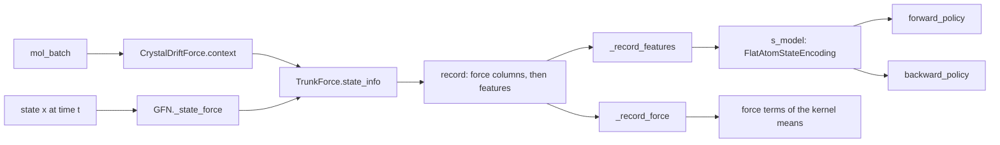

# State features and the atom encoder

*Drift: **C** (code-bound). Verified against commit `4b62d89a`, 2026-10-07. Sources at the end.*

A *state* of the crystal sampler is one row of the crystal latent at one trajectory time. Neither policy reads it directly: the forward policy $P_F$ and the backward policy $P_B$ both read the output of one shared state encoder, `s_model`, which by default is given the state and the condition vector. With *state features* on, the encoder is also given a description of the crystal that the state builds, atom by atom. A *provider* writes the state into a crystal, passes the crystal through a frozen pre-trained energy model (a *trunk*), and returns per-atom features of the asymmetric unit, the one symmetry-independent molecule of a Z' = 1 crystal; an attention encoder pools them into the state embedding. This page follows that route from the provider to the encoder, then the trainer wiring, the checkpoint check, the offline step that reads a molecule condition off the same trunk, and the evaluation loader. Left out and named: the condition channel is [conditional-route](conditional-route.md); the condition and prior files are [molecule-conditions-and-anchors](molecule-conditions-and-anchors.md); the loading paths are [checkpoints-and-resume](checkpoints-and-resume.md); the residual the two kernels enter is [trajectory-balance](trajectory-balance.md); the rows of the latent are [latent-dimension-structure](latent-dimension-structure.md). The trunks and the force term in the kernel means have no page yet and are named in the last section before the reference lists.

## The switch and the width

`models/gfn.py::GFN` takes six constructor arguments for the route. The table gives each argument, its default in the constructor signature, and what it sets.

| argument | default | what it sets |
|---|---|---|
| `state_features_dim` | 0 | width $W$ of the feature vector the provider returns per state; `::GFN.features_on` is `state_features_dim > 0` |
| `state_atoms` | 0 | number of atoms $A$ the features are padded to; above 0 it selects the atom encoder |
| `state_atom_hidden_dim` | 128 | token width of the atom layers |
| `state_atom_blocks` | 2 | rounds of self-attention over a row's atoms |
| `state_atom_heads` | 4 | attention heads per round |
| `state_crystal_t_min` | 0.0 | trajectory time before which a state is described by its molecule alone; 0 describes every state in its crystal |

With `state_atoms > 0` the constructor raises `ValueError` unless `state_features_dim` is positive, a multiple of `state_atoms`, and at least 3 per atom. It then builds `s_model` as `models/graph_state.py::FlatAtomStateEncoding` with `atoms = state_atoms` and `atom_dim = state_features_dim // state_atoms - 2`, so $W = A\,(F + 2)$ with $F$ the features per atom. The constructor also raises `ValueError` when `state_crystal_t_min` is outside $[0, 1)$, and when it is positive on a model without features. With `state_atoms == 0`, `s_model` is `models/architectures.py::StateEncoding` with `extra_dim = state_features_dim`. At 0 that module builds no extra block. At a positive width it projects the flat vector through `::StateEncoding.extra_in` (a linear layer, a layer norm and a GELU) and concatenates the result with the state and the condition. `train.py::Modeller._state_features_dim` returns 0 whenever `state_atoms` is 0, so the trainer builds either the atom encoder or the encoder without features, and not the flat form.

## The record of a state

Within the sampler one function calls the provider for a state, `models/gfn.py::GFN._state_force`, with a state `[B, dim]`, its time `[B]` and the provider's context. What it returns is the *record* of the state. On a model without features the record is the force on the latent, `[B, dim]`, or `None` when no force term would read the state. With features on it is `[B, dim + state_features_dim]`: the force columns first, then the features.

With features on, `_state_force` does the following in order.

1. It wraps the periodic rows of the state (`::GFN._wrap_ang`) and detaches the result unless `cfg:model.force_drift_differentiable` is true.
2. It makes one provider call, `state_info(state, context, need_force, create_graph)`, which returns a force or `None`, and the features. `need_force` is true when a force term is configured and, with a positive `cfg:model.force_drift_t_min`, at least one row's time has reached it. With a positive `cfg:model.state_crystal_t_min` the call takes a fifth argument, the rows whose time has reached that value (`t >= state_crystal_t_min`, one boolean per row).
3. It raises `ValueError` unless the features have shape `[B, state_features_dim]`.
4. It replaces every non-finite feature entry by zero where it stands and leaves the other entries of that row, the element and flag columns among them, as they are. The number of rows that held a non-finite entry is added to `_force_nonfinite_rows`, the counter `::GFN.force_nonfinite_rows` returns and `::GFN._clean_force` also adds to.
5. It detaches the features.
6. It fills the force columns with zeros when the provider returned no force. Otherwise it detaches the force unless the differentiable flag is on, raises `ValueError` unless its shape is the state's, and passes it through `::GFN._clean_force`.

`::GFN._record_force` returns the first `dim` columns of a record and `::GFN._record_features` the rest. On a model without features `_record_force` returns its argument unchanged and `_record_features` returns `None`. With features on, `_record_features` raises `RuntimeError` on a `None` record. `_state_force` raises `RuntimeError` when it is called and no provider is installed.

`::GFN.install_drift_force` stores the provider with `object.__setattr__`, outside the module tree, so the provider is in no state dict and no optimizer group. `::GFN._drift_context` builds the provider's context once per call of a trajectory function, by calling the provider's `context` on the `mol_batch` that function was given, unless the caller passed a `drift_context`. No call in `train.py` or `gflownet_losses.py` passes one.

## Which state each kernel reads

Write $x_i$ for the state at grid time $t_i$, $i = 0, \dots, T$. Every kernel evaluation takes the record of the state it is conditioned on: $P_F(x_{i+1} \mid x_i)$ reads the record of $x_i$, and $P_B(x_i \mid x_{i+1})$ reads the record of $x_{i+1}$. The table lists, per trajectory function, where the records are computed and which call hands the features to which network.

| route | where a record is computed | $P_F$ at step $i$ | $P_B$ at step $i$ |
|---|---|---|---|
| forward, `::GFN.get_traj_fwd` | $x_0$ before the loop; `::GFN._fwd_step` computes the record of the state it lands on and returns it to the loop | `::GFN._forward_kernel` with the record of $x_i$ | `::GFN._eval_pb_logprob` passes the features of $x_{i+1}$ to `::GFN.fwd_get_back_correction` |
| backward, `::GFN.get_traj_bwd` | $x_T$ before the loop when $T > 1$; `::GFN._bwd_step` computes the record of the state it samples and returns it | `_forward_kernel` with the record of the sampled $x_i$ | `_bwd_step` passes the features of $x_{i+1}$ to `::GFN.get_bwd_correction` |
| replay, `::GFN.get_traj_replay` | the loop calls `_state_force` on each stored state and passes two records to `::GFN._replay_step`; a live tail (`::GFN._implied_step`, or `_fwd_step` under `resample_last_k`) computes the record of the state it lands on | as forward | as forward |

The backward route's final step into the source is deterministic and calls no $P_B$ network; the source's record is still computed, and $P_F$ reads it. `::GFN.last_step_mean_shift` computes the record of $x_{T-1}$ and hands it to `_forward_kernel`. In each function a record returned by one step is the next step's input, so a state's record is computed once per trajectory function call. `tests/models/test_graph_policy.py` asserts $T + 1$ provider calls for one forward trajectory batch of $T$ steps.

On the forward and backward routes and in a live replay tail, the call to `_state_force` for the state a step produces sits inside the step function, which `::GFN._run_step` passes to `torch.utils.checkpoint` when `::GFN._use_traj_checkpoint` returns true for the branch. On a fixed replay the loop makes the call and passes the records in.

Inside `_forward_kernel`, a model with features calls `s_model(expanded_state, condition_embedding, features)` and then keeps the force columns for $P_F$'s force term, which is added only when `cfg:model.force_drift_fwd` is set. A model without features calls `s_model(expanded_state, condition_embedding)`. The state embedding goes to the forward policy and to `::GFN._step_flow`, which under `cfg:model.full_flow` hands it detached to the flow head; otherwise the flow value is written once per trajectory by `::GFN._condition_flow`, which reads no state embedding.

`::GFN._pb_net` takes `(expanded_state, condition_embedding, t, features=None)` and returns the backward network's mean and variance outputs from `s_model`, `t_model` and `backward_policy`. `fwd_get_back_correction` and `get_bwd_correction` both call it with three positional arguments when `features` is `None` and with four otherwise, so a model without features calls `_pb_net` with exactly `(expanded_state, condition_embedding, t)`; `models/conformer_gfn.py::ConformerGFN._pb_net` overrides it with that three-argument signature. With `cfg:model.learn_pb` false neither function calls `_pb_net`.

When $P_B$ is frozen, `_pb_net` evaluates a snapshot instead of the live modules. `models/gfn.py::GFN.PB_SNAPSHOT_MODULES` is `('t_model', 's_model', 'backward_policy')` and `::GFN.freeze_backward_policy` deep-copies those three, so the snapshot holds its own copy of the state encoder, atom layers included. With the snapshot installed `_pb_net` runs under `torch.no_grad()`: the snapshot's `s_model` on the detached state, the detached condition embedding and the detached features, then the snapshot's `backward_policy` and `t_model`. The features come from the live provider, which is not part of the snapshot.

## What raises with features on

- `models/gfn.py::GFN._maybe_scramble_condition_embedding` raises `ValueError` when it is called with a positive tile count on a model with features, with the message `scramble_conditions with state features on: the features are built from the row's own molecule, so permuting the condition vector does not hide it`. `get_traj_bwd` and `get_traj_replay` call it on a conditional model. `train.py::Modeller.bwd_train_step` passes its `repeats` as the tile count when the stage declares `cfg:stage.flags.scramble_conditions` and `::Modeller.scramble_applicable` holds, and 0 otherwise; the scramble itself is on [conditional-route](conditional-route.md).
- `models/gfn.py::GFN.compile_step_kernels` raises `ValueError` when the model has a force term or features. Its caller, `train.py::Modeller.maybe_compile_policy`, reaches it under `cfg:compile_policy` set to `step` where that setting enables compilation (Linux with CUDA), inside a `try` that catches `Exception`, prints `compile_policy: torch.compile unavailable here (...); continuing eager` and returns. Under the other enabling settings `maybe_compile_policy` compiles `s_model` among the submodules it lists.
- `get_traj_replay` raises `ValueError` when it is given `state_forces` on a model with features.

## The provider

`models/crystal_force.py::TrunkForce` wraps one trunk checkpoint written by `pretrain_atom_trunk.py`. Its constructor does the following.

- It loads the file and raises `ValueError` unless the stored arguments have `arm` equal to `trunk` and `target` equal to `full`, an absent `target` being read as `full`.
- It reads the trunk's pair cutoff, `label_cutoff`, `compress_at`, `temperature` and `lj_coeff` from the stored arguments.
- It sets `::TrunkForce.step` from the file's `step`, `::TrunkForce.planned_steps` from the stored `steps` argument (the value of `step` when the arguments carry none), and `::TrunkForce.finished` to `step == planned_steps`.
- It sets `::TrunkForce.stacked` to whether the file holds `intra_trunk_args`. On such a file (a *stacked* checkpoint) it builds a `models/stacked_trunk.py::StackedTrunk`, and otherwise (a *plain* checkpoint) a `models/atom_trunk.py::AtomTrunk`. It loads the weights and calls `requires_grad_(False)` and `eval()` on the trunk.
- It sets `models/crystal_force.py::TrunkForce.max_atoms`; `::TrunkForce.atom_dim` to the trunk's `node_dim`, plus the intra trunk's `node_dim` on a stacked checkpoint, plus 7; and `::TrunkForce.features_dim` to `max_atoms * (atom_dim + 2)`.

`::TrunkForce.atom_feature_dim` is a static method that returns the same `atom_dim` from a checkpoint file's stored arguments without building the trunk.

`::TrunkForce.context` clones the crystal batch it is given, builds the tables that depend on the molecule and space group only (`mxtaltools/crystal_building/image_pairs.py::build_image_tables`), raises `ValueError` when `max_atoms` is set and a molecule has more atoms than that, and splits the rows into chunks of `chunk`. On a stacked trunk it computes the intra trunk's per-atom states of every molecule here (`models/stacked_trunk.py::StackedTrunk.molecule_states`), once per context. The returned `models/crystal_force.py::TrunkContext` is used for every state of the trajectory batch.

`models/crystal_force.py::TrunkForce.state_info` takes `(state, ctx, need_force, create_graph, crystal_rows)` and returns `(force or None, features)`. It raises `ValueError` on a provider built with `max_atoms < 1`, on a missing context, on a state whose row count is not the context's, and on a `crystal_rows` whose shape is not `[B]`. It writes the state into the context's crystal batch (`mxtaltools/dataset_utils/data_class_methods/crystal_ops.py::MolCrystalOps.latent_to_cell_params`), and per chunk selects the periodic image molecules (`image_pairs.py::select_images`), finds the atom pairs inside the trunk's cutoff (`image_pairs.py::pair_distances`) and calls the trunk. With `need_force` the force is minus the gradient of the trunk's summed energy with respect to the state, by `torch.autograd.grad`, with `create_graph` passed through. Without it the whole pass runs with gradients disabled and the force is `None`.

The features of one atom are a row of width $F + 2$, with $F$ = `atom_dim`, $D$ the trunk's `node_dim` and $D_m$ the intra trunk's `node_dim` (0 on a plain checkpoint). The table gives the columns in order.

| columns | content | scale |
|---|---|---|
| $[0, D)$ | the trunk's node state of the atom in this crystal (`out['h']`) | as the trunk returns it |
| $[D, D + D_m)$ | the intra trunk's state of the atom, stacked checkpoints only (the context's `e_m`) | divided by the stacked trunk's stored `feature_scale`, inside `molecule_states` |
| next 3 | the atom's fractional position in the cell: `T_cf` applied to the Cartesian image of the state's fractional centroid plus the atom's offset | fractional, not wrapped into the cell |
| next 3 | the atom's offset from the molecule's heavy-atom centroid in the posed molecule: the stored molecule turned by the rotation matrix of the state's orientation vector (`mxtaltools/common/geometry_utils.py::rotvec2rotmat`) | divided by `models/crystal_force.py::COORD_SCALE` (5.0) |
| $F - 1$ | the trunk's per-atom energy (`out['e_atom']`) | divided by `::ENERGY_SCALE` (5.0), then clamped to plus or minus `::ENERGY_CLAMP` (10.0) |
| $F$ | atomic number | integer stored as a float |
| $F + 1$ | 1 on a real atom | 0 on padding |

Rows of padded atoms are zero in every column. The rows are flattened to `[B, max_atoms * (F + 2)]`.

`crystal_rows` selects the rows described *in their crystal*; `None`, the default, selects every row. A row outside the selection is described by its molecule alone: its columns $[0, D)$ (`::TrunkForce.crystal_dim` of them) and its energy column are zero, and its intra state, its two position blocks, its element and its flag are what they are for a selected row. Whether the crystal is built is decided per call, not per row: `state_info` selects images, finds pairs and calls the trunk when `need_force` is true, when `crystal_rows` is `None`, or when it selects at least one row, and then zeroes the crystal columns of the rows left out. When none of the three holds the call builds no image list, no pair list and makes no trunk call; it writes the state into the crystal batch and turns each molecule. `::TrunkForce.crystal_calls` counts the `state_info` calls that built the crystal, and `::TrunkForce.molecule_rows` the rows left out of a selection. A force is the crystal's whichever rows are selected.

The features carry no gradient. Every piece `state_info` writes is detached or computed under `torch.no_grad()`, `_state_force` detaches the vector again, and the trunk's parameters have `requires_grad` False. `tests/models/test_graph_policy.py` asserts that a loss on replayed log-probabilities gives the atom layers of `s_model` a gradient and the trunk's parameters none.

The memory bound of the force call applies to `state_info` unchanged; both go through the same three limits.

- `max_images` is passed to `select_images`: a crystal with more image molecules in range keeps those whose centres are nearest the reference molecule.
- `max_pairs` is passed to `pair_distances`: a crystal with more pairs inside the cutoff keeps its shortest.
- `::TrunkForce._calls` yields one trunk call for a chunk whose pair count is at most `max_pairs_per_call`, and otherwise one call per consecutive group of crystals whose pairs fit under it, adding the number of calls beyond the first to `::TrunkForce.extra_calls`.

`::TrunkForce.capped_rows` counts the states flagged by any of three: the `max_images` limit, the `max_pairs` limit, or the lattice-translation clamp of `select_images`. The constructor raises `ValueError` unless all three limits are positive and `max_pairs` is at most `max_pairs_per_call`. `::TrunkForce._inputs` orders the trunk's arguments: a stacked trunk is given the intra states and no intramolecular edges, a plain trunk the intramolecular edges and their distances.

`::CrystalDriftForce` is the object a crystal trainer installs. It holds a `TrunkForce` and the run's energy function. `::CrystalDriftForce.context` raises `ValueError` on `mol_batch=None` and otherwise passes `energies/molecular_crystal.py::MolecularCrystal.init_blank_crystal_batch` of the molecules to `TrunkForce.context`. Its call, its `features_dim` and its `state_info` delegate to the `TrunkForce`. Its `__deepcopy__` returns the object itself, so a deep copy of a sampler holds the same provider.

## The encoder

`models/graph_state.py::FlatAtomStateEncoding` has `StateEncoding`'s call, `forward(s, conditioning, extra)`: `s` is the expanded state (`models/gfn.py::GFN.expand_state_for_policy`), `conditioning` the condition embedding, `extra` the features. It raises `ValueError` when `extra` is `None` or is not `atoms * (atom_dim + 2)` wide, reshapes it to `[B, atoms, atom_dim + 2]`, and unpacks each atom's row:

- the last column above 0.5 is the mask of real atoms;
- the column before it, rounded to an integer, is the element;
- the first `atom_dim` columns are the atom features.

It then calls `models/graph_state.py::AtomStateEncoding`, passing `conditioning` as that module's `extra` vector when it was built with a positive `conditioning_dim` and nothing otherwise.

`AtomStateEncoding` returns `x_model` applied to the concatenation of `s`, the pooled atoms and `extra`. `::AtomStateEncoding.x_model` is a `scalarMLP` with `cfg:model.s_layers` layers, `cfg:model.s_hidden_dim` filters, output width `cfg:model.s_emb_dim` and the model's `cfg:model.norm`. The state enters twice: as the pool's per-row context, appended to every atom's token, and beside the pooled vector at the input of `x_model`. The condition vector joins at that input, after the pool; no atom token reads it.

`::AtomSetPool` turns the atoms of one row into one vector of width `3 * hidden_dim`.

- A token is a linear map (`::AtomSetPool.token`) of the atom's features, an element embedding (`::AtomSetPool.embed`, an `nn.Embedding` with 101 rows and width `type_dim`, 16 by default) and the row's context.
- Each of `blocks` rounds is self-attention over the row's atoms (`nn.MultiheadAttention` with `heads` heads) and a two-layer GELU MLP, both residual, each behind its own `nn.LayerNorm` over the token.
- After a final `nn.LayerNorm`, three pools are concatenated: a mean under learned weights, the softmax over the row's real atoms of one linear score per atom (`::AtomSetPool.score`); the plain mean over real atoms; and the sum divided by `models/graph_state.py::SUM_SCALE` (16.0).

Padding is handled inside the pool. Atom features at padded positions are replaced by zeros and their element index by 0 before the token map; padded positions are the attention's `key_padding_mask` and take a score of $-\infty$ in the weighted pool; and the tokens at padded positions are set to zero after the token map, after every round and after the final norm. The pool raises `ValueError` on a row with no real atom, on atom features of another width, and on a context given to a pool built without one or missing from a pool built with one.

Inside the pool a row's output is computed from that row's atoms alone: attention runs within the row and every normalisation is per token. `tests/models/test_graph_state.py` asserts, on an `AtomStateEncoding` built with `norm='layer'`, that a row encodes equally alone and in a batch, under a wider padding, with padding holding 0, 1e6 or NaN, in training and in evaluation mode, and under a reordering of its atoms.

## The trainer

The width is derived, not read from the config. `train.py::Modeller._state_features_dim` reads `cfg:model.state_atoms`; it returns 0 when that is 0 or absent, raises `ValueError` when it is positive and `cfg:drift_force.checkpoint` is null, and otherwise returns `state_atoms * (TrunkForce.atom_feature_dim(checkpoint) + 2)`. `::Modeller._build_gfn_config` puts the result in the constructor arguments as `state_features_dim`, beside every key of the `cfg:model` block, which carries `cfg:model.{state_atoms, state_atom_hidden_dim, state_atom_blocks, state_atom_heads, state_crystal_t_min}` under the constructor's own names. That dictionary is the `gfn_config` a checkpoint stores.

`::Modeller.init_gfn` calls `::Modeller._build_drift_force` after the model has been built or reloaded and installs the result on the training model and the EMA model. `_build_drift_force` does the following in order.

1. It raises `ValueError` on a key under `cfg:drift_force` that is not in `::Modeller.DRIFT_FORCE_KEYS`.
2. It returns `None` when the model has neither a force term nor features, printing a notice when a checkpoint is named all the same.
3. It raises `ValueError` when `cfg:drift_force.checkpoint` is null.
4. It raises `ValueError` unless `cfg:energy_function` is `elj`, the largest entry of `cfg:z_primes` is 1 and `cfg:temperature_conditioning` is false.
5. It builds a `TrunkForce` with `max_atoms` set to the model's `state_atoms` and with whichever of `cfg:drift_force.{chunk, max_images, max_pairs, max_pairs_per_call}` are not null, and calls `models/crystal_force.py::TrunkForce.check_energy` with the energy function's temperature and `lj_coeff`, which raises when either differs from the value in the trunk's stored arguments.
6. It raises `ValueError` on a trunk whose `finished` is False unless `cfg:drift_force.partial` is true. The message reads `the trunk <path> is at step <step> of <planned_steps>: its fitting run has not finished (drift_force.partial: true reads it anyway)`.
7. With features on, it raises `ValueError` unless the trunk's `features_dim` equals the model's `state_features_dim`, then prints a line beginning `state features:` with the atom count, the features per atom and the trunk's path, and with a positive `state_crystal_t_min` that time.
8. It returns a `CrystalDriftForce` over the trunk and the run's energy function. On a model with features and no force term it returns here, before the line beginning `force term:` is printed.

At evaluation `train.py::Modeller.fwd_eval_sampling` reads the provider on the first batch of the training conditions. With a force term it calls `::Modeller.force_agreement_stats`. With features and no force term it calls `::Modeller.provider_counts`, which returns `force/nonfinite_rows`, `force/trunk_states`, `force/molecule_only_states`, `force/capped_states` and `force/extra_trunk_calls`, the five running totals `force_agreement_stats` also logs. `force/trunk_states` counts every state the provider was called on, and `force/molecule_only_states` those of them described by the molecule alone.

On a reload the state encoder is the checkpoint's. `checkpointing.py::Checkpointer._gfn_config_from`, used by `::Checkpointer.load_full` and `::Checkpointer.load_weights_only`, raises `ValueError` when `cfg:model.state_atoms` in the run's config (absent read as 0) differs from `state_atoms` in the checkpoint's `gfn_config` (absent read as 0), with a message beginning `model.state_atoms is <asked> in this run's config and <held> in the checkpoint`. It raises in the same way when `cfg:model.state_crystal_t_min` (absent read as 0) differs from the checkpoint's, with a message beginning `model.state_crystal_t_min is <asked> in this run's config and <held> in the checkpoint`. It compares those two keys. `state_features_dim` and the three `state_atom_*` values are taken from the checkpoint's `gfn_config`: they are in neither `::Checkpointer.RECONFIGURABLE_GFN_KEYS` nor `::Checkpointer.FORCE_DRIFT_GFN_KEYS`, the two sets of keys the function overwrites from the run's config. Step 7 above then compares the trunk named by this run's `cfg:drift_force.checkpoint` with the stored width. The loading paths themselves are [checkpoints-and-resume](checkpoints-and-resume.md).

## The condition read off the intra trunk

`build_trunk_conditions.py` is an offline data step, separate from the provider: it rewrites the stored condition vector of crystal files, the `embedding` the condition channel reads ([molecule-conditions-and-anchors](molecule-conditions-and-anchors.md)), from the intra trunk of a stacked checkpoint. Its arguments are the files, `--trunk`, `--out-dir` and `--device`. `build_trunk_conditions.py::load_trunk` exits on a checkpoint that holds no `intra_trunk_args`.

`build_trunk_conditions.py::molecule_conditions` pads each row's atomic numbers and stored positions to the widest molecule of its chunk, computes the per-atom states with `StackedTrunk.molecule_states`, and returns per row the concatenation of their mean over the molecule's atoms and their sum divided by `build_trunk_conditions.py::SUM_SCALE` (16.0). The width is twice the intra trunk's `node_dim`. That constant is declared separately from `models/graph_state.py::SUM_SCALE` and has the same value.

For each file `build_trunk_conditions.py::main` treats as a crystal batch every entry of the file's dictionary whose value has both a `num_graphs` and an `embedding` attribute, under whatever key it sits, and exits when the file holds none. A batch is re-embedded once: two keys that name one object are handled together. For each batch `main` computes `molecule_conditions`, exits on a non-finite condition, replaces `batch.embedding`, asserts that the first and last rows keep their condition through `subsample_new_batch`, and prints the keys that name the batch, the row count, the old and new embedding shapes, the width as `embedding_conditioning_dim`, the number of distinct conditions and their root mean square. It then asserts that the batches of the file have one embedding width, writes that width as `embedding_dim` and an `encoder` string into the file's dictionary, saves the dictionary under the same file name in `--out-dir`, and prints the path written. No other entry of the file is changed. `train.py`, `energies/molecular_crystal.py`, `checkpointing.py` and `utils.py` do not read the `embedding_dim` or `encoder` entries.

A run takes the rewritten condition through four keys: `cfg:prior_path`, `cfg:molecules_path` and `cfg:test_molecules_path` name the copies, and `cfg:embedding_conditioning_dim` is the printed width. `train.py::Modeller._load_condition_file` reads the `prior` entry of a condition file and `::Modeller.init_prior_dataset` the `equalized_prior` entry of a prior file. `main` rewrites each of the two that a file holds as a crystal batch with an `embedding`.

## The evaluation loader

`eval/cond_panel/sampler.py::load_run` rebuilds a sampler from an archive's `gfn_config` and its evaluation weights, restores the frozen $P_B$ snapshot the archive carries, and, when the sampler has a force term or features, installs a provider built from the config's `drift_force` block as steps 5 to 8 of `_build_drift_force` build it. Three things differ from the trainer. The trunk file is the `trunk_path` argument when given and the config's `cfg:drift_force.checkpoint` otherwise, and `load_run` raises `ValueError` when neither names a file on the machine. `check_energy` is called after a `thermal_scaling_factor` in the prior file, when present, has replaced the rebuilt energy function's `lj_coeff`. The route check of step 4 is not repeated. The message for an unfinished trunk reads `the trunk <file> is at step <step> of <planned_steps>: its fitting run has not finished, and the run's config does not set drift_force.partial`.

## Neighbouring objects without a page

- `models/atom_trunk.py::AtomTrunk` is the per-atom energy model on a Z' = 1 crystal whose node states and per-atom energies the features carry, fitted by `pretrain_atom_trunk.py`.
- `models/intra_trunk.py::IntraTrunk` is the same module over every atom pair of one isolated molecule, fitted by `pretrain_intra_trunk.py`.
- `models/stacked_trunk.py::StackedTrunk` is an `AtomTrunk` over intermolecular pairs that reads a frozen `IntraTrunk`'s per-atom states as extra inputs per atom, fitted by `pretrain_atom_trunk.py` with `--intra`.
- The force term in the kernels, `models/gfn.py::GFN.init_force_drift`, adds to each kernel's mean a gate times that kernel's step variance times the provider's force, under `cfg:model.force_drift_fwd` and `cfg:model.force_drift_bwd`, and reads the force columns of the record described here.

## Owner choices

*Left for the owner. Three buckets: bullets bitten, design choices, priorities.*

## Config keys

`cfg:model.{state_atoms, state_atom_hidden_dim, state_atom_blocks, state_atom_heads, state_crystal_t_min}`; `cfg:model.{force_drift_fwd, force_drift_bwd, force_drift_t_min, force_drift_differentiable}`; `cfg:model.{s_layers, s_hidden_dim, s_emb_dim, norm, learn_pb, full_flow}`; `cfg:drift_force.{checkpoint, chunk, max_images, max_pairs, max_pairs_per_call, partial}`; `cfg:compile_policy`; `cfg:stage.flags.scramble_conditions`; `cfg:energy_function`, `cfg:z_primes`, `cfg:temperature_conditioning`; `cfg:prior_path`, `cfg:molecules_path`, `cfg:test_molecules_path`, `cfg:embedding_conditioning_dim`. `state_features_dim` is a constructor argument and a `gfn_config` entry, not a config key.

Code: `models/gfn.py::GFN.features_on`, `.install_drift_force`, `._drift_context`, `._state_force`, `._record_force`, `._record_features`, `._clean_force`, `.force_nonfinite_rows`, `._wrap_ang`, `.expand_state_for_policy`, `._forward_kernel`, `._fwd_step`, `._bwd_step`, `._replay_step`, `._implied_step`, `._run_step`, `._use_traj_checkpoint`, `._eval_pb_logprob`, `._step_flow`, `._condition_flow`, `.get_traj_fwd`, `.get_traj_bwd`, `.get_traj_replay`, `.last_step_mean_shift`, `._pb_net`, `.fwd_get_back_correction`, `.get_bwd_correction`, `.PB_SNAPSHOT_MODULES`, `.freeze_backward_policy`, `._maybe_scramble_condition_embedding`, `.compile_step_kernels`, `.init_force_drift`; `models/architectures.py::StateEncoding.extra_in`; `models/conformer_gfn.py::ConformerGFN._pb_net`; `models/graph_state.py::AtomSetPool`, `::AtomStateEncoding`, `::FlatAtomStateEncoding`, `::SUM_SCALE`; `models/crystal_force.py::TrunkForce.state_info`, `.context`, `.atom_feature_dim`, `.check_energy`, `.energy_and_force`, `._calls`, `._inputs`, `.max_atoms`, `.atom_dim`, `.features_dim`, `.step`, `.planned_steps`, `.finished`, `.stacked`, `.capped_rows`, `.extra_calls`, `.crystal_dim`, `.crystal_calls`, `.molecule_rows`; `models/crystal_force.py::TrunkContext`, `::CrystalDriftForce`, `::COORD_SCALE`, `::ENERGY_SCALE`, `::ENERGY_CLAMP`; `models/atom_trunk.py::AtomTrunk`; `models/intra_trunk.py::IntraTrunk`; `models/stacked_trunk.py::StackedTrunk.molecule_states`; `train.py::Modeller._state_features_dim`, `._build_gfn_config`, `._build_drift_force`, `.DRIFT_FORCE_KEYS`, `.init_gfn`, `.force_agreement_stats`, `.provider_counts`, `.fwd_eval_sampling`, `.maybe_compile_policy`, `.scramble_applicable`, `.bwd_train_step`, `._load_condition_file`, `.init_prior_dataset`; `checkpointing.py::Checkpointer._gfn_config_from`, `.load_full`, `.load_weights_only`, `.RECONFIGURABLE_GFN_KEYS`, `.FORCE_DRIFT_GFN_KEYS`; `energies/molecular_crystal.py::MolecularCrystal.init_blank_crystal_batch`; `build_trunk_conditions.py::load_trunk`, `::molecule_conditions`, `::main`; `eval/cond_panel/sampler.py::load_run`; `mxtaltools/crystal_building/image_pairs.py::build_image_tables`, `::select_images`, `::pair_distances`; `mxtaltools/dataset_utils/data_class_methods/crystal_ops.py::MolCrystalOps.latent_to_cell_params`; `mxtaltools/common/geometry_utils.py::rotvec2rotmat`.

## Could be tooling

- A config-load check for `cfg:model.state_atoms` above 0 that reports, before any model is built, the combinations the code meets later: a null `cfg:drift_force.checkpoint`, an energy function, Z' or temperature conditioning that step 4 of `_build_drift_force` raises on, a stage of the selected protocol that declares `scramble_conditions` on a conditional problem with vector conditions, and `cfg:compile_policy` set to `step`.
- A dataset preflight that reads the trunk checkpoint's stored arguments and the three data files and asserts what is otherwise met later: no molecule with more atoms than `state_atoms` (`TrunkForce.context` raises at the first batch that holds one), no atomic number outside the 101 rows of `AtomSetPool.embed`, a stored `embedding` width equal to `cfg:embedding_conditioning_dim`, and `step` equal to the stored `steps` (step 6 of `_build_drift_force` raises after the model is built).
- A test that `models/graph_state.py::SUM_SCALE` and `build_trunk_conditions.py::SUM_SCALE` are equal.

## Sources

The code above, read at the stamped commit, and the `model` and `drift_force` blocks of `configs/mk_dev.yaml` with their comments. The `max_images` and `max_pairs` arguments of `select_images` and `pair_distances`, and what a crystal over either keeps, were read in MXtalTools at commit `3ab145c6`.

Tests that pin the behaviour:

- `tests/models/test_graph_policy.py`: a stacked checkpoint loads as a provider; `state_info` returns the per-atom layout above, the same with and without the force, under any chunking and call budget; a sampler built with `state_atoms` scores one trajectory equally rolled forward, rolled backward and replayed, with a force term and without, and with $P_B$ frozen; the constructor's width check; non-finite features zeroed where they stand and counted, and the scramble refused; `_gfn_config_from` refusing another `state_atoms` and another `state_crystal_t_min`; a row left out of `crystal_rows` keeping every column that is the molecule's own and losing the trunk state and the energy, with no crystal built when no row and no force asks for one; a sampler with `state_crystal_t_min` scoring every route alike, the crystal built only for states inside the window or read by a force term; the constructor refusing the key without features or outside $[0, 1)$.
- `tests/models/test_graph_state.py`: a row's encoding under batching, padding width and padding content; atom reordering; every input read; gradients reaching every parameter and real atoms only; the calls that raise.
- `tests/models/test_stacked_trunk.py`: the stacked stages read the intra states and hold no intramolecular edge; a crystal's energy is independent of its batch; the intra trunk receives no gradient; `molecule_conditions` equals the pooled intra states of each row's molecule.
- `tests/models/test_crystal_force.py`: the provider's force is minus the trunk's energy gradient under any chunking; a context is reusable and leaves the caller's batch untouched; `check_energy` and the other refusals; the default per-crystal limits leave the fixture crystals' forces unchanged, tight limits are counted in `capped_rows`, and a split across trunk calls changes no value; a checkpoint from before the last step is marked unfinished; a deep copy shares the provider.
